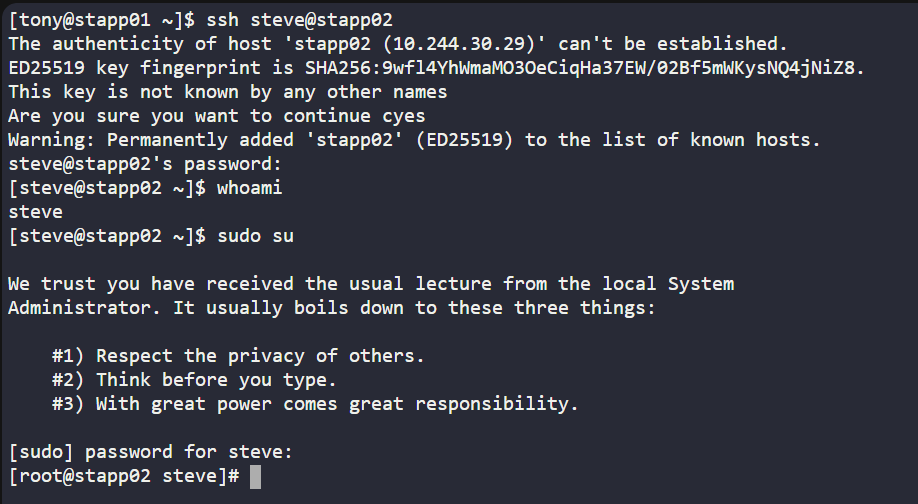
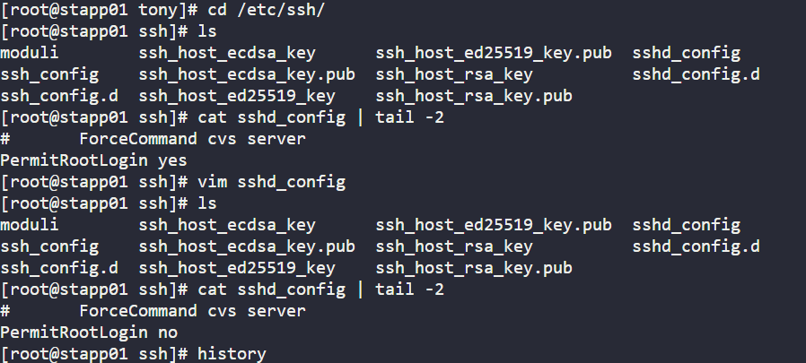
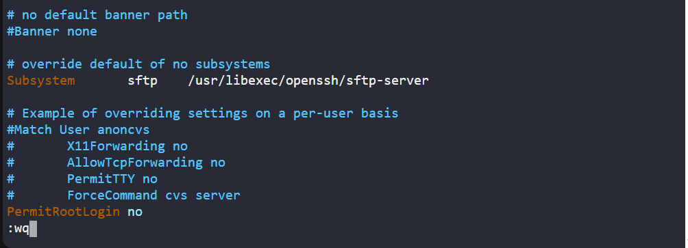
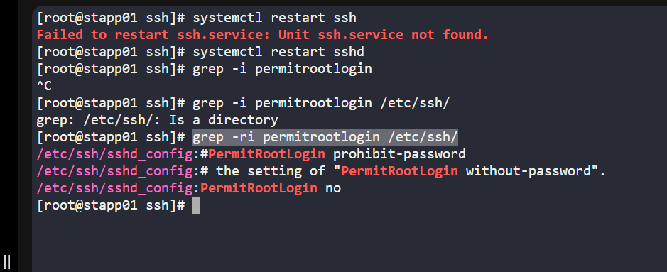
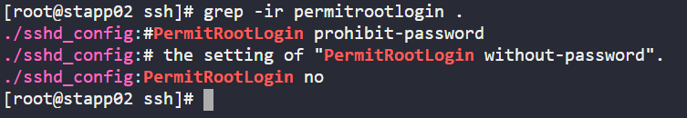
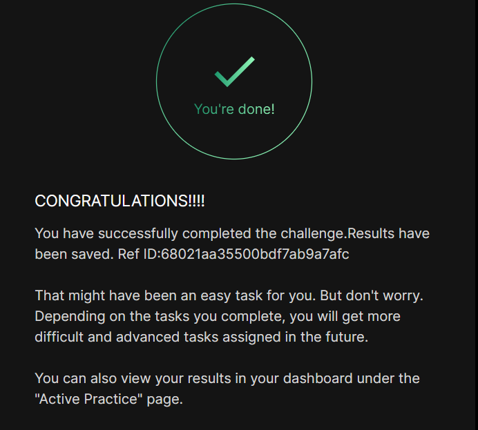

# Day 003 :shipit:

## Task

Following security audits, the xFusionCorp Industries security team has rolled out new protocols, including the restriction of direct root SSH login.

Your task is to disable direct SSH root login on all app servers within the Stratos Datacenter.

## Commands Used


```
    1  ls
    2  cd /etc/ssh/
    3  ls
    4  cat sshd_config | tail -2
    5  vim sshd_config  (You have to set PermitRootlogin to no)
    6  ls
    7  cat sshd_config | tail -2
    8  systemctl restart sshd
    9  grep -ri permitrootlogin /etc/ssh/
    10 or grep -ri permitrootlogin .
```
ssh into the server
- 

go the config file of /etc/ssh/sshd_config
- 


Change PermitRootlogin
- 

IMP to restart the ssh or sshd

And check the status 
- 
- second way to use grep using flag -r for recursive and -i for case insensitive
- 


## What I Learned

- How to disable SSH root login for better server security.
- How to edit the SSH configuration file (`/etc/ssh/sshd_config`).
- How to restart the SSH service after making changes.

## Notes

- Root login should be disabled to prevent unauthorized access.
- Always verify the change using `grep PermitRootLogin /etc/ssh/sshd_config` or `grep -ri permitrootlogin .`
- Restarting the SSH service is required for the change to take effect.

