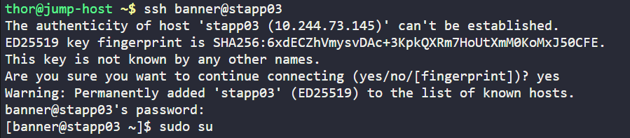
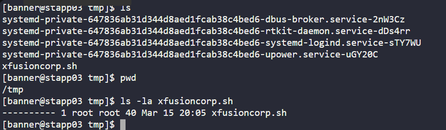
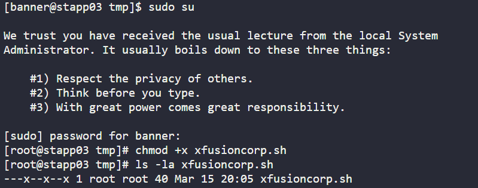

# Day 004 :shipit:

## Task 

In a bid to automate backup processes, the xFusionCorp Industries sysadmin team has developed a new bash script named xfusioncorp.sh. While the script has been distributed to all necessary servers, it lacks executable permissions on App Server 3 within the Stratos Datacenter.


Your task is to grant executable permissions to the /tmp/xfusioncorp.sh script on App Server 3. Additionally, ensure that all users have the capability to execute it.

## Commands Used
```
   1 chmod 755 xfusioncorp.sh 
   2  ls -la xfusioncorp.sh 
   3  ls -la xfusioncorp.sh 
```


Login into the server
- 

After login go to the path where files is stored and check file permission
- 

update the file permission accordingly and check
- 


## What I Learned
- `chmod` changes file permissions in Linux.
- Execute (`x`) permission is required to run a script.
- `chmod 755 file` allows all users to execute the script.
- `ls -l` is used to verify file permissions.

## Notes
- Script: `/tmp/xfusioncorp.sh`
- Command used:
  ```bash
  chmod 755 /tmp/xfusioncorp.sh

