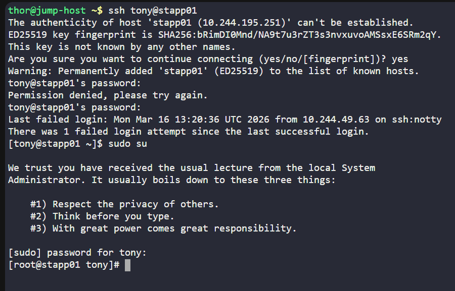
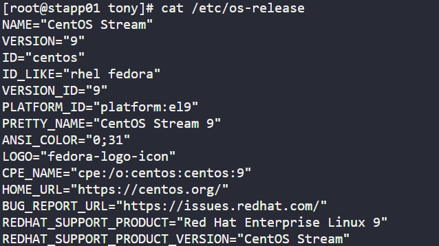
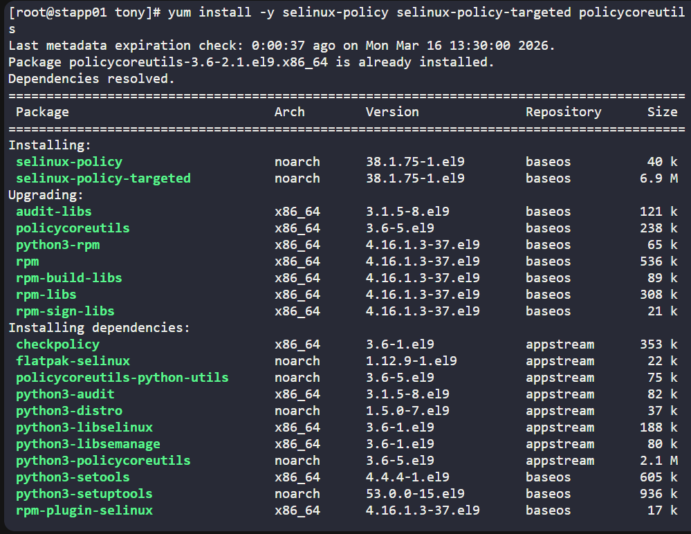
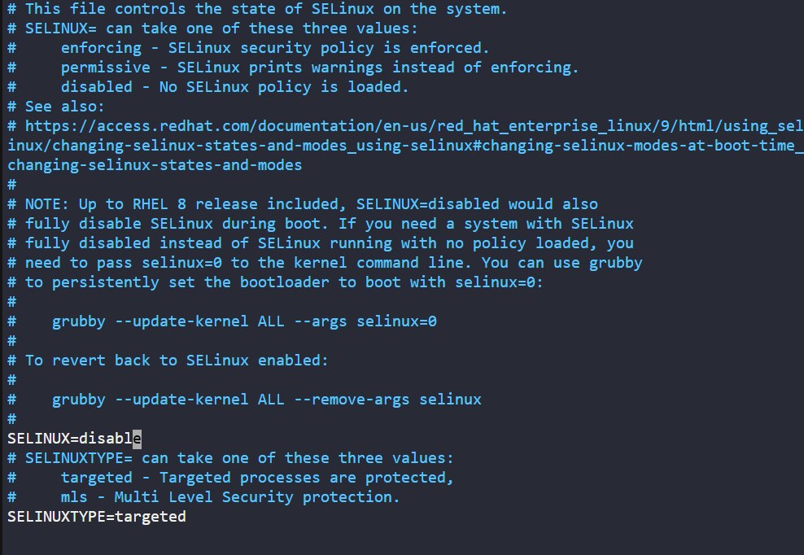
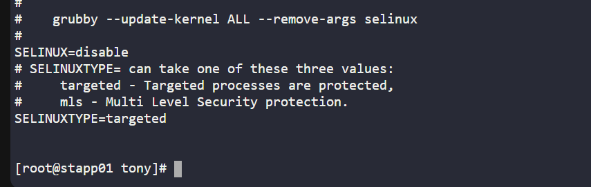
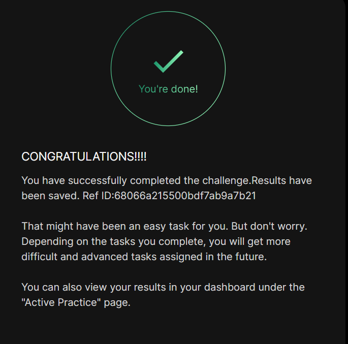

# Day 005 :shipit:

## Task

Following a security audit, the xFusionCorp Industries security team has opted to enhance application and server security with SELinux. To initiate testing, the following requirements have been established for App server 1 in the Stratos Datacenter:


Install the required SELinux packages.

Permanently disable SELinux for the time being; it will be re-enabled after necessary configuration changes.

No need to reboot the server, as a scheduled maintenance reboot is already planned for tonight.

Disregard the current status of SELinux via the command line; the final status after the reboot should be disabled.

## Commands Used

```
uname -a
cat /etc/os-release
sestatus
yum install -y selinux-policy selinux-policy-targeted policycoreutils
vi /etc/selinux/config
cat /etc/selinux/config

```
Login to server and switch to root
- 

Check OS details
- 

Install the SELinux as define
- 

Make changes in vim /etc/selinux/config
- 

Verify using cat /etc/selinux/config
- 


## What I Learned

- SELinux (Security-Enhanced Linux) is a **kernel-level security module** used to enforce mandatory access control policies on Linux systems.
- SELinux is **not managed as a systemd service**, so commands like `systemctl status SELinux` will not work.
- The correct way to check SELinux status is using commands like:
  - `sestatus`
  - `getenforce`
- On **CentOS Stream 9 (RHEL-based systems)** the package manager used is **dnf/yum**, not `apt`.
- Required SELinux packages include:
  - `selinux-policy`
  - `selinux-policy-targeted`
  - `policycoreutils`
- SELinux configuration is controlled by the file:

  `/etc/selinux/config`

- Changing `SELINUX=disabled` in this configuration file **permanently disables SELinux**, but the change only takes effect **after the next reboot**.
- Runtime SELinux status may still show `Enforcing` or `Permissive` until the system is rebooted.

---

## Notes

- Install SELinux packages:

```bash
dnf install -y selinux-policy selinux-policy-targeted policycoreutils

