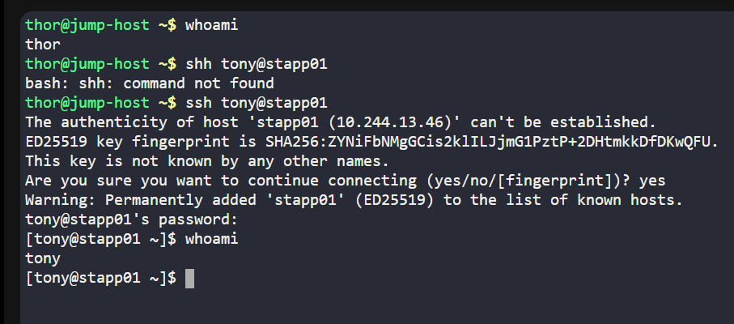
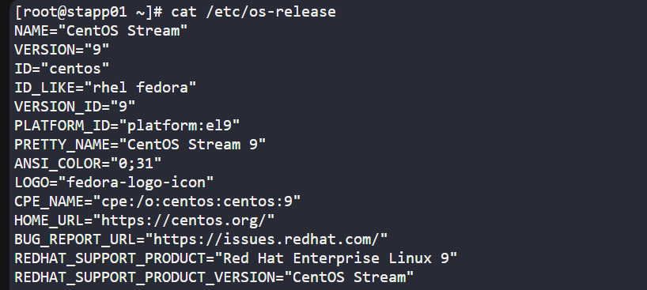
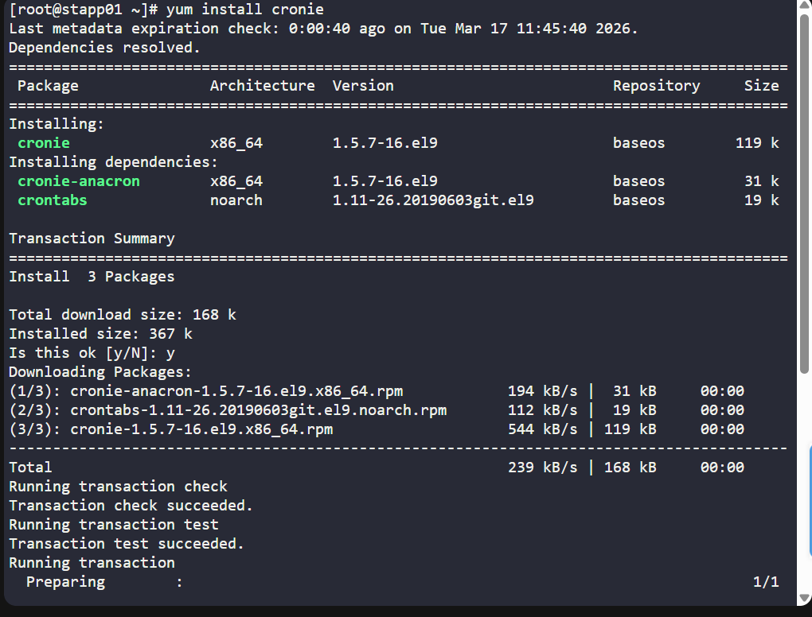
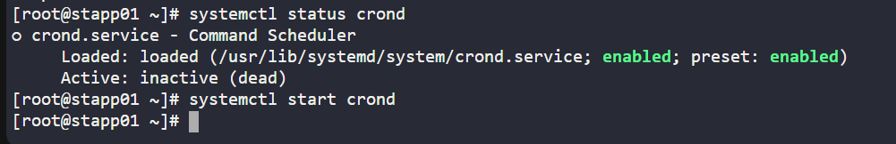
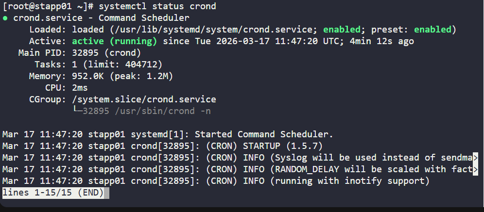
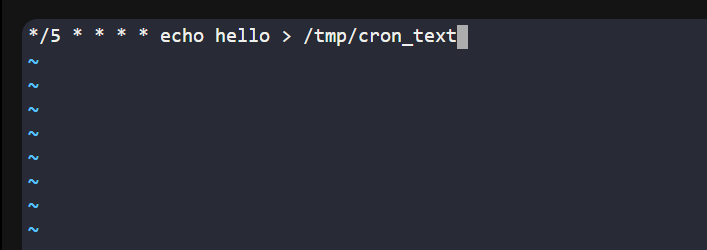
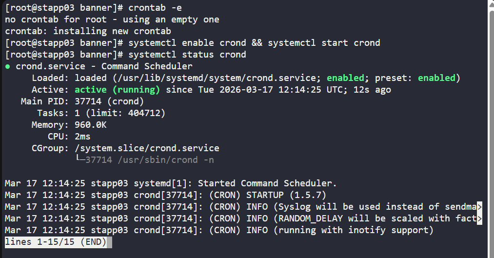
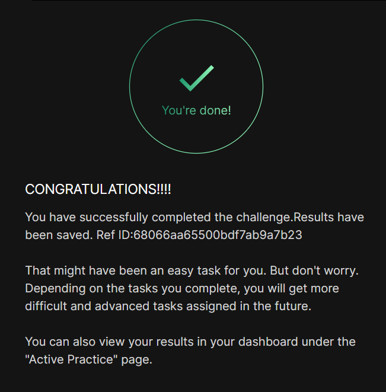

# Day 006 :shipit:

## Task
The Nautilus system admins team has prepared scripts to automate several day-to-day tasks. They want them to be deployed on all app servers in Stratos DC on a set schedule. Before that they need to test similar functionality with a sample cron job. Therefore, perform the steps below:


a. Install cronie package on all Nautilus app servers and start crond service.


b. Add a cron */5 * * * * echo hello > /tmp/cron_text for root user.

## Commands Used

```
    whoami
    cat /etc/os-release 
    yum update
    clear
    yum install cronie
    systemctl status crond
    systemctl start crond
    crontab -e
    systemctl status crond
    cat /tmp/cron_text

```

Login into the server 
- 

Sudo not working so check the os using cat /etc/os-release
- 

Install cronie
- 

check the crond status and start it. 
- 

check the status
- 

Add cron job.
- 

Added on all servers.
- 

## What I Learned

- **cronie** provides the cron daemon used to schedule recurring tasks on Linux.
- The cron service on **CentOS / RHEL systems** is called **crond**.
- The `systemctl` command is used to manage services like starting, enabling, and checking the status of cron.
- A **cron job** allows automation of tasks at fixed intervals.
- The cron expression `*/5 * * * *` means the job runs **every 5 minutes**.
- Cron jobs for the root user are managed using the `crontab -e` command.

---

## Notes

### Install cronie
```bash
yum install -y cronie


