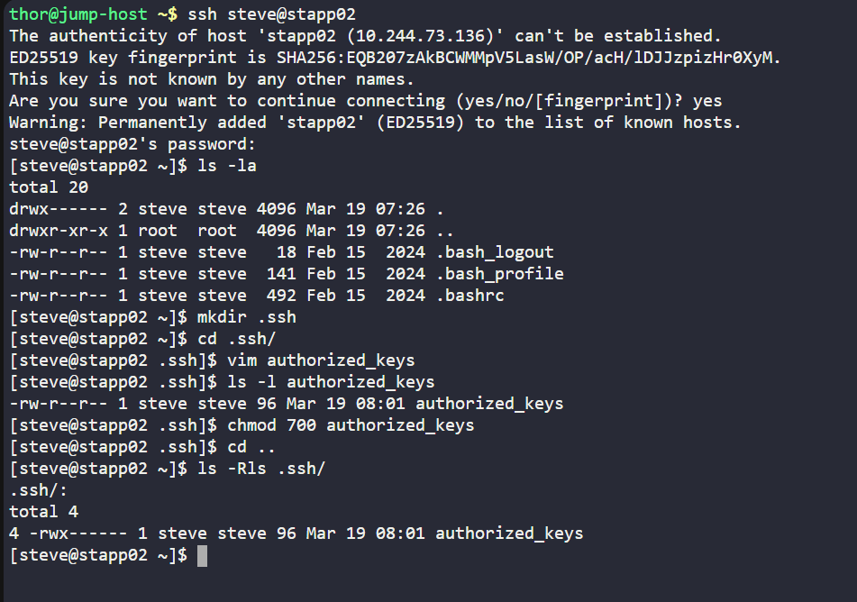
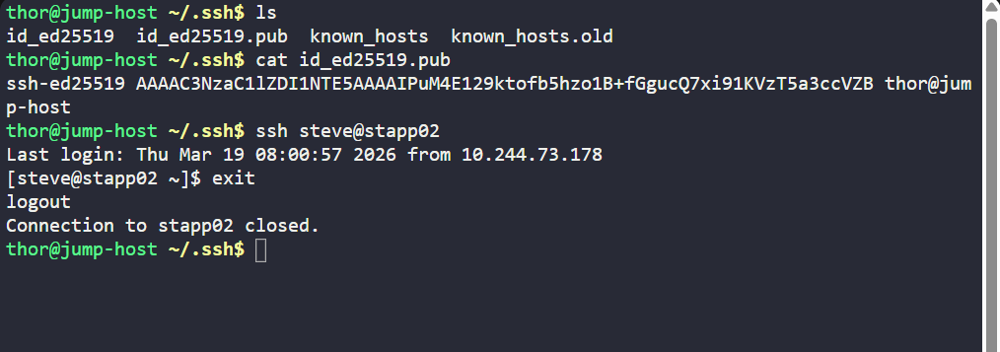
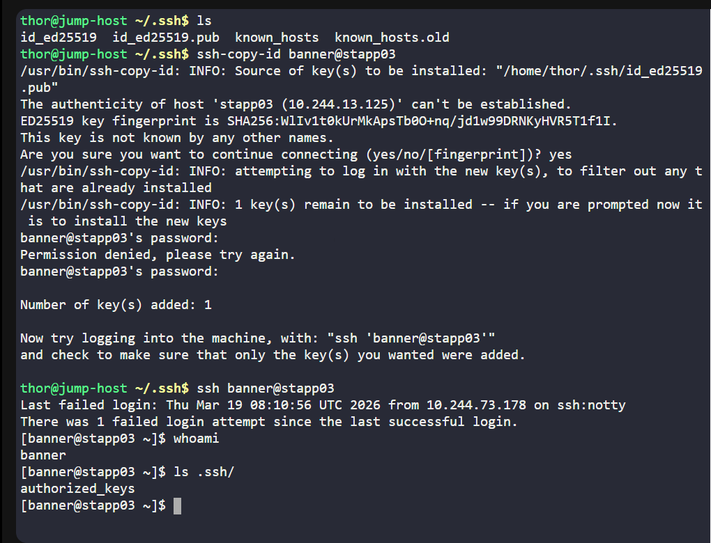
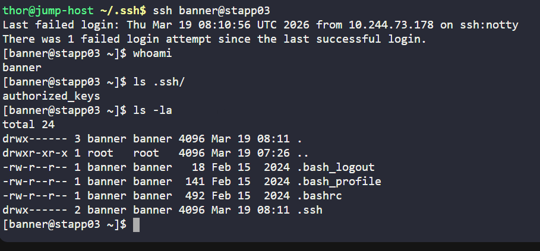

# Day 007 :shipit:

## Task

The system admins team of xFusionCorp Industries has set up some scripts on jump host that run on regular intervals and perform operations on all app servers in Stratos Datacenter. To make these scripts work properly we need to make sure the thor user on jump host has password-less SSH access to all app servers through their respective sudo users (i.e tony for app server 1). Based on the requirements, perform the following:

Set up a password-less authentication from user thor on jump host to all app servers through their respective sudo users.

## Commands Used


There is method to do this ssh password less login

**First long way**

Get the pub.key and login into the server 

check if .ssh exists if not create one and save the key in .ssh/authorized_keys file with the persmission 700 for authorized file

- 

check the login 
- 

**Second easy way**

use the one command `ssh-copy-id user@server and then enter the password`
 


logged in 
- 

## What I Learned

- How to configure password-less SSH authentication using SSH keys.
- The difference between password authentication and key-based authentication.
- How to generate SSH keys using `ssh-keygen`.
- How SSH uses a **public key (authorized_keys)** on the server and a **private key** on the client to allow secure login.
- Correct permissions required for SSH authentication to work:
  - `.ssh` directory → `700`
  - `authorized_keys` file → `600`
- How to ensure proper ownership of SSH files (`user:user`).
- Why password-less SSH is important for automation scripts and DevOps tasks.

## Notes

- Password-less SSH allows automated scripts to connect to servers without manual password input.
- The public key from the client machine must be added to the server's `~/.ssh/authorized_keys` file.
- Ownership and permissions must be correct, otherwise SSH will ignore the keys.
- Example permission fixes:

```bash
chown -R tony:tony /home/tony/.ssh
chmod 700 /home/tony/.ssh
chmod 600 /home/tony/.ssh/authorized_keys
```