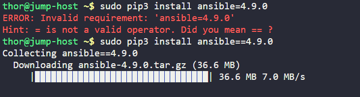
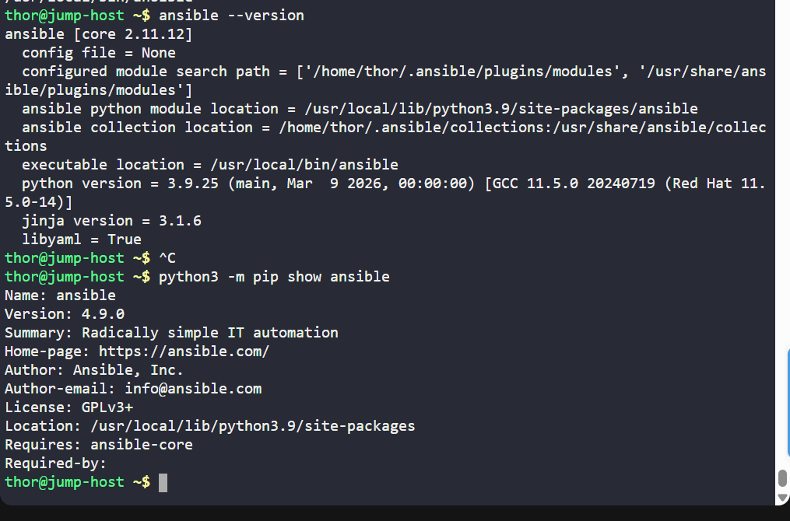

# Day 008 :shipit:

## Task

During the weekly meeting, the Nautilus DevOps team discussed about the automation and configuration management solutions that they want to implement. While considering several options, the team has decided to go with Ansible for now due to its simple setup and minimal pre-requisites. The team wanted to start testing using Ansible, so they have decided to use jump host as an Ansible controller to test different kind of tasks on rest of the servers.

Install ansible version 4.9.0 on Jump host using pip3 only. Make sure Ansible binary is available globally on this system, i.e all users on this system are able to run Ansible commands.

## Commands Used

**p.s.** notes A one-line definition: Ansible is a tool that automates server and infrastructure tasks using simple YAML playbooks.

```
ansible --version
sudo yum remove -y ansible
hash -r
sudo pip3 install ansible==4.9.0
echo 'export PATH=$PATH:/usr/local/bin' | sudo tee /etc/profile.d/ansible.sh
source /etc/profile.d/ansible.sh
which ansible
ansible --version
python3 -m pip show ansible
type -a ansible
hash
```

Install Ansible using pip3 with the sepecific version
- 


Check the version
- 
## What I Learned

The lab required Ansible to be installed using pip3 only, so the yum-installed package had to be removed.

The old Ansible binary was located at /usr/bin/ansible, while the pip3 installation placed the new binary at /usr/local/bin/ansible.

After removing the old package, Bash still remembered the old command path due to command hashing.

Running hash -r cleared Bash’s cached command paths and forced it to search for ansible again.

ansible --version showed ansible [core 2.11.12], which is expected for Ansible package version 4.9.0.

The installation was verified globally because the Ansible executable was available in /usr/local/bin.
## Notes

hash -r clears Bash’s command cache.

which ansible shows the active command path.

type -a ansible can show all available matching command paths.

python3 -m pip show ansible confirms the package version installed by pip3.

ansible-core version and ansible package version are not the same thing; for this task, package version 4.9.0 was the key requirement.

