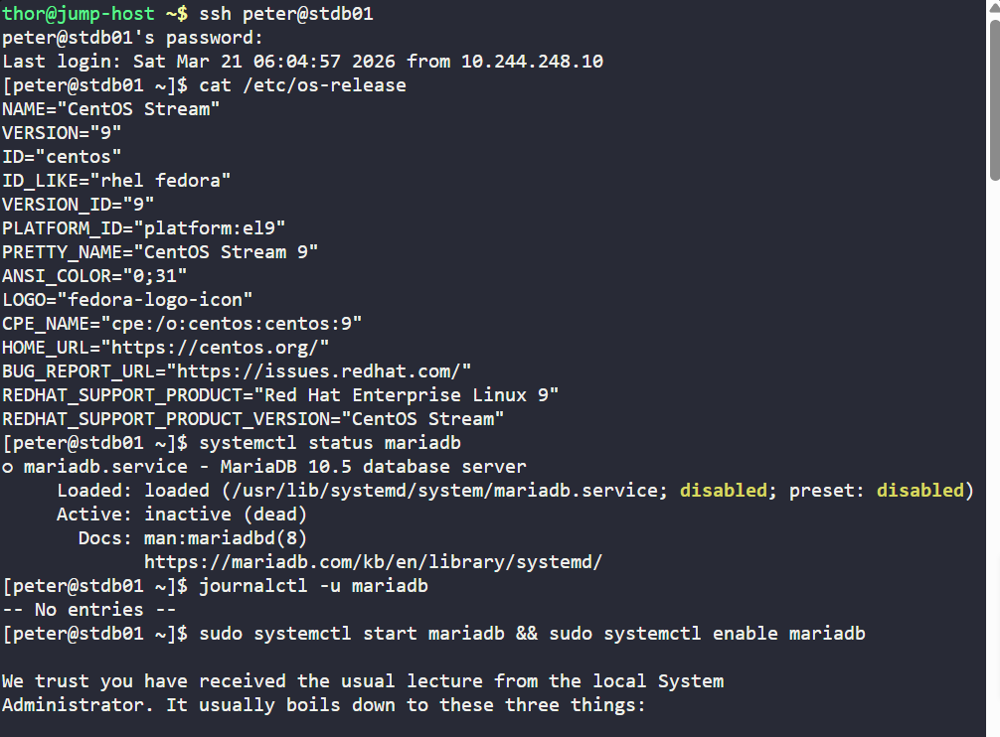
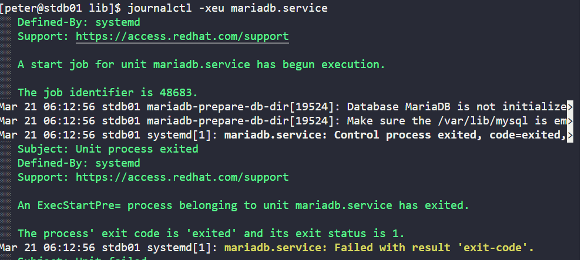
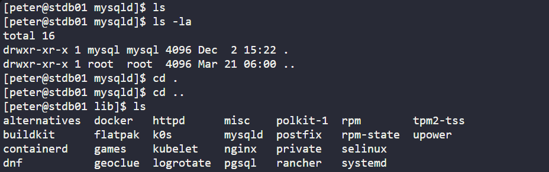
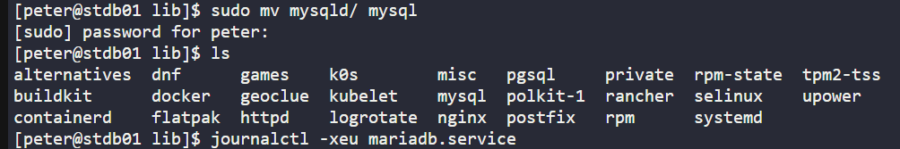
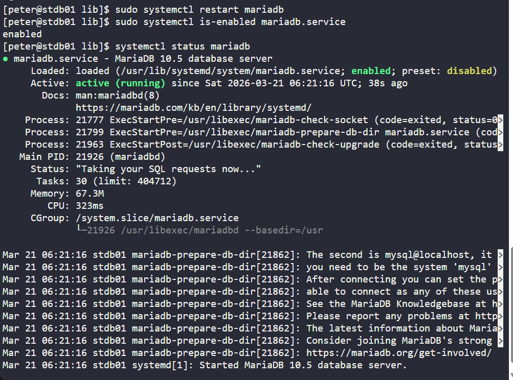

# Day 009 :shipit:

## Task
There is a critical issue going on with the Nautilus application in Stratos DC. The production support team identified that the application is unable to connect to the database. After digging into the issue, the team found that mariadb service is down on the database server.

Look into the issue and fix the same.
## Commands Used


```
systemctl status mariadb
journalctl -xeu mariadb.service
cd /var/lib
sudo mv mysqld mysql
sudo systemctl restart mariadb
systemctl status mariadb
sudo systemctl is-enabled mariadb.service

```
Login into the server check the maridb 
- 

Error from journalctl -xeu servicename
- 

No mysql dir present
- 

Created mysql with the root permission and check the status
- 

Check the status
- 

## What I Learned

- The application issue was caused by the `mariadb` service being down on the database server.
- MariaDB was failing during startup because the expected database directory name was incorrect.
- On this system, MariaDB expected the data directory as `/var/lib/mysql`, but the directory was present as `/var/lib/mysqld`.
- Renaming the directory back to `/var/lib/mysql` fixed the startup issue.
- After correcting the directory name, restarting the `mariadb` service brought the database back online.
- Verified that the service was running successfully and also enabled at boot.

## Notes

- `systemctl status mariadb` helps confirm whether the service is running or failed.
- `journalctl -xeu mariadb.service` is useful for checking the exact startup failure reason.
- `sudo mv /var/lib/mysqld /var/lib/mysql` corrected the expected MariaDB data directory path.
- `sudo systemctl restart mariadb` restarted the service after the fix.
- `sudo systemctl is-enabled mariadb.service` confirmed the service was enabled.
- A healthy MariaDB service shows `Active: active (running)`.


