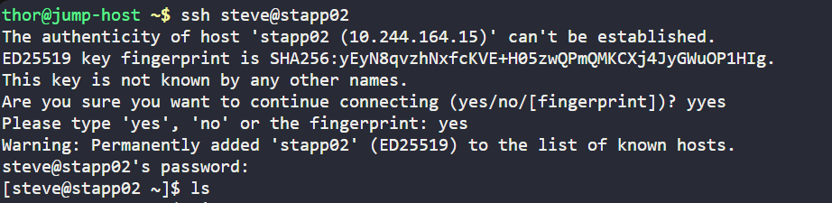
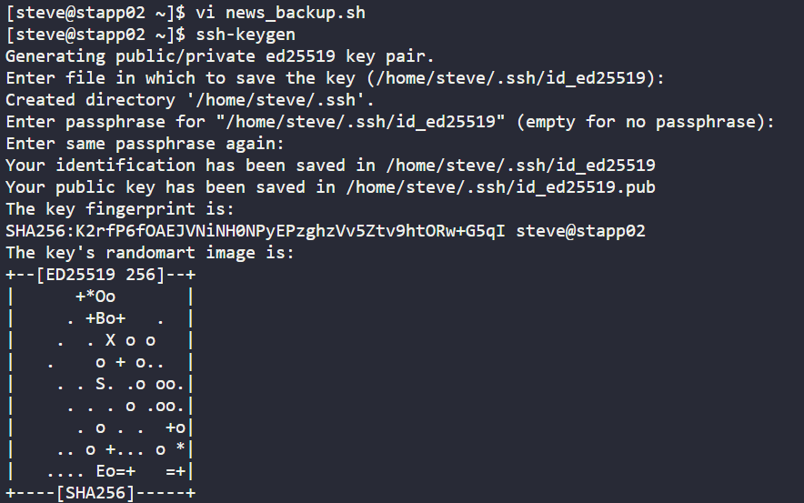
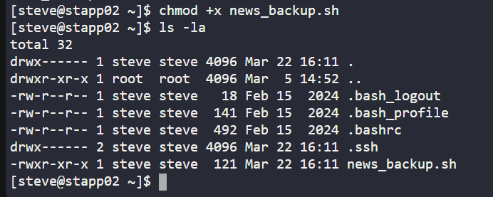
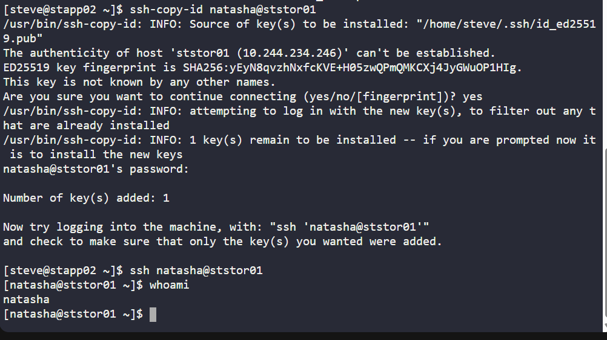
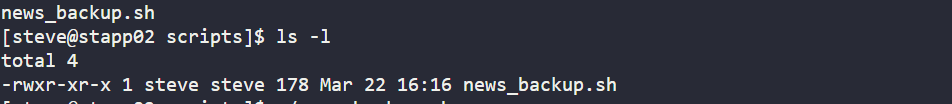
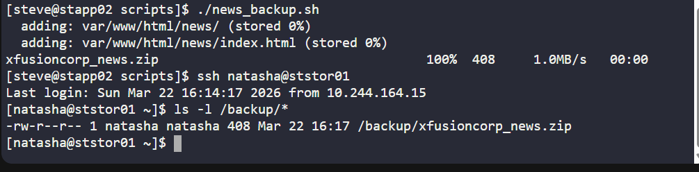
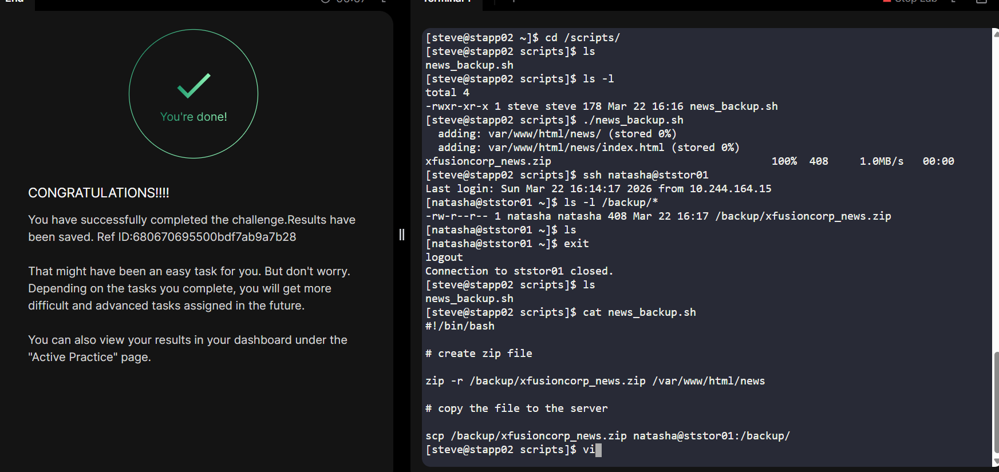

# Day 010 :shipit:

## Task

The production support team of xFusionCorp Industries is working on developing some bash scripts to automate different day to day tasks. One is to create a bash script for taking websites backup. They have a static website running on App Server 3 in Stratos Datacenter, and they need to create a bash script named media_backup.sh which should accomplish the following tasks. (Also remember to place the script under /scripts directory on App Server 3).

a. Create a zip archive named xfusioncorp_media.zip of /var/www/html/media directory.

b. Save the archive in /backup/ on App Server 3. This is a temporary storage, as backups from this location will be cleaned on a weekly basis. Therefore, we also need to save this backup archive on Nautilus Storage Server.

c. Copy the created archive to Nautilus Storage Server server in /backup/ location.

d. Please make sure script won't ask for password while copying the archive file. Additionally, the respective server user (for example, tony in case of App Server 1) must be able to run it.

e. Do not use sudo inside the script.

Note:
The zip package must be installed on given App Server before executing the script. This package is essential for creating the zip archive of the website files. Install it manually outside the script.

## Commands Used

```
yum install -y zip
mkdir -p /scripts
vi /scripts/media_backup.sh
chmod +x /scripts/media_backup.sh
ssh-keygen -t rsa -N "" -f /home/banner/.ssh/id_rsa
ssh-copy-id natasha@ststor01
su - banner -c /scripts/media_backup.sh
```
```
#!/bin/bash

# create zip file 
zip -r /backup/xfusioncorp_ecommerce.zip /var/www/html/ecommerce 

# copy to storage server via scp 
scp /backup/xfusioncorp_ecommerce.zip natasha@ststor01:/backup/ 
```

ssh into the server 
- 

created script and ssh-key
- 

changed file persmission
- 

stored the pub key to storage server and did the test login
- 

move the script the /scripts/ path
- 

check the file permission
- 

run the script and check the file is present on storage server
- 

## What I Learned

- A Bash script can automate website backup tasks like archiving and copying files to another server.
- The `zip` package must be installed before using the `zip` command.
- The `zip -r` command is used to create a recursive zip archive of a directory.
- The `scp` command is used to securely copy files from one server to another.
- Passwordless SSH must be configured so the script can copy files without asking for a password.
- In this task, the backup archive is first created locally in `/backup/` and then copied to the Nautilus Storage Server.
- The script should be executable and placed in the `/scripts` directory.
- `sudo` should not be used inside the script.

---

## Notes

- Created a backup script named `ecommerce_backup.sh` under `/scripts`.
- The script creates `xfusioncorp_ecommerce.zip` from `/var/www/html/ecommerce`.
- The zip archive is stored locally in `/backup/`.
- The archive is then copied to `ststor01:/backup/` using `scp`.
- Passwordless SSH is required to make sure the script runs non-interactively.
- The respective app server user must be able to execute the script successfully.

---



