# Day 011 :shipit:

## Task

The Nautilus application development team recently finished the beta version of one of their Java-based applications, which they are planning to deploy on one of the app servers in Stratos DC. After an internal team meeting, they have decided to use the tomcat application server. Based on the requirements mentioned below complete the task:

a. Install tomcat server on App Server 2.

b. Configure it to run on port 8088.

c. There is a ROOT.war file on Jump host at location /tmp.

Deploy it on this tomcat server and make sure the webpage works directly on base URL i.e curl http://stapp02:8088

## Commands Used

```
sudo yum install -y tomcat tomcat-webapps tomcat-admin-webapps
sudo systemctl stop tomcat
sudo sed -i 's/Connector port="8080"/Connector port="8088"/' /etc/tomcat/server.xml
scp thor@jump_host:/tmp/ROOT.war /tmp/ROOT.war
sudo cp /tmp/ROOT.war /var/lib/tomcat/webapps/ROOT.war
sudo systemctl start tomcat
sudo systemctl enable tomcat
curl http://stapp02:8088

```

ssh into the server and run the update then install tomcat

- 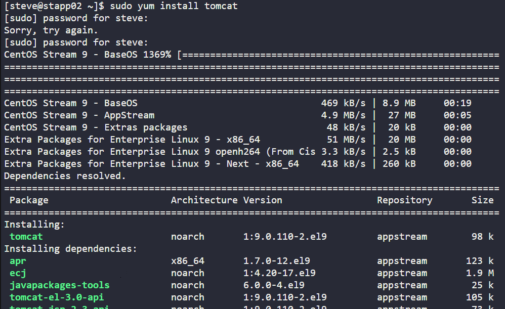

check the tomcat version
- 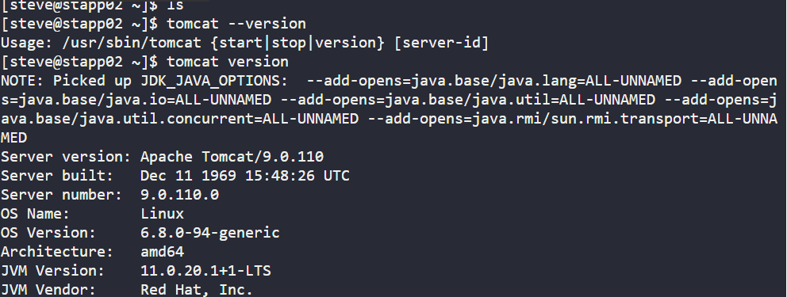

cd into the config file of tomcat to for port update
- 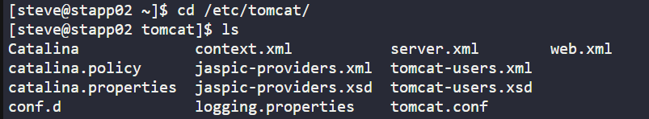

checked tomcat status
- 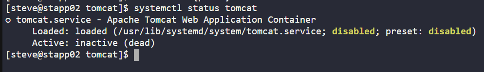

installed iproute for centos / iproute2 for ubuntu (installed to use ss )
- 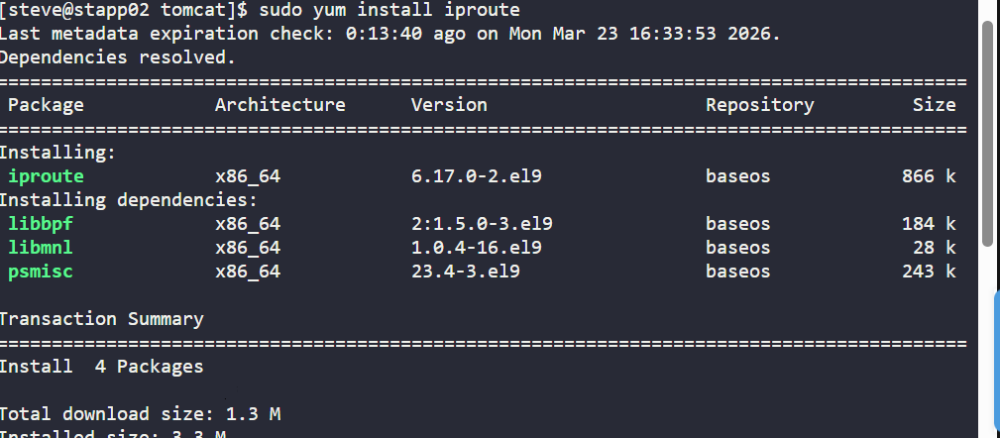

check the line number where connector port is written
- 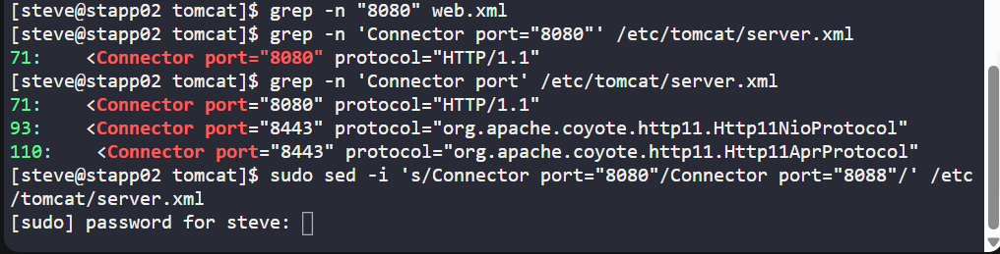

updated the port using sed stream editor
- 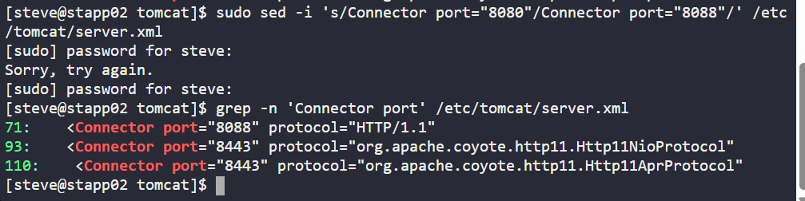

copy the file from jump server to the appserver2
- 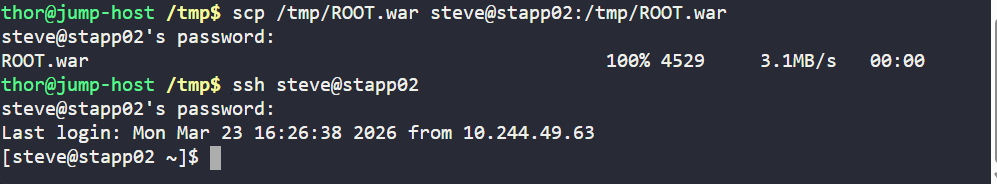

copy the ROOT.war to tomcat file
- 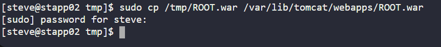

enable and start the tomcat
- 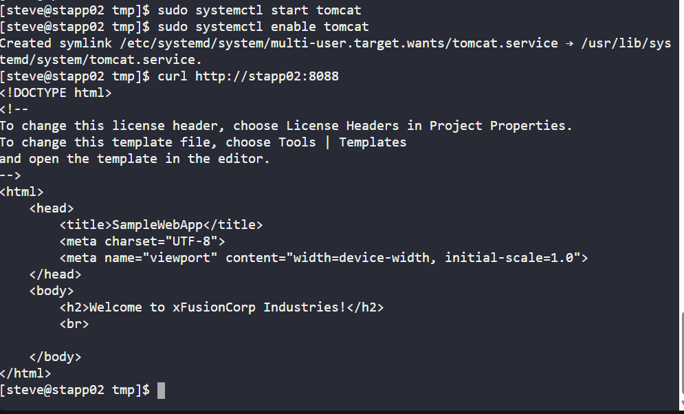


## What I Learned

- Apache Tomcat is a Java application server used to deploy and run Java web applications.
- Tomcat can be installed on CentOS/RHEL systems using `yum`.
- The main Tomcat configuration file is `server.xml`.
- Tomcat listens on port `8080` by default, but this can be changed by editing the connector port in `server.xml`.
- The `systemctl` command is used to stop and start the Tomcat service.
- The `sed` command can be used to update configuration values directly from the command line.
- A `.war` file is a web application archive used to deploy Java applications on Tomcat.
- Deploying the application as `ROOT.war` makes it accessible directly from the base URL.

## Notes

- Installed Tomcat and related web application packages on **App Server 2**.
- Stopped the Tomcat service before updating the configuration.
- Changed the Tomcat port from **8080** to **8088**.
- Learned that the port can also be changed manually by editing `/etc/tomcat/server.xml` with `vi`.
- The application needs to be deployed as `ROOT.war` so it works directly on `http://stapp02:8088`.


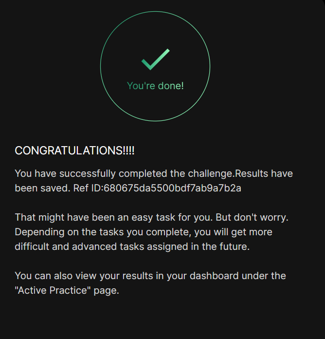