# Day 012 :shipit:

## Task
Our monitoring tool has reported an issue in Stratos Datacenter. One of our app servers has an issue, as its Apache service is not reachable on port 5002 (which is the Apache port). The service itself could be down, the firewall could be at fault, or something else could be causing the issue.

Use tools like telnet, netstat, etc. to find and fix the issue. Also make sure Apache is reachable from the jump host without compromising any security settings.

Once fixed, you can test the same using command curl http://stapp02:5002 command from jump host.

Note: Please do not try to alter the existing index.html code, as it will lead to task failure.
## Commands Used

```
ssh tony@stapp01
sudo systemctl status httpd
sudo ss -tulpn | grep 5002
sudo grep -R "^Listen" /etc/httpd/conf /etc/httpd/conf.d
sudo systemctl stop sendmail
sudo systemctl disable sendmail
sudo systemctl start httpd
sudo systemctl restart httpd
curl http://stapp01:5002 | wc -l
ss -tulpn | grep 5002
sudo iptables -L -n
sudo iptables -I INPUT -p tcp --dport 5002 -j ACCEPT
curl http://stapp01:5002 | wc -l

```

check the connection to each server
- 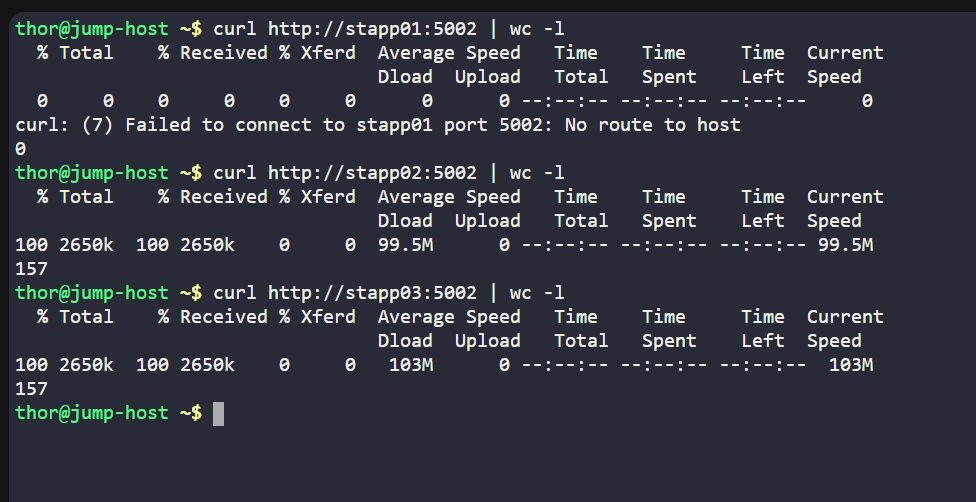

catch httpd is broken on server 1 and ssh into app1

check the httpd status
- 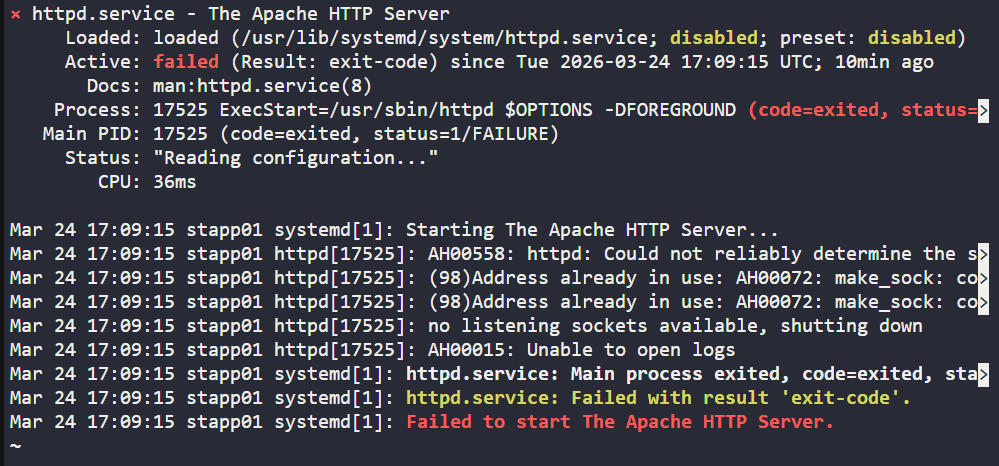

logs
- 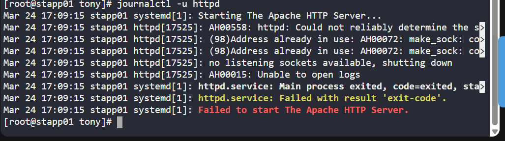

port mapping is wrong
- 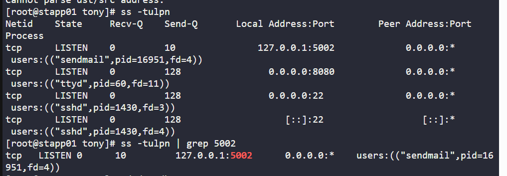

cd into the config file of httpd
- 

grep the word listen in file and Port mapping is fine
- 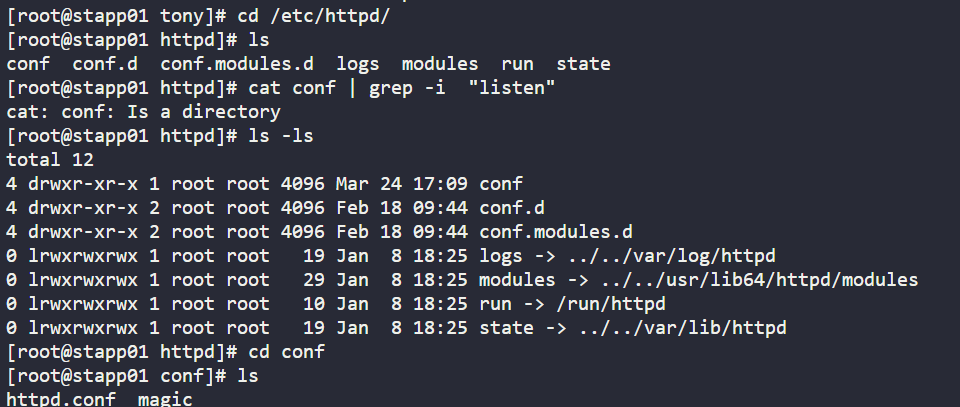

since port is occupied by sendmail check the status for it
- 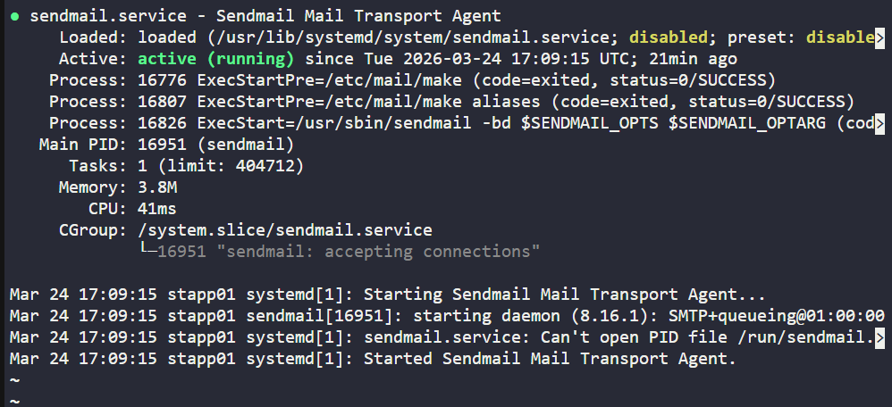

stop the sendmail and check the status
- 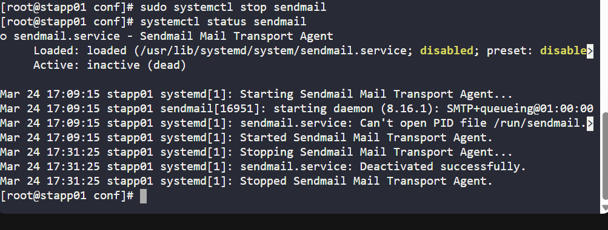

restart the httpd and check the status
- 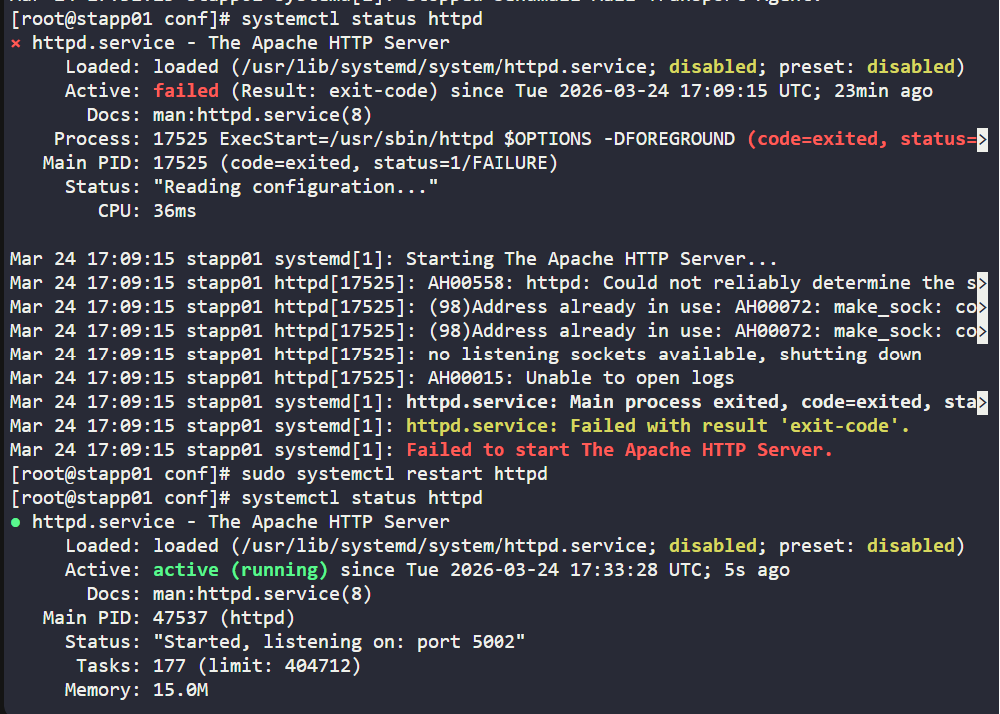

check on server the port and curl
- 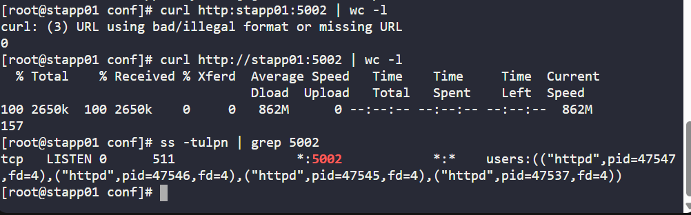

check on jump server failed : error : no route to host
- 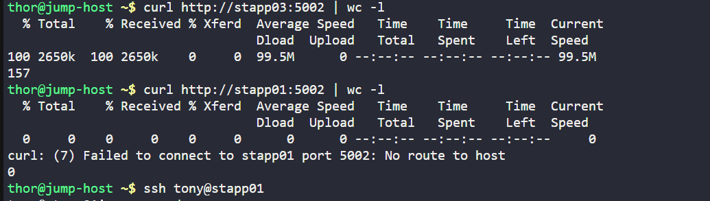

ssh back into the server and check route table / incoming traffic blocked
- 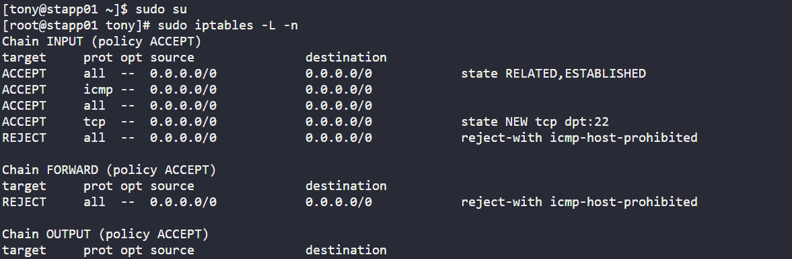

add the rule to allow the incoming traffic on port 5002 and check the status
- 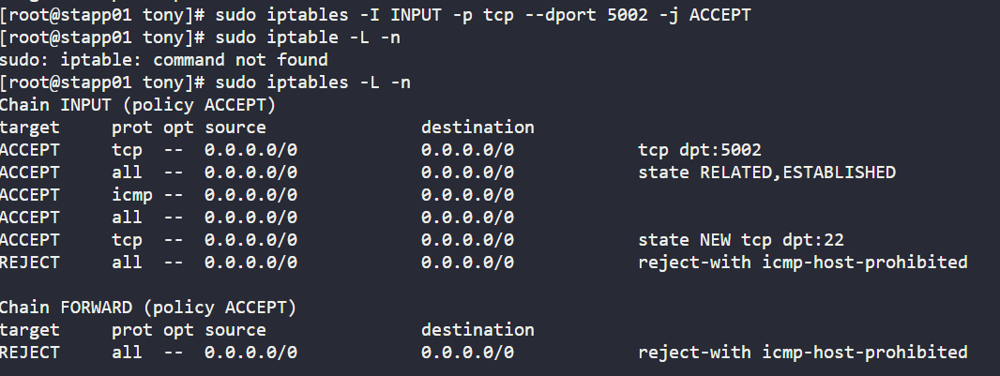

and it worked after changing the last part iproutes
- 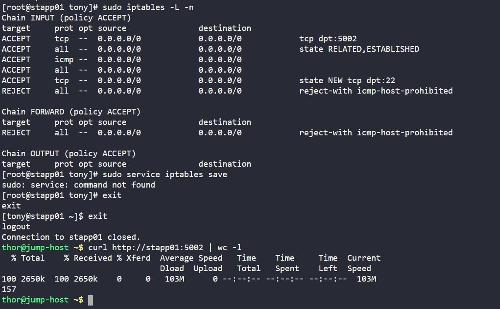


## What I Learned

- The `ss -tulpn` command helps identify which service is listening on a specific port.
- `sendmail` was occupying port `5002`, which prevented Apache from using that port.
- Apache must be configured to listen on the required port in `/etc/httpd/conf/httpd.conf`.
- The `systemctl` command is used to manage services like `httpd` and `sendmail`.
- A service working locally does not always mean it is reachable remotely.
- `iptables` rules can block incoming traffic even when Apache is running correctly.
- The `REJECT` rule in `iptables` was causing the `No route to host` error from the jump host.
- Adding an `ACCEPT` rule for port `5002` allowed external access to the Apache service.

## Notes

- Checked Apache service status and verified the listening port on **App Server 1**.
- Found that `sendmail` was listening on port `5002` instead of `httpd`.
- Stopped and disabled `sendmail` so Apache could use port `5002`.
- Confirmed Apache was listening on `5002` after restarting the service.
- Verified that the webpage worked locally on `stapp01`.
- Found that remote access was still blocked because of `iptables`.
- Added an inbound `iptables` rule to allow TCP traffic on port `5002`.
- After updating the firewall rule, Apache became reachable from the jump host.

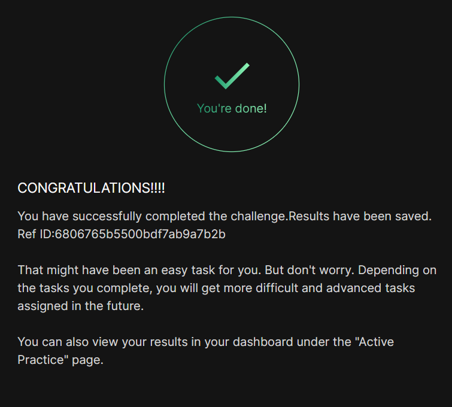