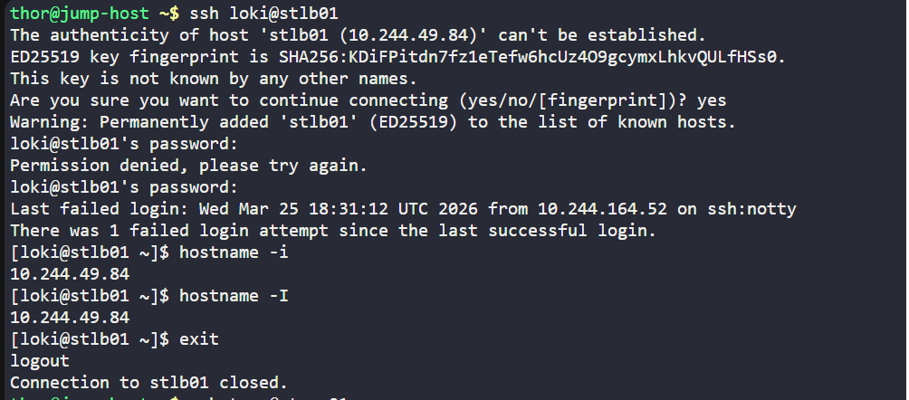
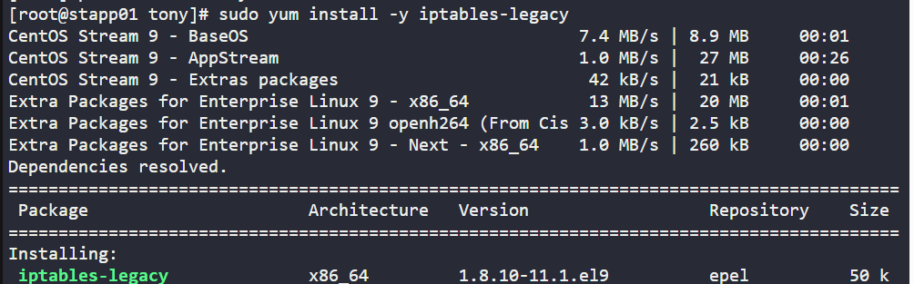
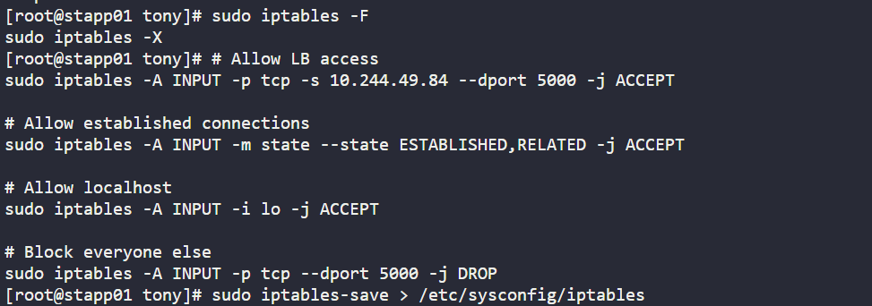
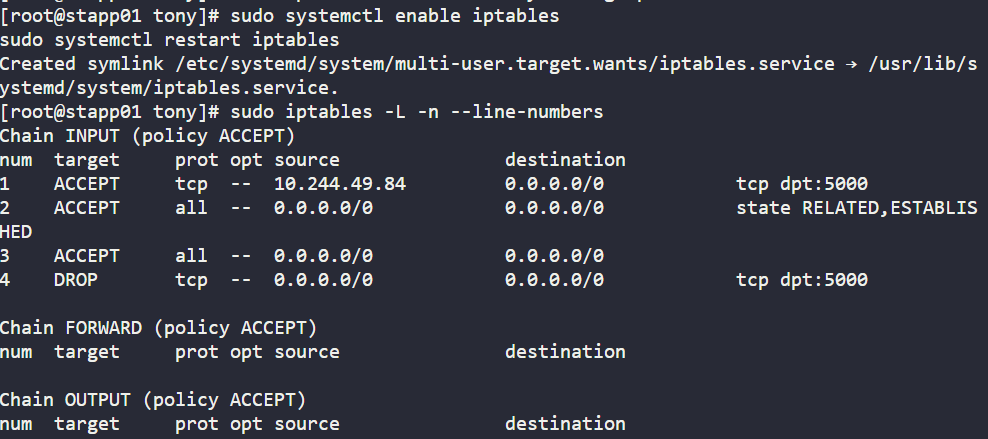
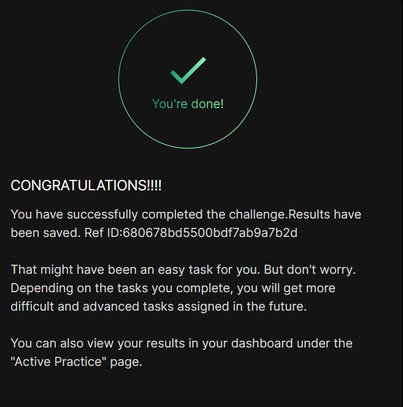

# Day 013 :shipit:

## Task

We have one of our websites up and running on our Nautilus infrastructure in Stratos DC. Our security team has raised a concern that right now Apache’s port i.e 8089 is open for all since there is no firewall installed on these hosts. So we have decided to add some security layer for these hosts and after discussions and recommendations we have come up with the following requirements:


1. Install iptables and all its dependencies on each app host.


2. Block incoming port 8089 on all apps for everyone except for LBR host.


3. Make sure the rules remain, even after system reboot.

## Commands Used

```
step0 get the hostip of loadbalaner from lb server
hostname -I

Step 1: Install iptables
sudo yum install -y iptables-legacy

Step 2: Clean Existing Rules
sudo iptables -F
sudo iptables -X

Step 3: Configure Firewall Rules
# Allow traffic from Load Balancer
sudo iptables -A INPUT -p tcp -s 10.244.49.84 --dport 5000 -j ACCEPT

# Allow established connections
sudo iptables -A INPUT -m state --state ESTABLISHED,RELATED -j ACCEPT

# Allow localhost traffic
sudo iptables -A INPUT -i lo -j ACCEPT

# Block all other traffic on port 5000
sudo iptables -A INPUT -p tcp --dport 5000 -j DROP


Step 4: Save Rules (Persistence)
sudo iptables-save > /etc/sysconfig/iptables


Step 5: Enable & Restart Service
sudo systemctl enable iptables
sudo systemctl restart iptables


Step 6: Verify Rules
sudo iptables -L -n --line-numbers


```


ssh into lb get the host ip



ssh into the server install iptables
- 

delete old rules/save new rules/ save to config
- 

enable and start iptables and check the iptables output
- 

repeat the same on other app servers
## What I Learned

## Notes


