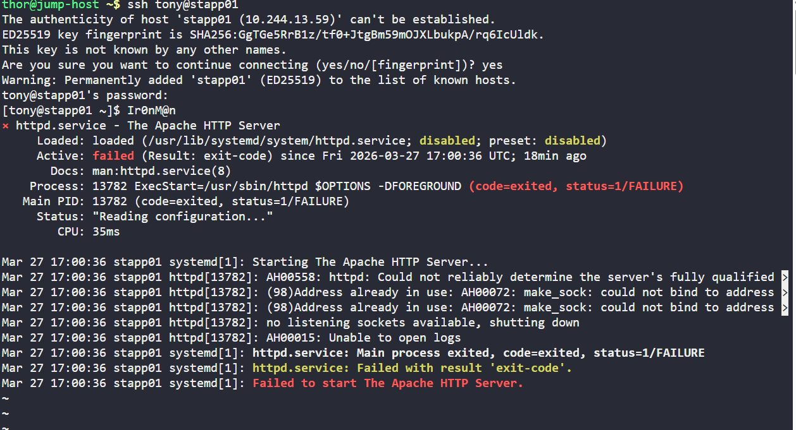
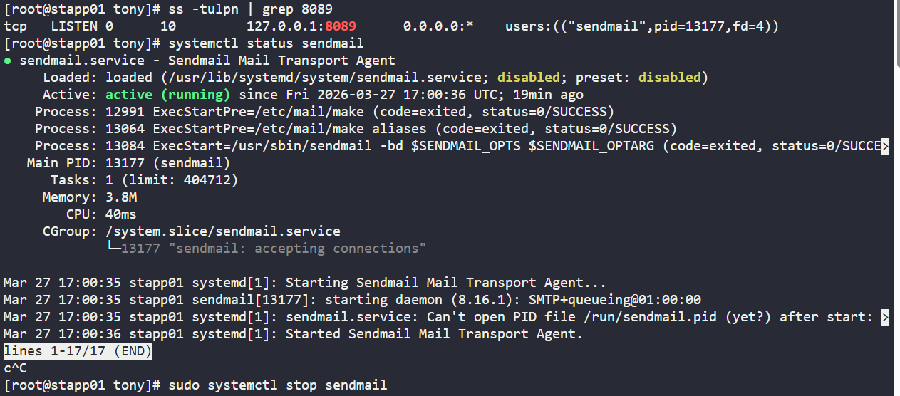
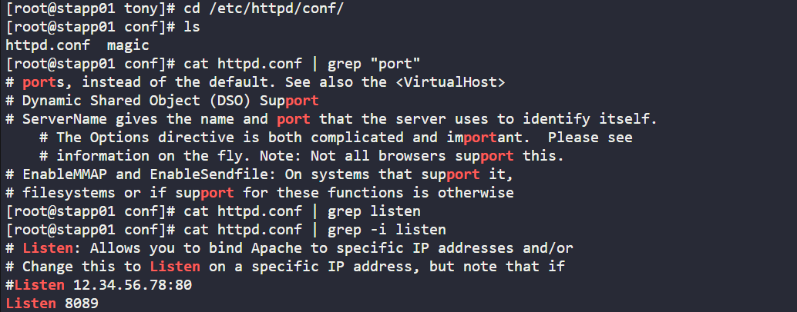
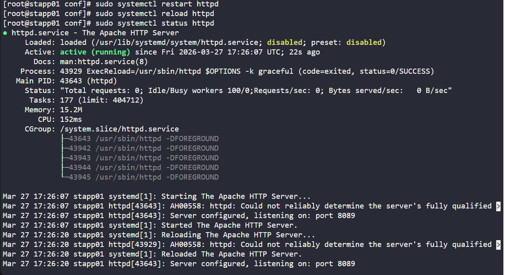
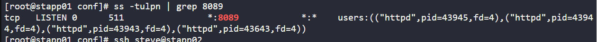

# Day 014 :shipit:

## Task
The production support team of xFusionCorp Industries has deployed some of the latest monitoring tools to keep an eye on every service, application, etc. running on the systems. One of the monitoring systems reported about Apache service unavailability on one of the app servers in Stratos DC.

Identify the faulty app host and fix the issue. Make sure Apache service is up and running on all app hosts. They might not have hosted any code yet on these servers, so you don't need to worry if Apache isn't serving any pages. Just make sure the service is up and running. Also, make sure Apache is running on port 8089 on all app servers.
## Commands Used


```
ssh tony@stapp01
sudo systemctl status httpd
ss -tulpn | grep 8089
sudo systemctl stop sendmail
sudo systemctl restart httpd
ss -tulpn | grep 8089

ssh steve@stapp02
sudo systemctl status httpd
ss -tulpn | grep 8089

ssh banner@stapp03
sudo systemctl status httpd
ss -tulpn | grep 8089

```
ssh into the server checked the httpd status /port mapping is wrong
- 

verified the port and check the service which is using port and stop it
- 

cd into the config file for httpd and grep the listen port in config file
- 

restarted and reload the service httpd
- 


verify the port 
- 

performed the same steps on other apps servers
## What I Learned

The error "Address already in use" indicates a port conflict.

ss -tulpn helps identify which service is using a specific port.

Another service (like sendmail) can block Apache from starting.

Apache must be running on the required port (8089) on all servers.

Restarting the service after fixing conflicts is necessary.

## Notes

The error "Address already in use" indicates a port conflict.

ss -tulpn helps identify which service is using a specific port.

Another service (like sendmail) can block Apache from starting.

Apache must be running on the required port (8089) on all servers.

Restarting the service after fixing conflicts is necessary.