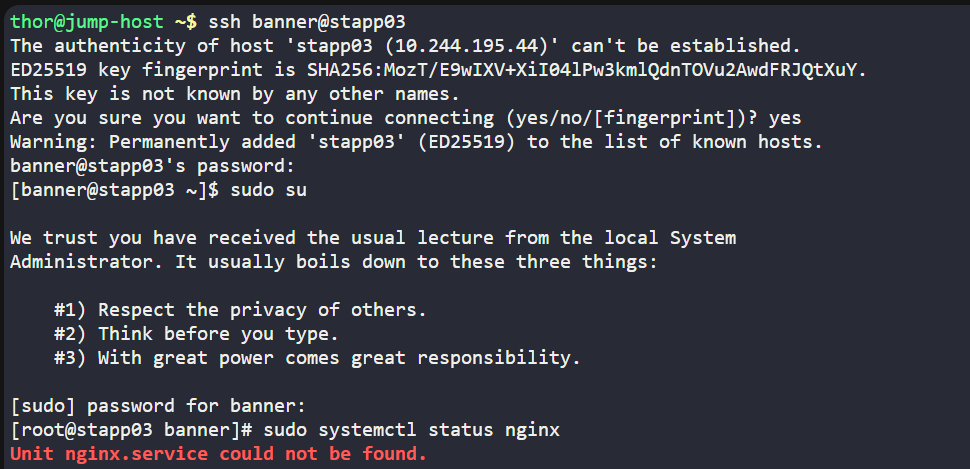
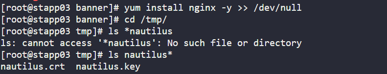
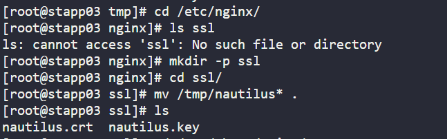
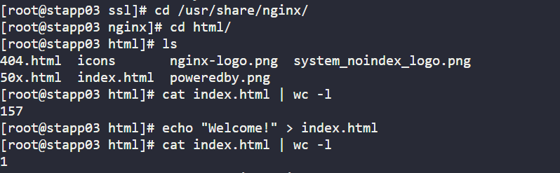
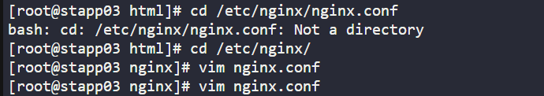
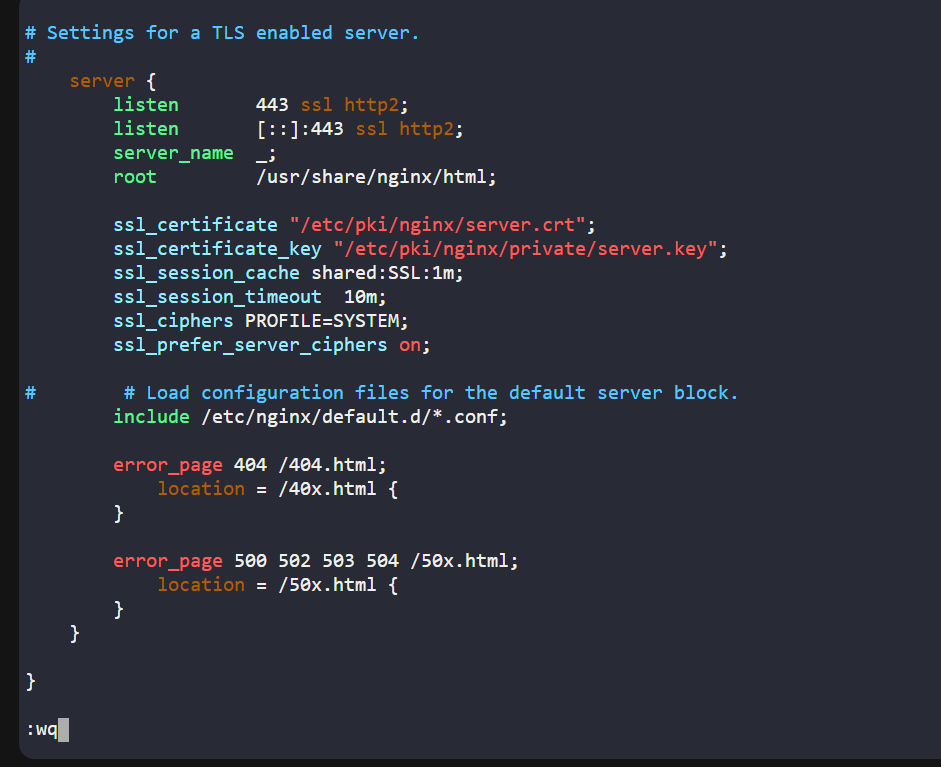
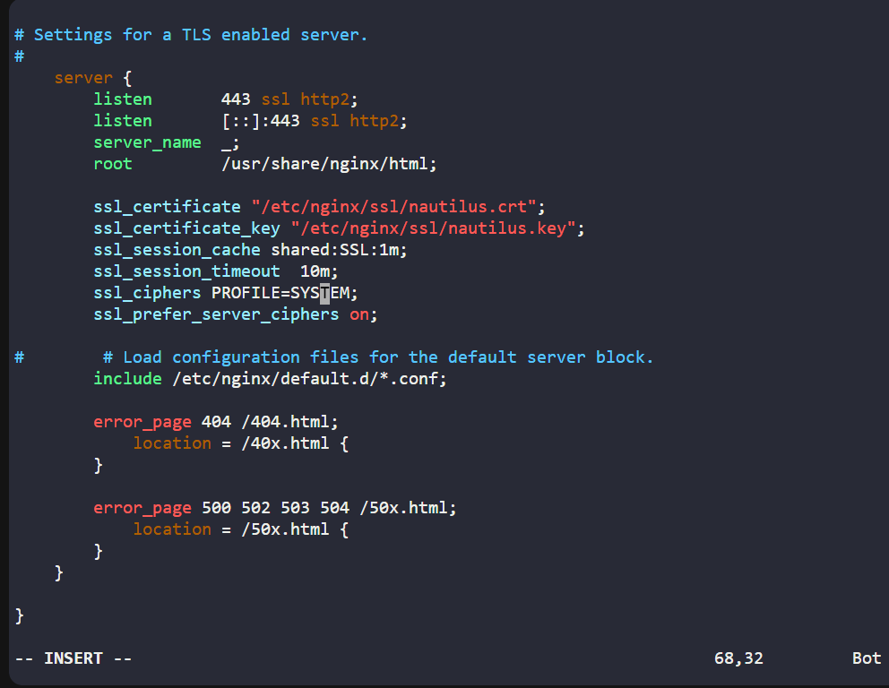
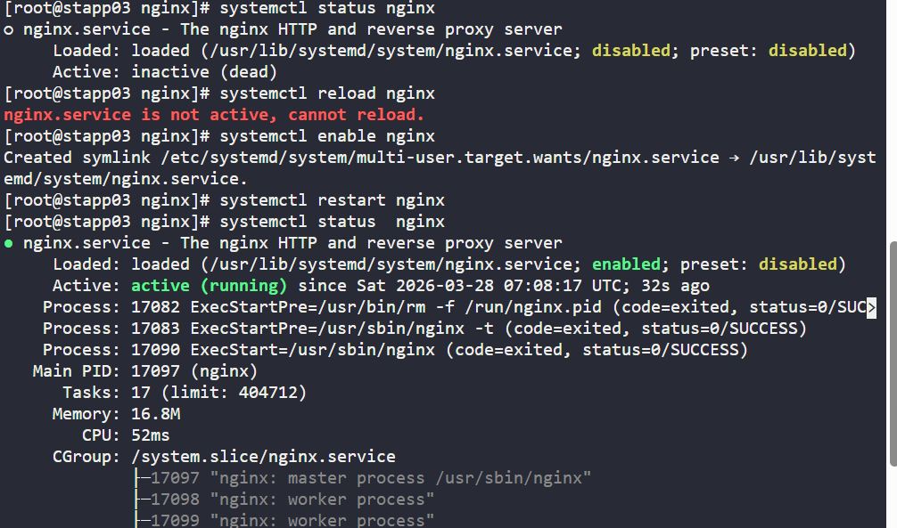
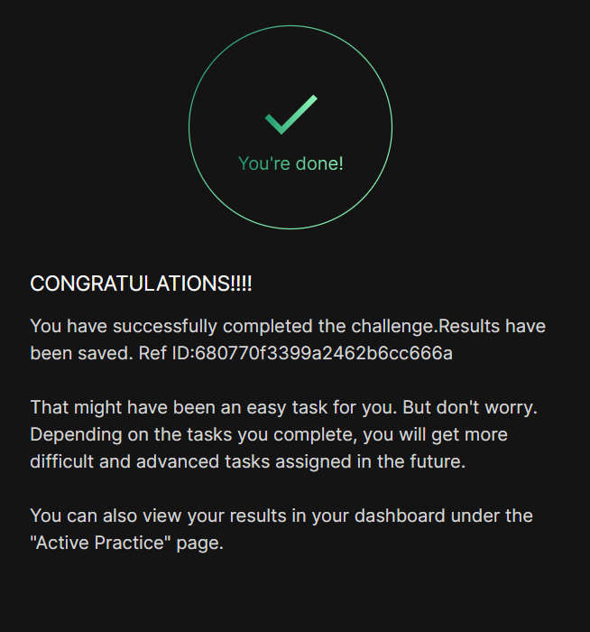

# Day 015 :shipit:

## Task

The system admins team of xFusionCorp Industries needs to deploy a new application on App Server 2 in Stratos Datacenter. They have some pre-requites to get ready that server for application deployment. Prepare the server as per requirements shared below:

1. Install and configure nginx on App Server 2.

2. On App Server 2 there is a self signed SSL certificate and key present at location /tmp/nautilus.crt and /tmp/nautilus.key. Move them to some appropriate location and deploy the same in Nginx.

3. Create an index.html file with content Welcome! under Nginx document root.

4. For final testing try to access the App Server 2 link (via hostname) from jump host using curl command. For example: curl -Ik https://<app-server-name>/.

## Commands Used


```
sudo yum install -y nginx
sudo systemctl start nginx
sudo systemctl enable nginx

sudo mkdir -p /etc/nginx/ssl
sudo mv /tmp/nautilus.crt /etc/nginx/ssl/
sudo mv /tmp/nautilus.key /etc/nginx/ssl/

echo "Welcome!" | sudo tee /usr/share/nginx/html/index.html

sudo vi /etc/nginx/nginx.conf (update the path for https and cert key paths)
sudo systemctl restart nginx


```

ssh into the server and check the nginx status
- 

go to the given path check the files 
- 

move the cert and key to the /etc/nginx/ssl/ created the dir ssl and moved the cert and key into them
- 

go the /usr/share/nginx/html/ check the index.html file and udpate the same
- 

go to the /etc/nginx/ path updated the nginx.config file with ssl enabled updated the path
- 
updated the the path and enable the nginx.config file 
before - 
after- 

check the nginx status/enable/restart the service
- 

## What I Learned

- Nginx can be configured to serve HTTPS using SSL certificates.
- The `listen 443 ssl` directive enables HTTPS on port 443.
- Default Nginx SSL certificate paths must be replaced with custom certificates when provided.
- Certificates and keys should be stored in a proper directory like `/etc/nginx/ssl/`.
- Nginx must be restarted after configuration changes for them to take effect.
- `curl -Ik https://<hostname>` can be used to test HTTPS connectivity and headers.

## Notes

- Installed and started Nginx on **App Server 2**.
- Moved provided SSL certificate and key from `/tmp` to `/etc/nginx/ssl/`.
- Updated Nginx configuration to use `nautilus.crt` and `nautilus.key`.
- Created a simple `index.html` with content **Welcome!**.
- Restarted Nginx to apply SSL configuration.
- Verified HTTPS access locally and from jump host using curl.



