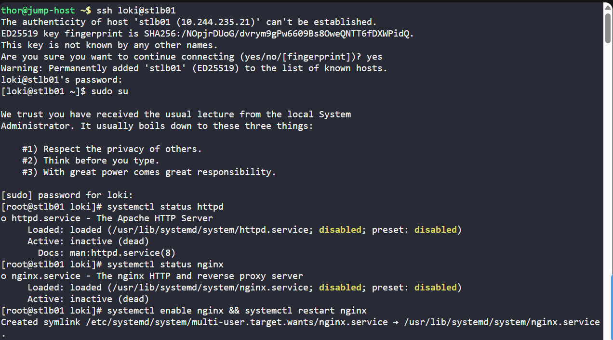

# Day 016 :shipit:

## Task

Day by day traffic is increasing on one of the websites managed by the Nautilus production support team. Therefore, the team has observed a degradation in website performance. Following discussions about this issue, the team has decided to deploy this application on a high availability stack i.e on Nautilus infra in Stratos DC. They started the migration last month and it is almost done, as only the LBR server configuration is pending. Configure LBR server as per the information given below:

a. Install nginx on the LBR (load balancer) server if it is not already installed.

b. Configure load-balancing with the http context making use of all App Servers. Ensure that you update only the main Nginx configuration file located at /etc/nginx/nginx.conf.

c. Make sure you do not update the apache port that is already defined in the apache configuration on all app servers, also make sure apache service is up and running on all the app servers.

d. Once done, you can access the website by running curl http://stlb01:80 in the terminal.

## Commands Used


ssh into the server check the status for the nginx
- 

ssh into the app server check the httpd server listing port  3007

back to lbserver edit the nginx-config file as below to server as lb to all app servers


after this reloaded/restart/enable nginx

go to each app server check status/enable/restart/reload httpd on all server

all check the ss -tulpn 

last on app server use curl http://stlb1:80

# Nginx Load Balancer Lab Notes

## What I Learned
- How to set up **Nginx as a reverse proxy** for multiple backend servers.
- How to configure the **upstream module** in Nginx to load balance requests.
- How to enable and manage services with **systemctl**.
- How to verify if Nginx and Apache are running and listening on the correct ports.
- How to test the load balancer using `curl` to ensure traffic is correctly routed to backend servers.
- Basics of checking **active connections** with `ss -tulpn`.

---

## Commands Used

### On Load Balancer (`stlb01`)
```
# SSH into load balancer
ssh loki@stlb01

# Switch to root
sudo su

# Check service status
systemctl status nginx
systemctl status httpd

# Enable and restart Nginx
systemctl enable nginx
systemctl restart nginx

# Test Nginx configuration
nginx -t

# Reload Nginx after config changes
systemctl reload nginx

# Verify listening ports
ss -tulpn
```

```
ON APP servers

# SSH into each app server
ssh tony@stapp01
ssh steve@stapp02
ssh banner@stapp03

# Switch to root
sudo su

# Check Apache service status
systemctl status httpd

# Enable and restart Apache
systemctl enable httpd
systemctl restart httpd
systemctl reload httpd

# Verify listening ports
ss -tulpn
```

```
# Test from any server or jump host
curl http://stlb01:80

``

Notes

Nginx configuration syntax must always be checked using nginx -t.

Backend servers must be reachable and running Apache on the configured port (3004 in this lab).

Nginx upstream directive allows simple round-robin load balancing by default.

Include directives in nginx.conf allow modular configuration.

Always enable services with systemctl enable <service> to start on boot.

ss -tulpn is helpful to verify listening ports and processes.

Round-robin behavior can be tested by repeatedly hitting the load balancer with curl.


updated nginx-config file as below

```
include /etc/nginx/conf.d/*.conf;

upstream app_servers {
    server stapp01:3004;
    server stapp02:3004;
    server stapp03:3004;
}

server {
    listen       80;
    listen       [::]:80;
    server_name  _;

    location / {
        proxy_pass http://app_servers;
    }

    error_page 404 /404.html;
    location = /404.html {
    }

    error_page 500 502 503 504 /50x.html;
    location = /50x.html {
    }
}
```