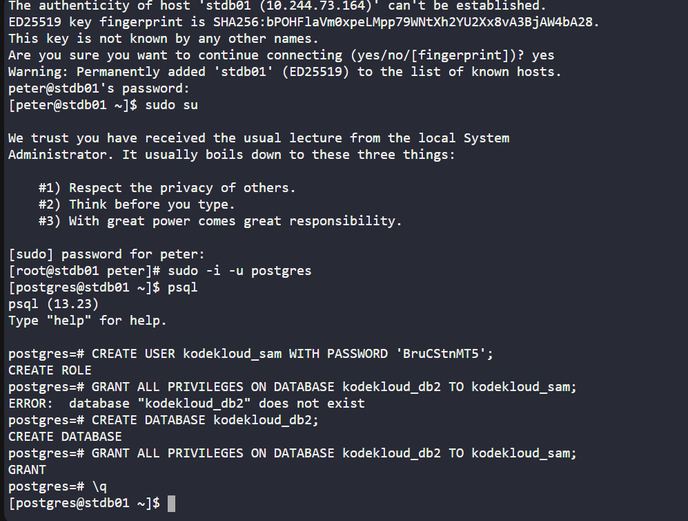

# Day 017 :shipit:

## Task

The Nautilus application development team has shared that they are planning to deploy one newly developed application on Nautilus infra in Stratos DC. The application uses PostgreSQL database, so as a pre-requisite we need to set up PostgreSQL database server as per requirements shared below:

PostgreSQL database server is already installed on the Nautilus database server.

a. Create a database user kodekloud_sam and set its password to BruCStnMT5.

b. Create a database kodekloud_db2 and grant full permissions to user kodekloud_sam on this database.

Note: Please do not try to restart PostgreSQL server service.

## Commands Used

```
# Switch to postgres user
sudo -i -u postgres

# Open PostgreSQL shell
psql

# Create user with password
CREATE USER kodekloud_sam WITH PASSWORD 'BruCStnMT5';

# Create database
CREATE DATABASE kodekloud_db2;

# Grant privileges
GRANT ALL PRIVILEGES ON DATABASE kodekloud_db2 TO kodekloud_sam;

# Exit PostgreSQL shell
\q
```


## What I Learned
- How to switch to the PostgreSQL superuser using `sudo -i -u postgres`
- How to access the PostgreSQL interactive shell using `psql`
- How to create a new database user with a secure password
- How to create a new PostgreSQL database
- How to grant full privileges on a database to a specific user
- Understanding that PostgreSQL changes like user and database creation do not require a service restart

## Notes
- Always run PostgreSQL administrative commands as the `postgres` user
- Use strong passwords when creating database users
- The command `GRANT ALL PRIVILEGES ON DATABASE` gives full access to the specified database only
- No need to restart PostgreSQL after creating users or databases
- Use `\q` to safely exit the PostgreSQL shell


