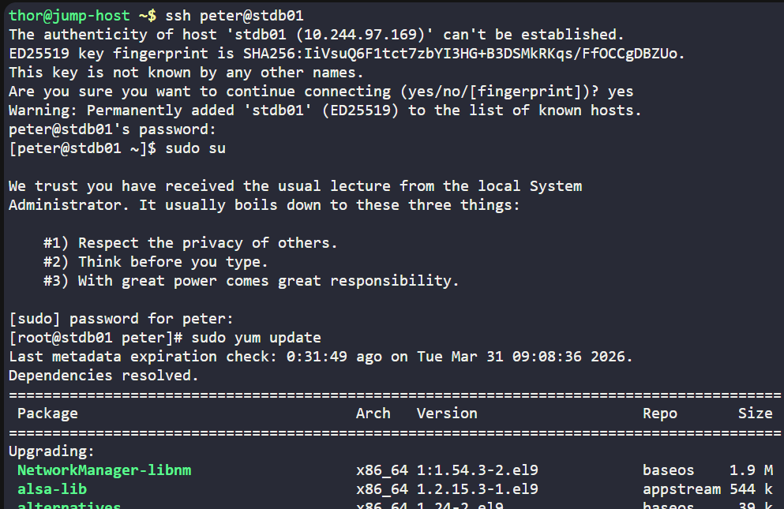
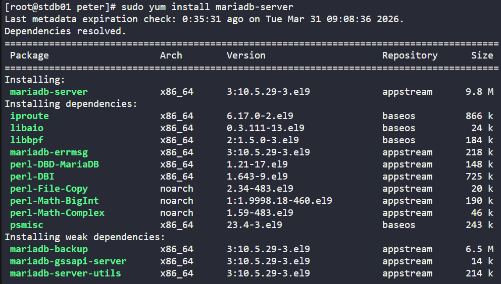
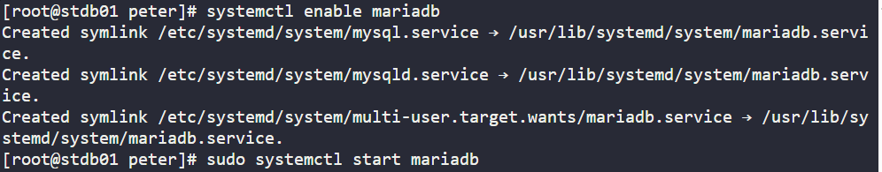
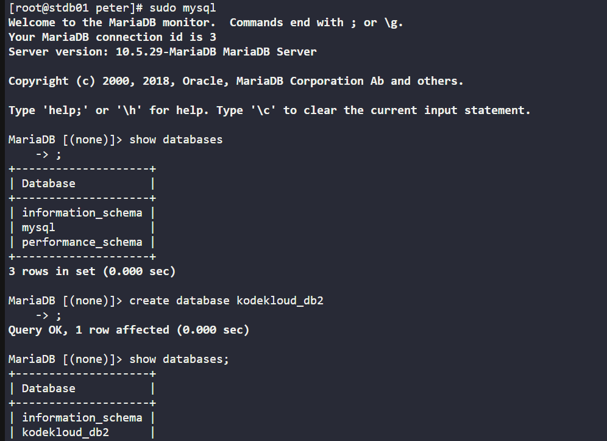
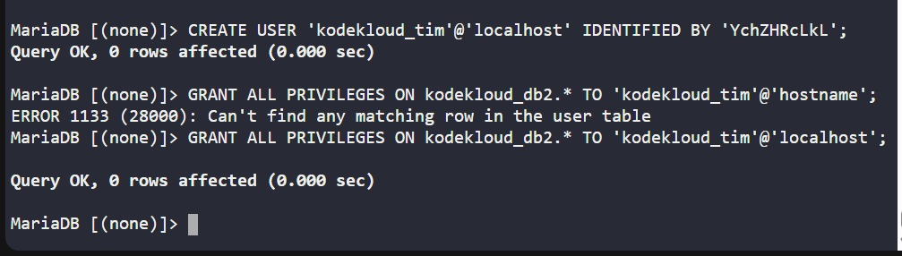
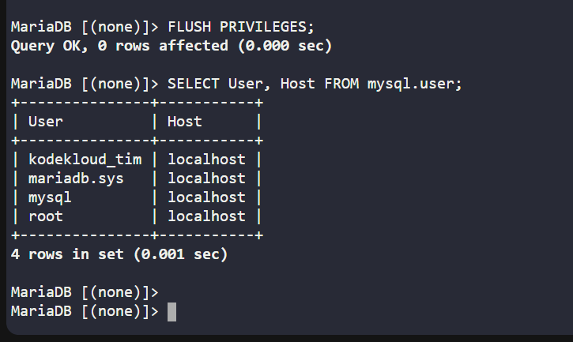

# Day 018 :shipit:

## Task

We need to setup a database server on Nautilus DB Server in Stratos Datacenter. Please perform the below given steps on DB Server:

a. Install/Configure MariaDB server.

b. Create a database named kodekloud_db2.

c. Create a user called kodekloud_tim and set its password to YchZHRcLkL.

d. Grant full permissions to user kodekloud_tim on database kodekloud_db2.

## Commands Used

```
sudo yum install -y mariadb-server
sudo systemctl start mariadb
sudo systemctl enable mariadb
sudo mysql


CREATE DATABASE kodekloud_db2;
CREATE USER 'kodekloud_tim'@'localhost' IDENTIFIED BY 'YchZHRcLkL';
GRANT ALL PRIVILEGES ON kodekloud_db2.* TO 'kodekloud_tim'@'localhost';
FLUSH PRIVILEGES;
EXIT;

```

ssh into the server update the server
- 

install mariadb-server not mariadb
- 

enable/start/status on mariadb
- 

go into the mysql check the databases/create new database/check again
- 

created user with the password/ granted the permission
- 

save the changes and check the user
- 
## What I Learned


-   Difference between MariaDB client (mariadb) and server (mariadb-server).
-   How to install and manage database services using yum.
-   How to start and enable services using systemctl.
-   Basic database administration:
        Creating a database
        Creating users
        Granting privileges
-   Importance of FLUSH PRIVILEGES to apply permission changes.

## Notes

Installing only mariadb does not set up a database server.

Always ensure the MariaDB service is running before accessing it.

Default login can be done using:
```
sudo mysql
```
SQL commands used:
```
CREATE DATABASE kodekloud_db2;
CREATE USER 'kodekloud_tim'@'localhost' IDENTIFIED BY 'YchZHRcLkL';
GRANT ALL PRIVILEGES ON kodekloud_db2.* TO 'kodekloud_tim'@'localhost';
FLUSH PRIVILEGES;
```
Service management commands:
```
sudo systemctl start mariadb
sudo systemctl enable mariadb
```

