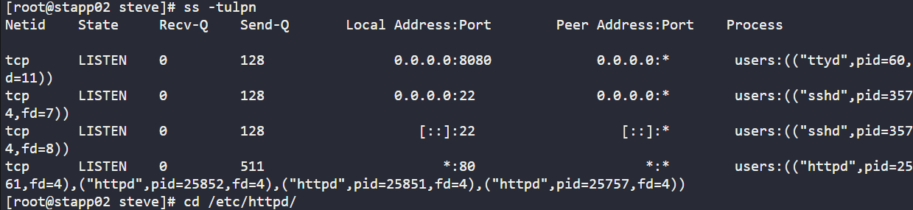
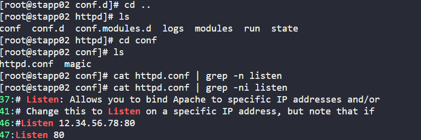
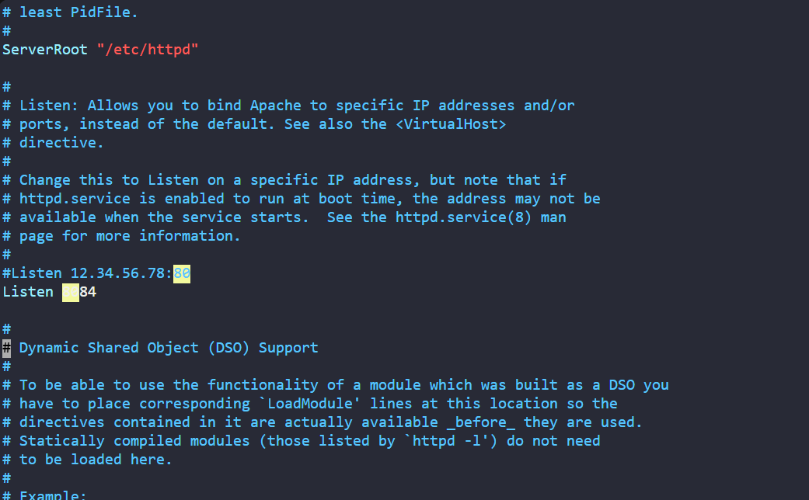
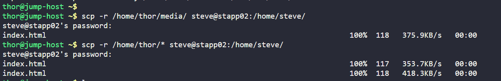
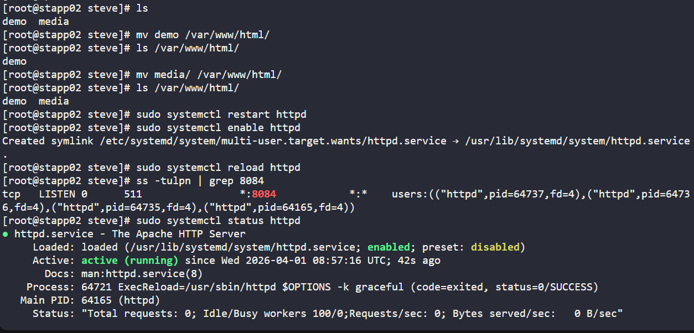
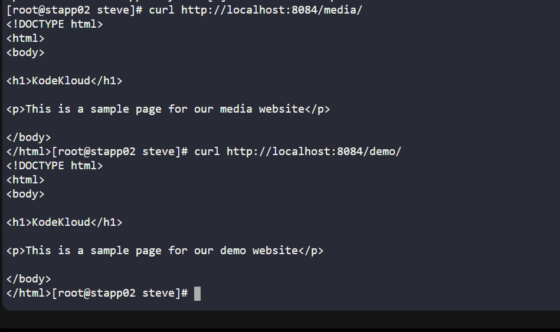
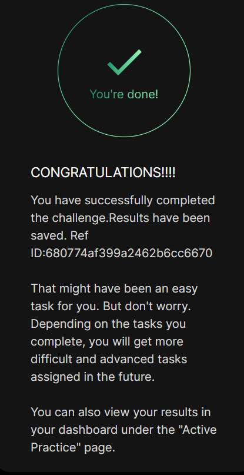

# Day 019 :shipit:

## Task

xFusionCorp Industries is planning to host two static websites on their infra in Stratos Datacenter. The development of these websites is still in-progress, but we want to get the servers ready. Please perform the following steps to accomplish the task:


a. Install httpd package and dependencies on app server 2.


b. Apache should serve on port 8084.


c. There are two website's backups /home/thor/media and /home/thor/demo on jump_host. Set them up on Apache in a way that media should work on the link http://localhost:8084/media/ and demo should work on link http://localhost:8084/demo/ on the mentioned app server.


d. Once configured you should be able to access the website using curl command on the respective app server, i.e curl http://localhost:8084/media/ and curl http://localhost:8084/demo/

## Commands Used

```
sudo yum install httpd -y
sudo systemctl start httpd
sudo systemctl enable httpd
ss -tulpn
sudo yum install iproute -y
sudo yum install iproute -y
scp -r /home/thor/* steve@stapp02:/home/steve/
sudo mv demo /var/www/html/
sudo mv media /var/www/html/
sudo systemctl restart httpd
sudo systemctl status httpd
ss -tulpn | grep 8084
curl http://localhost:8084/media/
curl http://localhost:8084/demo/

```

check the httpd listing port
- 

go to the httpd httpd.conf file and edit the port
- 

update the port
- 

copied the dir to the server 
- 

moved the demo and media file to /var/www/html path so httpd can pick the file and serve as the path /demo and /media

restarted/reload/enabled the httpd 

checked the port listening on and status for httpd
- 

check the localhost for /demo and /media
- 

## What I Learned

- Installed and configured Apache (httpd) on a Linux server
- Changed Apache default port from 80 to 8084
- Understood Apache directory structure (`/etc/httpd`, `/var/www/html`)
- Learned how to transfer files between servers using SCP
- Handled permission issues while copying files to protected directories
- Deployed multiple static websites using directory-based routing
- Verified services and ports using system tools
- Tested web endpoints using curl
- Troubleshooted missing packages and command errors

---

## Notes

- Apache runs on port 80 by default → needs manual change in config file
- Configuration file path:
  `/etc/httpd/conf/httpd.conf`
- Restart Apache after any config change
- Direct copy to `/var/www/html` may fail due to permissions
- Best practice: copy to home directory, then move using sudo
- `ss` command may not be available → install `iproute`
- Apache automatically serves content inside `/var/www/html`
- Minor command mistakes can break flow (`cd ..`, `ls`)
- FQDN warning in Apache is normal and non-blocking


