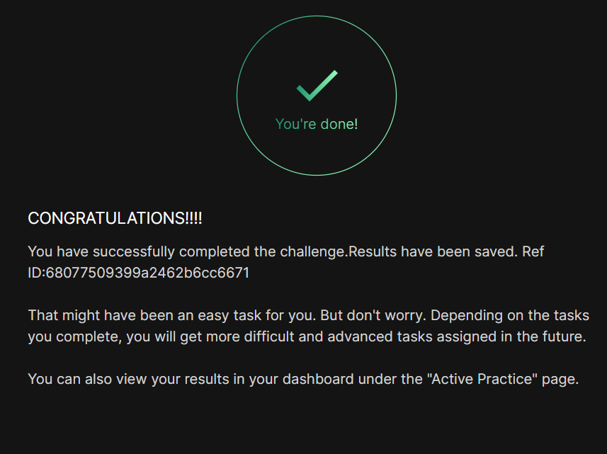

# Day 02 :shipit:

## Task

The `Nautilus` application development team is planning to launch a new PHP-based application, which they want to deploy on `Nautilus` infra in `Stratos DC`. The development team had a meeting with the production support team and they have shared some requirements regarding the infrastructure. Below are the requirements they shared:

a. Install `nginx` on `app server 2` , configure it to use port `8097` and its document root should be `/var/www/html`.

b. Install `php-fpm` version `8.1` on `app server 2`, it must use the unix socket `/var/run/php-fpm/default.sock` (create the parent directories if don't exist).

c. Configure php-fpm and nginx to work together.

d. Once configured correctly, you can test the website using `curl http://stapp02:8097/index.php` command from jump host.

NOTE: We have copied two files, `index.php` and `info.php`, under `/var/www/html` as part of the `PHP-based application` setup. Please do not modify these files.


# Nginx + PHP-FPM 8.1 Setup Guide
> CentOS Stream 9 | App Server 2 (stapp02) | Port 8097

---

## Prerequisites

- Root access on `stapp02`
- CentOS Stream 9
- Remi repository (for PHP 8.1)

---

## Step 1: Install Nginx & PHP-FPM 8.1

Remove any existing PHP packages, add the correct Remi repo for EL9, then install.

```bash
# Remove any existing php packages
dnf remove -y php-fpm php-common

# Install Remi repo for EL9
dnf install -y https://rpms.remirepo.net/enterprise/remi-release-9.rpm

# Enable PHP 8.1 from Remi
dnf module reset php -y
dnf module enable php:remi-8.1 -y

# Install nginx and php-fpm 8.1
dnf install -y nginx php-fpm

# Verify PHP version is 8.1
php-fpm --version
```

> ⚠️ **Important:** Use `remi-release-9.rpm` (not `remi-release-8.rpm`) on CentOS Stream 9.

---

## Step 2: Configure PHP-FPM Socket

Overwrite the default pool config to use the required Unix socket path.

```bash
cat > /etc/php-fpm.d/www.conf << 'EOF'
[default]
user = nginx
group = nginx
listen = /var/run/php-fpm/default.sock
listen.owner = nginx
listen.group = nginx
listen.mode = 0660
pm = dynamic
pm.max_children = 5
pm.start_servers = 2
pm.min_spare_servers = 1
pm.max_spare_servers = 3
EOF
```

---

## Step 3: Configure Nginx on Port 8097

Write the nginx config with FastCGI passthrough to the PHP-FPM socket.

```bash
cat > /etc/nginx/nginx.conf << 'EOF'
user nginx;
worker_processes auto;
error_log /var/log/nginx/error.log;
pid /run/nginx.pid;

events {
    worker_connections 1024;
}

http {
    include       /etc/nginx/mime.types;
    default_type  application/octet-stream;
    sendfile        on;
    keepalive_timeout  65;

    server {
        listen       8097;
        server_name  localhost;
        root         /var/www/html;
        index        index.php index.html;

        location / {
            try_files $uri $uri/ =404;
        }

        location ~ \.php$ {
            fastcgi_pass  unix:/var/run/php-fpm/default.sock;
            fastcgi_index index.php;
            fastcgi_param SCRIPT_FILENAME $document_root$fastcgi_script_name;
            include       fastcgi_params;
        }
    }
}
EOF
```

---

## Step 4: Create Socket Directory & Set Permissions

```bash
mkdir -p /var/run/php-fpm
chown nginx:nginx /var/run/php-fpm

# Create tmpfiles entry so it persists across reboots
cat > /etc/tmpfiles.d/php-fpm.conf << 'EOF'
d /run/php-fpm 0755 nginx nginx -
EOF

systemd-tmpfiles --create /etc/tmpfiles.d/php-fpm.conf
```

---

## Step 5: Ensure Document Root Exists

```bash
mkdir -p /var/www/html
chown -R nginx:nginx /var/www/html
```

> ℹ️ The application files (`index.php`, `info.php`) should already be present here. Do **not** modify them.

---

## Step 6: Enable & Start Services

```bash
systemctl enable --now php-fpm
systemctl enable --now nginx
systemctl status php-fpm nginx
```

Both services should show `active (running)`.

---

## Step 7: Verify & Test

```bash
# Check socket exists with correct permissions
ls -la /var/run/php-fpm/default.sock

# Test locally on stapp02
curl http://stapp02:8097/index.php
```

**Expected output:**
```
Welcome to xFusionCorp Industries!
```

---

## Summary

| Component  | Detail                              |
|------------|-------------------------------------|
| Web server | Nginx 1.20.x                        |
| Port       | `8097`                              |
| Document root | `/var/www/html`                  |
| PHP version | PHP-FPM **8.1** (Remi modular)     |
| Socket     | `/var/run/php-fpm/default.sock`     |
| Pool name  | `[default]`                         |
| Run as     | `nginx:nginx`                       |

