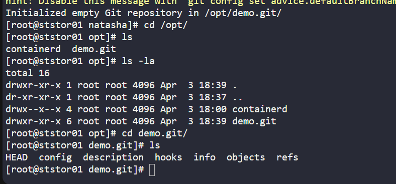
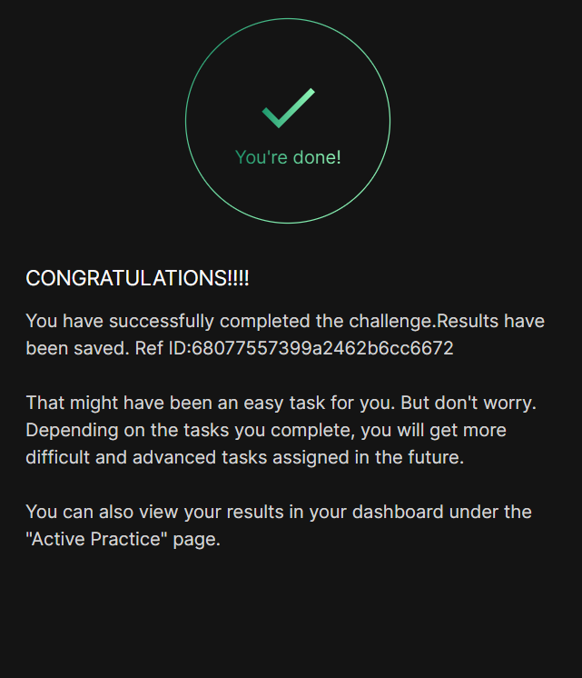

# Day 021 :shipit:

## Task
The Nautilus development team has provided requirements to the DevOps team for a new application development project, specifically requesting the establishment of a Git repository. Follow the instructions below to create the Git repository on the Storage server in the Stratos DC:

Utilize yum to install the git package on the Storage Server.

Create a bare repository named /opt/media.git (ensure exact name usage).

## Commands Used
```
sudo yum install -y git
rm -rf /opt/news.git
git init --bare /opt/news.git
```





## What I Learned

How to install Git using yum
Difference between a bare and non-bare Git repository

A bare repository is created using:

git init --bare
Bare repositories do not contain a .git folder; instead, all Git files are directly inside the repository directory
Importance of following exact naming and paths in tasks (e.g., /opt/news.git)

## Notes

A Git bare repository is a special type of Git repo that does not have a working directory (no project files) — it only contains the Git data.