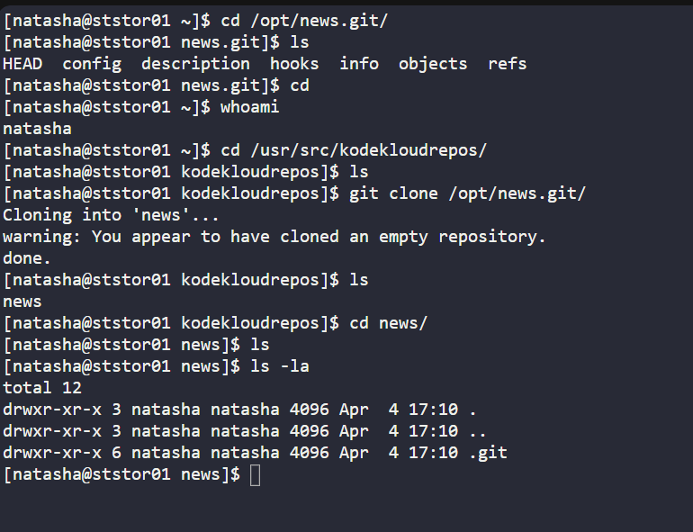
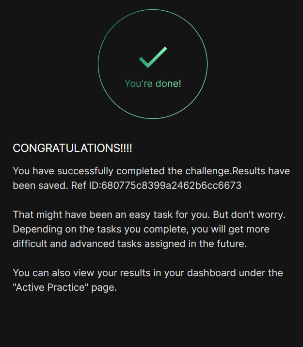

# Day 022 :shipit:

## Task
The DevOps team established a new Git repository last week, which remains unused at present. However, the Nautilus application development team now requires a copy of this repository on the Storage Server in the Stratos DC. Follow the provided details to clone the repository:

The repository to be cloned is located at /opt/news.git


Clone this Git repository to the /usr/src/kodekloudrepos directory. Perform this task using the natasha user, and ensure that no modifications are made to the repository or existing directories, such as changing permissions or making unauthorized alterations.

## Commands Used


```
sudo su - natasha -c "git clone /opt/news.git /usr/src/kodekloudrepos/news"
```



## What I Learned
- Cloning a local Git repository using `git clone`
- Running commands as another user (`sudo su - user -c`)
- Following restrictions without modifying permissions or files

## Notes
- Source: `/opt/news.git`
- Destination: `/usr/src/kodekloudrepos`
- Command:
  `sudo su - natasha -c "git clone /opt/news.git /usr/src/kodekloudrepos/news"`
- No changes made to existing files or permissions


