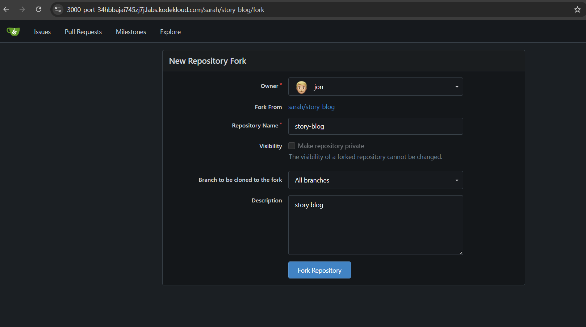
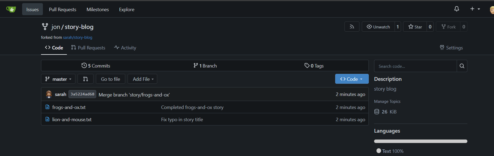
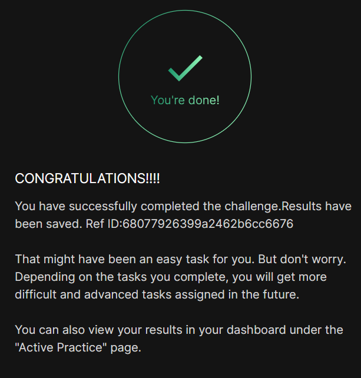

# Day 023 :shipit:

## Task

There is a Git server utilized by the Nautilus project teams. Recently, a new developer named Jon joined the team and needs to begin working on a project. To begin, he must fork an existing Git repository. Follow the steps below:

Click on the Gitea UI button located on the top bar to access the Gitea page.

Login to Gitea server using username jon and password Jon_pass123.

Once logged in, locate the Git repository named sarah/story-blog and fork it under the jon user.

## Commands Used

Logged into the webpage as user/forked the required repo

## What I Learned

## Notes

