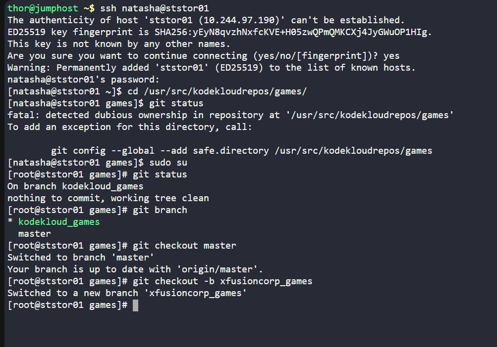
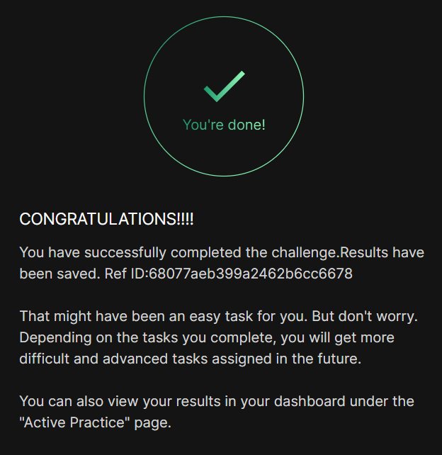

# Day 024 :shipit:

## Task

Nautilus developers are actively working on one of the project repositories, /usr/src/kodekloudrepos/games. Recently, they decided to implement some new features in the application, and they want to maintain those new changes in a separate branch. Below are the requirements that have been shared with the DevOps team:

On Storage server in Stratos DC create a new branch xfusioncorp_games from master branch in /usr/src/kodekloudrepos/games git repo.

Please do not try to make any changes in the code.

## Commands Used

## What I Learned

## Notes

