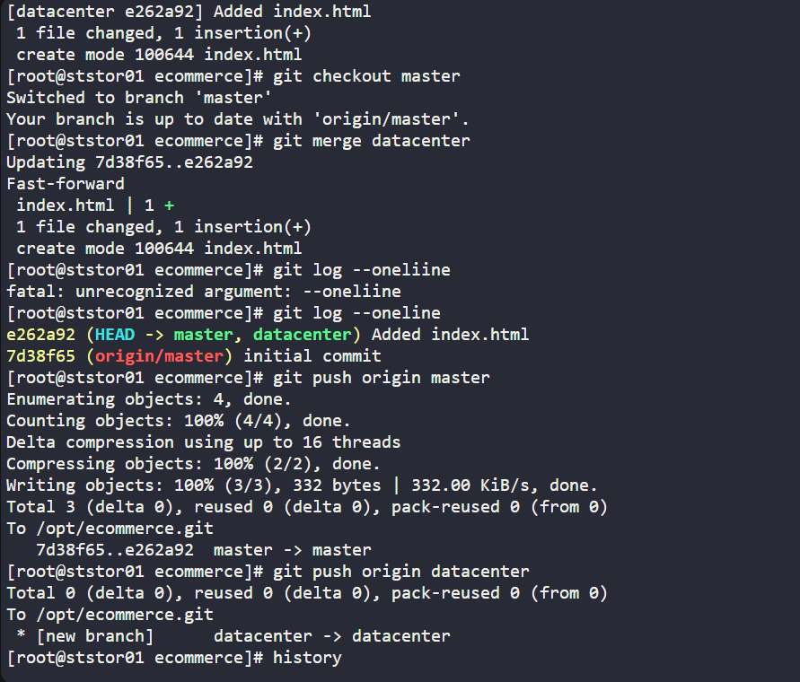
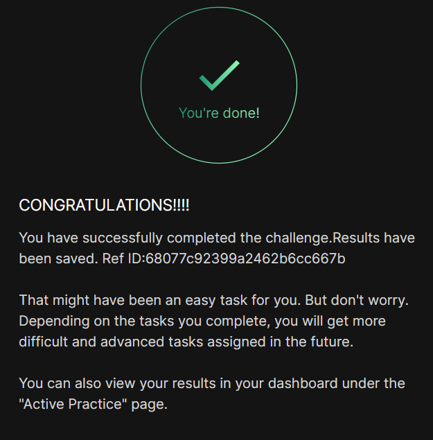

# Day 025 :shipit:

## Task

The Nautilus application development team has been working on a project repository /opt/ecommerce.git. This repo is cloned at /usr/src/kodekloudrepos on storage server in Stratos DC. They recently shared the following requirements with DevOps team:


Create a new branch datacenter in /usr/src/kodekloudrepos/ecommerce repo from master and copy the /tmp/index.html file (present on storage server itself) into the repo. Further, add/commit this file in the new branch and merge back that branch into master branch. Finally, push the changes to the origin for both of the branches.

## Commands Used

```
[root@ststor01 ecommerce]# history
    1  git status
    2  git checkout -b datacenter
    3  cp /tmp/index.html .
    4  ls
    5  git add .
    6  git commit -m "Added index.html"
    7  git checkout master
    8  git merge datacenter
    9  git log --oneliine
   10  git log --oneline
   11  git push origin master
   12  git push origin datacenter
   13  history
```

## What I Learned



## Notes

