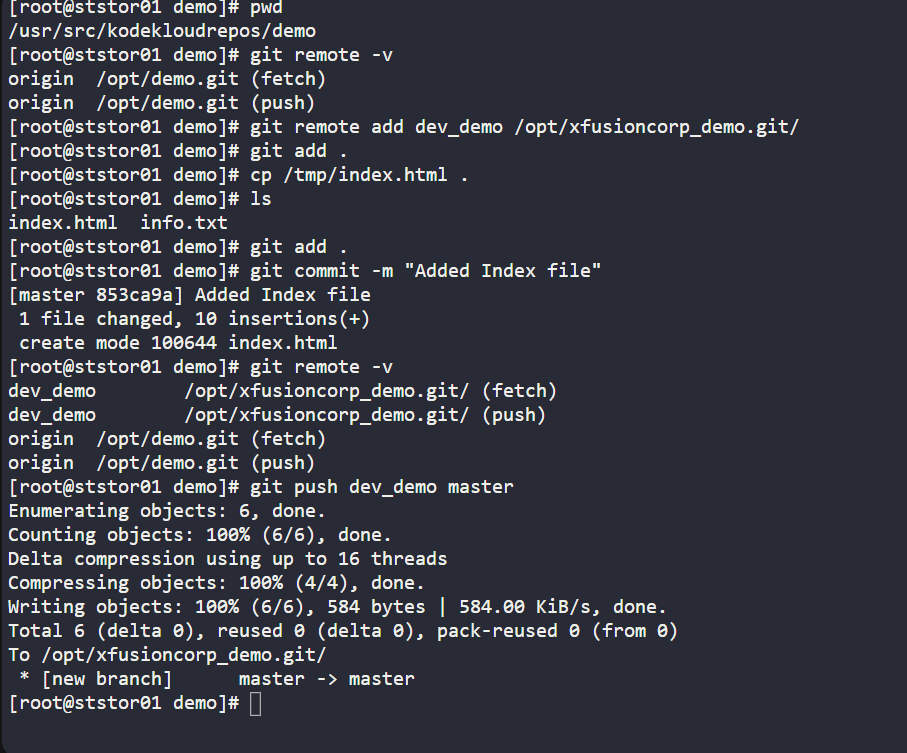
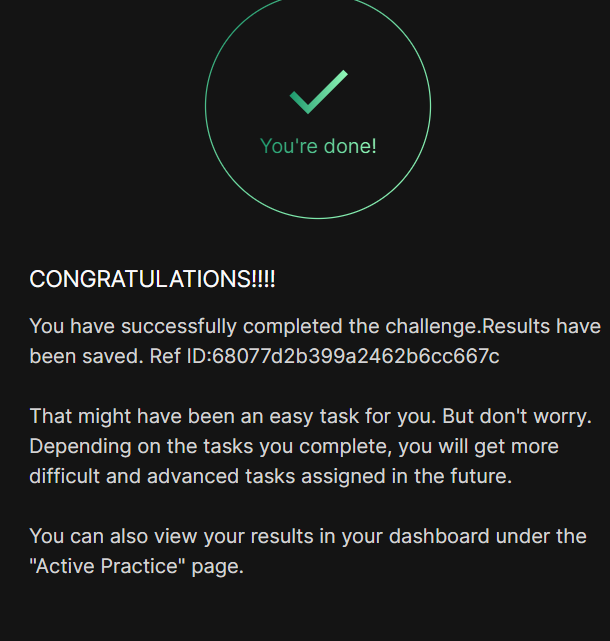

# Day 026 :shipit:

## Task
The xFusionCorp development team added updates to the project that is maintained under /opt/ecommerce.git repo and cloned under /usr/src/kodekloudrepos/ecommerce. Recently some changes were made on Git server that is hosted on Storage server in Stratos DC. The DevOps team added some new Git remotes, so we need to update remote on /usr/src/kodekloudrepos/ecommerce repository as per details mentioned below:


a. In /usr/src/kodekloudrepos/ecommerce repo add a new remote dev_ecommerce and point it to /opt/xfusioncorp_ecommerce.git repository.


b. There is a file /tmp/index.html on same server; copy this file to the repo and add/commit to master branch.


c. Finally push master branch to this new remote origin.

## Commands Used
```
# Step 1: Navigate to the cloned repo
cd /usr/src/kodekloudrepos/ecommerce

# Step 2: Verify existing remotes
git remote -v

# Step 3: Add the new remote 'dev_ecommerce' pointing to the bare repo
git remote add dev_ecommerce /opt/xfusioncorp_ecommerce.git

# Step 4: Verify the new remote was added
git remote -v

# Step 5: Copy the file from /tmp/index.html into the repo
cp /tmp/index.html .

# Step 6: Stage the file
git add index.html

# Step 7: Commit to master branch
git commit -m "Added index.html to master branch"

# Step 8: Push master branch to the new remote
git push dev_ecommerce master
```



## What I Learned
How to add a new Git remote and push a local branch to it.

## Notes


- git remote add <name> <path> adds a new remote (local or remote path)
- cp /tmp/file . copies a file into the repo directory
- git add → git commit → git push <remote> <branch> is the standard flow
- You can have multiple remotes pointing to different repositories


