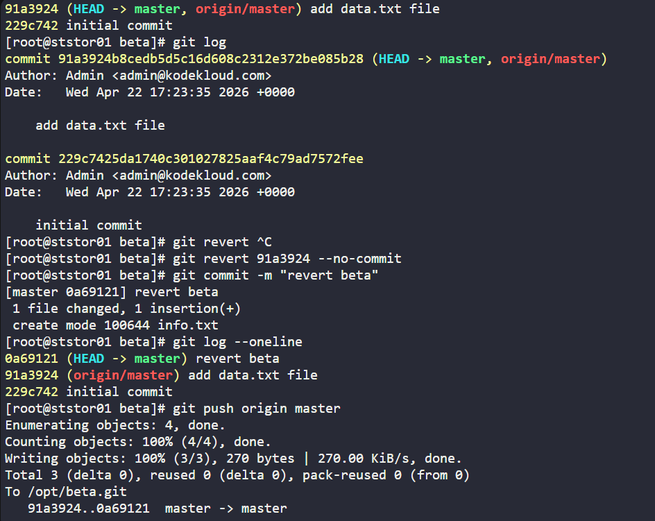
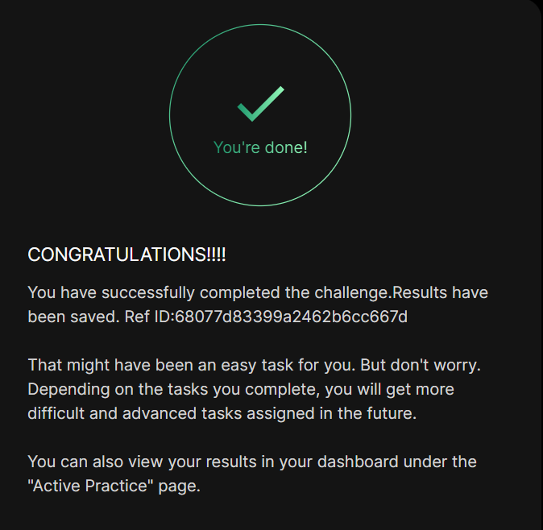

# Day 027 :shipit:

## Task

The Nautilus application development team was working on a git repository /usr/src/kodekloudrepos/beta present on Storage server in Stratos DC. However, they reported an issue with the recent commits being pushed to this repo. They have asked the DevOps team to revert repo HEAD to last commit. Below are more details about the task:

In /usr/src/kodekloudrepos/beta git repository, revert the latest commit ( HEAD ) to the previous commit (JFYI the previous commit hash should be with initial commit message ).

Use revert beta message (please use all small letters for commit message) for the new revert commit.

## Commands Used

Step 2: Navigate to the Repository & Check Git Log
bashcd /usr/src/kodekloudrepos/beta
git log --oneline

Step 3: Identify the Latest Commit (HEAD) and Revert It
bashgit revert HEAD --no-edit -m "revert beta"

⚠️ If the above flags don't set the message correctly, use this instead:

bashgit revert HEAD --no-commit
git commit -m "revert beta"

Step 4: Verify the Revert
bashgit log --oneline

## What I Learned

RequirementStatusReverted HEAD (91a3924 - "add data.txt file")✅ Done

Previous commit (229c742 - "initial commit") is preserved✅ Done

New revert commit created (0a69121)✅ Done

Commit message is "revert beta" (all lowercase)✅ Done

## Notes

