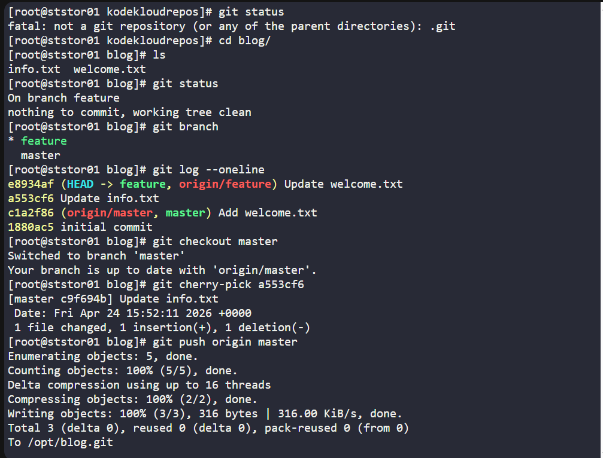
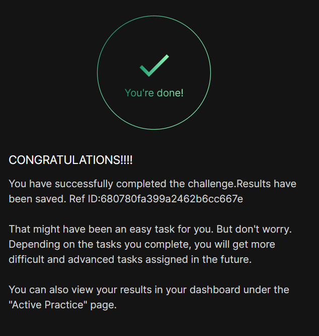

# Day 028 :shipit:

## Task

The Nautilus application development team has been working on a project repository /opt/blog.git. This repo is cloned at /usr/src/kodekloudrepos on storage server in Stratos DC. They recently shared the following requirements with the DevOps team:

There are two branches in this repository, master and feature. One of the developers is working on the feature branch and their work is still in progress, however they want to merge one of the commits from the feature branch to the master branch, the message for the commit that needs to be merged into master is Update info.txt. Accomplish this task for them, also remember to push your changes eventually.

## Commands Used




```
cd /usr/src/kodekloudrepos/blog

# Get the commit hash for "Update info.txt" from feature branch
COMMIT=$(git log --oneline feature | grep "Update info.txt" | awk '{print $1}')
echo "Commit to cherry-pick: $COMMIT"

# Switch to master and cherry-pick
git checkout master
git cherry-pick $COMMIT

# Push to remote
git push origin master
```
## What I Learned

What this does:

- git cherry-pick applies a single specific commit from the feature branch onto master — without merging the entire branch
- This keeps the in-progress work on feature isolated while moving only the desired commit (Update info.txt) to master
- The final git push syncs the changes back to /opt/blog.git on the storage server

## Notes


