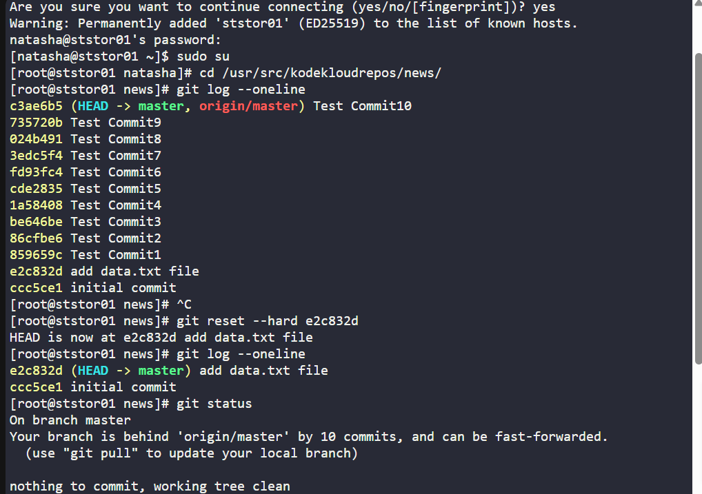
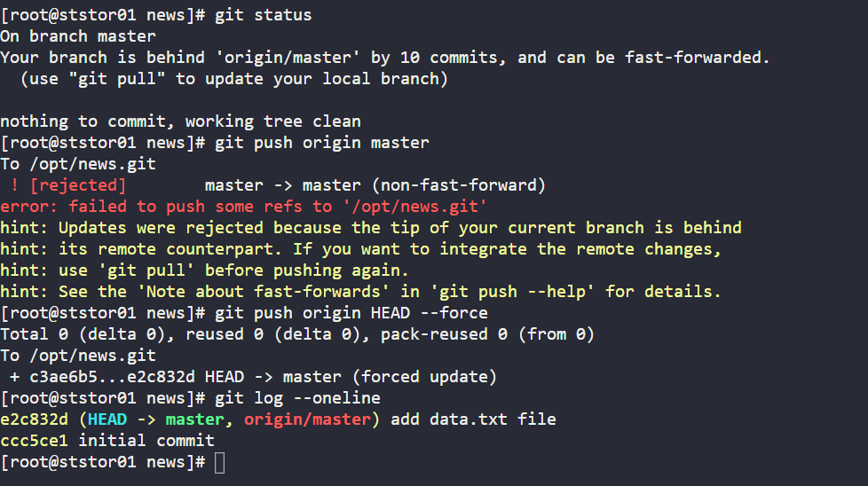
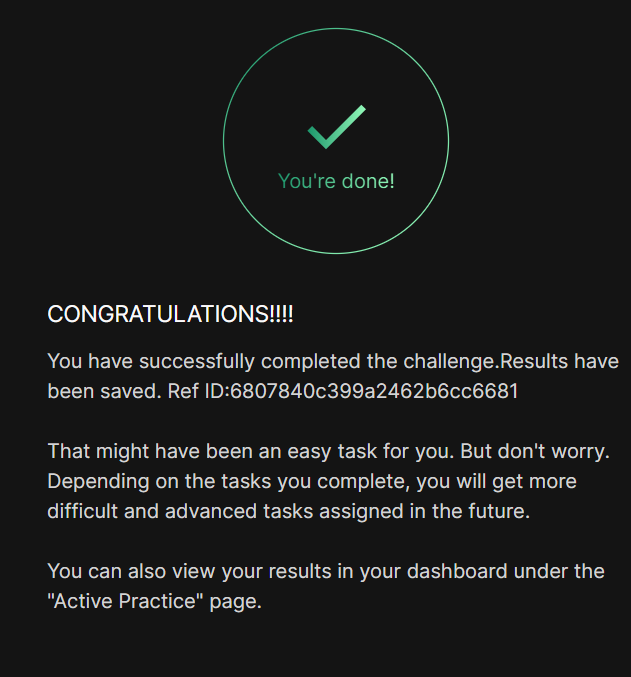

# Day 030 :shipit:

## Task
The Nautilus application development team was working on a git repository /usr/src/kodekloudrepos/news present on Storage server in Stratos DC. This was just a test repository and one of the developers just pushed a couple of changes for testing, but now they want to clean this repository along with the commit history/work tree, so they want to point back the HEAD and the branch itself to a commit with message add data.txt file. Find below more details:


In /usr/src/kodekloudrepos/news git repository, reset the git commit history so that there are only two commits in the commit history i.e initial commit and add data.txt file.


Also make sure to push your changes.

## Commands Used
```
cd /usr/src/kodekloudrepos/news
git log --oneline
git reset --hard <commit_id>
git push origin HEAD --force
```





## What I Learned

- How to inspect commit history using `git log --oneline`
- How to reset a repository to a specific commit using `git reset --hard`
- Understanding how Git history rewriting works
- Difference between `git reset` and `git revert`
- Importance of force pushing after rewriting history

---

## Notes

- `git reset --hard <commit_id>` removes all commits after the specified commit
- Always double-check the commit ID before resetting
- Use `git push origin HEAD --force` to update the remote repository
- Force push rewrites remote history — use carefully in shared repositories
- This operation is destructive and cannot be undone easily

