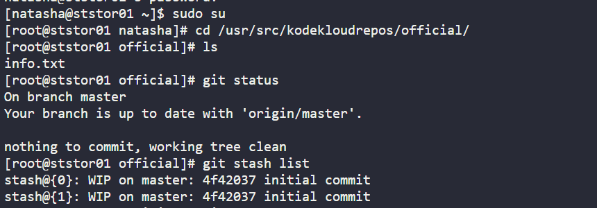
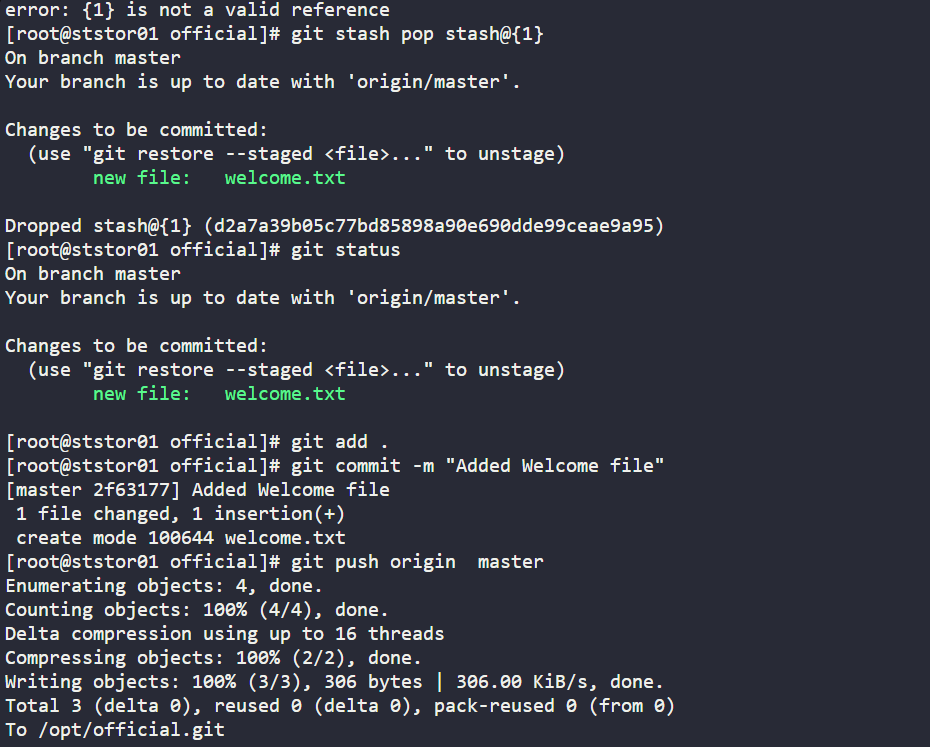
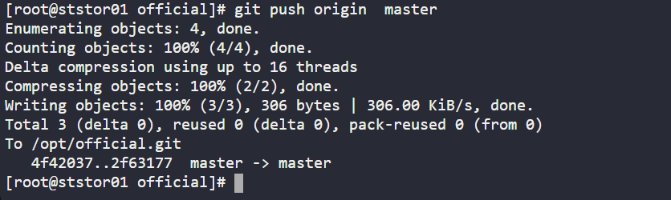
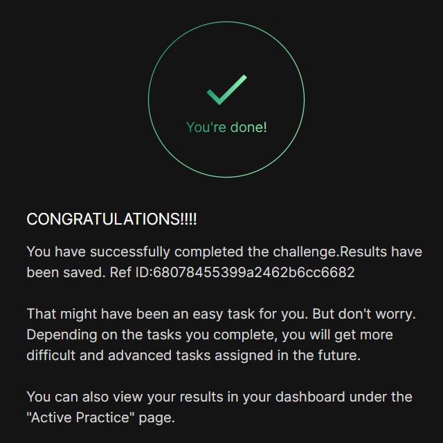

# Day 031 :shipit:

## Task
The Nautilus application development team was working on a git repository /usr/src/kodekloudrepos/official present on Storage server in Stratos DC. One of the developers stashed some in-progress changes in this repository, but now they want to restore some of the stashed changes. Find below more details to accomplish this task:

Look for the stashed changes under /usr/src/kodekloudrepos/official git repository, and restore the stash with stash@{1} identifier. Further, commit and push your changes to the origin.

## Commands Used

## What I Learned

## Notes

