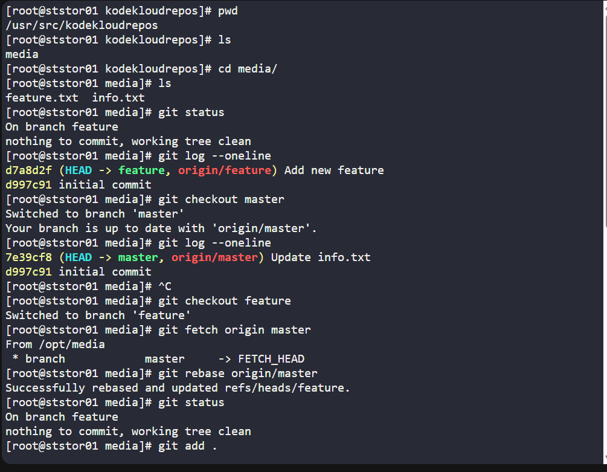
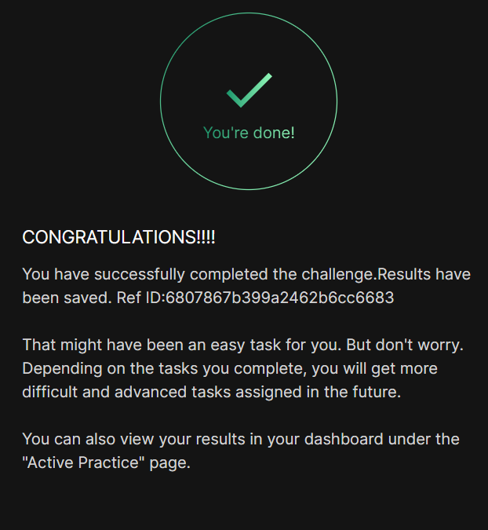

# Day 032 :shipit:

## Task

The Nautilus application development team has been working on a project repository /opt/media.git. This repo is cloned at /usr/src/kodekloudrepos on storage server in Stratos DC. They recently shared the following requirements with DevOps team:


One of the developers is working on feature branch and their work is still in progress, however there are some changes which have been pushed into the master branch, the developer now wants to rebase the feature branch with the master branch without loosing any data from the feature branch, also they don't want to add any merge commit by simply merging the master branch into the feature branch. Accomplish this task as per requirements mentioned.


Also remember to push your changes once done.

## Commands Used




# Git Rebase Task

## Commands

```bash
# Move to repository
cd /usr/src/kodekloudrepos/media

# Check current status
git status

# View commit history
git log --oneline

# Switch to master branch
git checkout master

# Check master branch commits
git log --oneline

# Switch back to feature branch
git checkout feature

# Fetch latest master branch changes
git fetch origin master

# Rebase feature branch with master
git rebase origin/master

# Check repository status
git status

# Stage changes (not required here since working tree was clean)
git add .

# Check commit history after rebase
git log --oneline

# Push changes to remote repository
git push origin feature

can be use

git push origin feature --force

# Push rejected because history changed after rebase

# Pull feature branch with rebase
git pull origin feature --rebase

# Push again
git push origin feature

# Verify final commit history
git log --oneline
```

---

## Notes

- `git rebase origin/master`
  rebases the feature branch on top of the latest master branch commits.

- Rebase helps maintain a clean linear commit history.

- Unlike merge, rebase does not create an extra merge commit.

- After rebase, Git history changes, so normal push may fail with:
  `non-fast-forward`.

- Usually after rebase, we use:
  
```bash
git push origin feature --force
```

- In this task:
  - feature branch work was preserved
  - master branch changes were included
  - changes were successfully pushed to remote repository

- `git log --oneline`
  is useful to verify commit history before and after rebase.


## Notes


