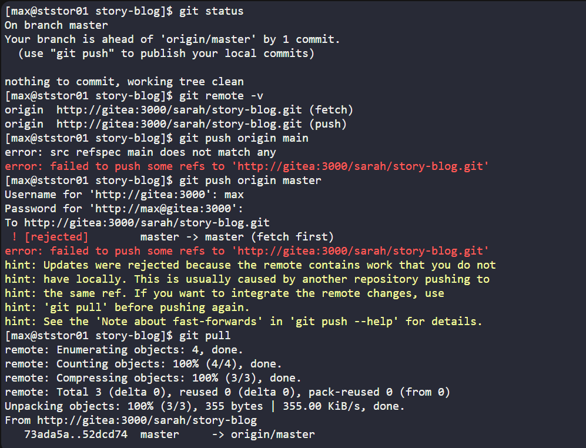
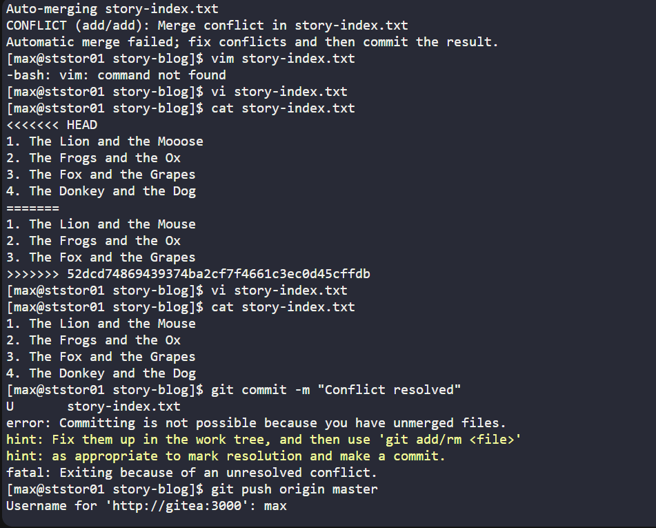
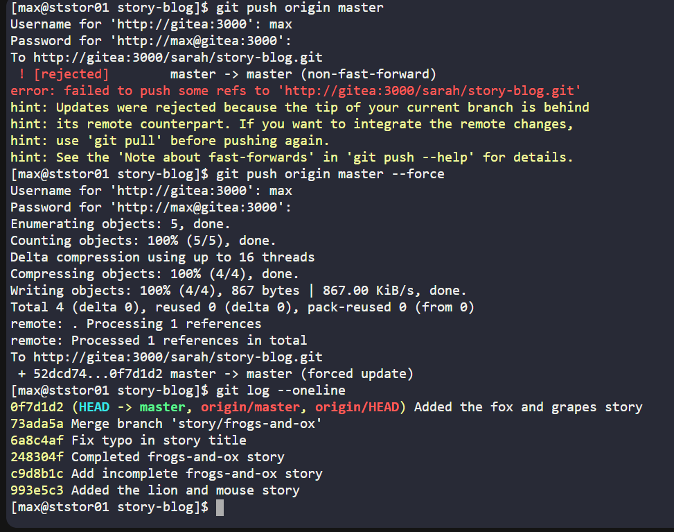
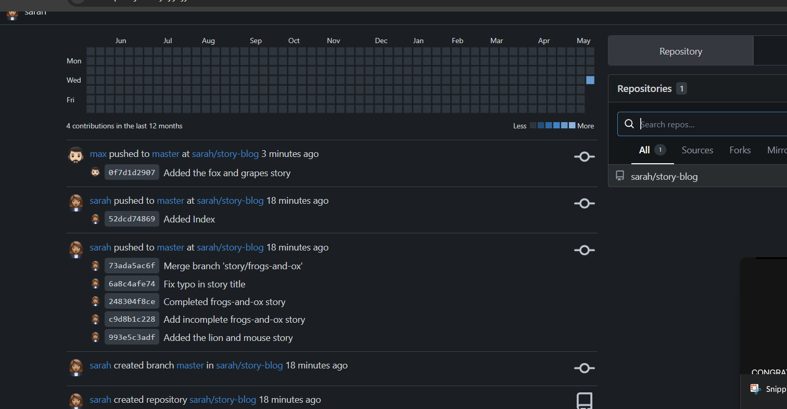
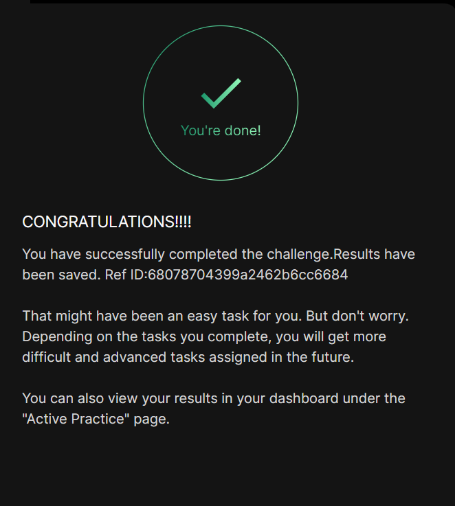

# Day 033 :shipit:

## Task

Sarah and Max were working on writting some stories which they have pushed to the repository. Max has recently added some new changes and is trying to push them to the repository but he is facing some issues. Below you can find more details:


SSH into storage server using user max and password Max_pass123. Under /home/max you will find the story-blog repository. Try to push the changes to the origin repo and fix the issues. The story-index.txt must have titles for all 4 stories. Additionally, there is a typo in The Lion and the Mooose line where Mooose should be Mouse.


Click on the Gitea UI button on the top bar. You should be able to access the Gitea page. You can login to Gitea server from UI using username sarah and password Sarah_pass123 or username max and password Max_pass123.


Note: For these kind of scenarios requiring changes to be done in a web UI, please take screenshots so that you can share it with us for review in case your task is marked incomplete. You may also consider using a screen recording software such as loom.com to record and share your work.

## Commands Used








```

[max@ststor01 story-blog]$ history
    1  clear
    2  ls
    3  clear
    4  ls
    5  git remote -v
    6  cd story-blog/
    7  clear
    8  git status
    9  git remote -v
   10  git push origin main
   11  git push origin master
   12  git pull
   13  vim story-index.txt 
   14  vi story-index.txt 
   15  cat story-index.txt 
   16  vi story-index.txt 
   17  cat story-index.txt 
   18  git commit -m "Conflict resolved"
   19  git push origin master
   20  git push origin master --force
   21  git log --oneline
   22  history
```


## What I Learned

## Notes
