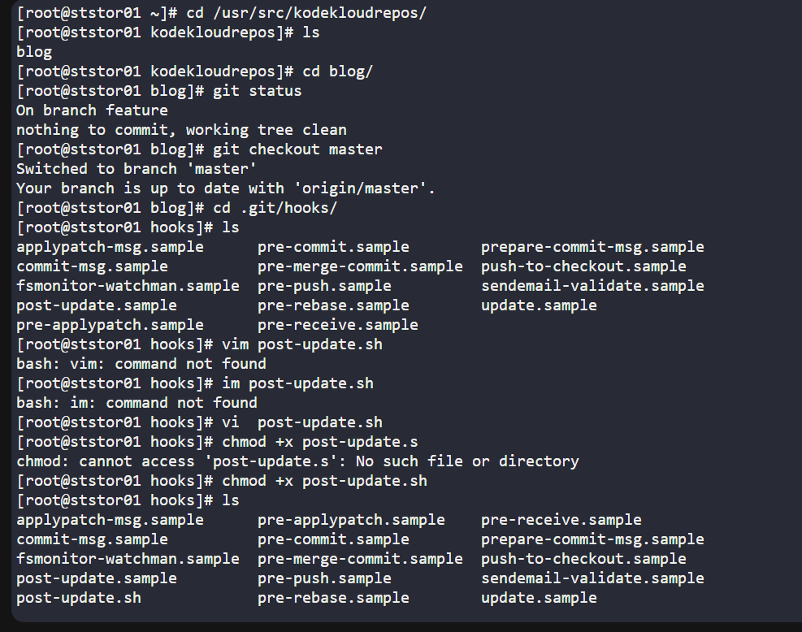
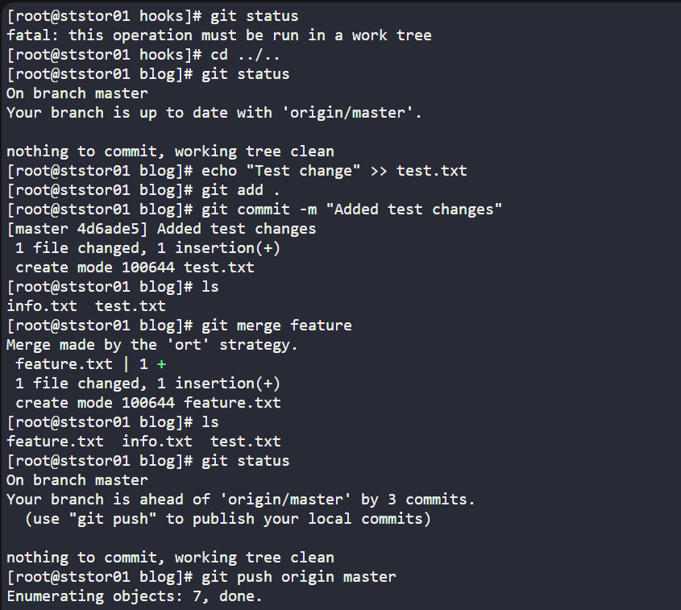
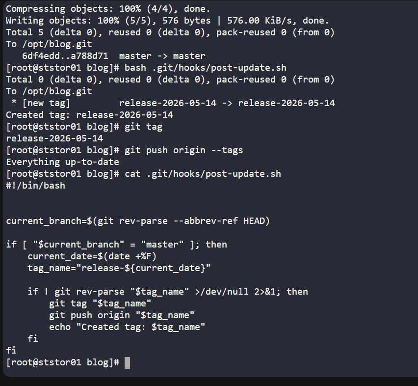
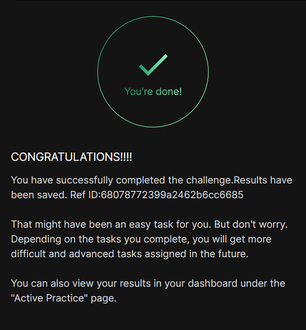

# Day 034 :shipit:

## Task


The Nautilus application development team was working on a git repository /opt/blog.git which is cloned under /usr/src/kodekloudrepos directory present on Storage server in Stratos DC. The team want to setup a hook on this repository, please find below more details:


Merge the feature branch into the master branch, but before pushing your changes complete below point.

Create a post-update hook in this git repository so that whenever any changes are pushed to the master branch, it creates a release tag with name release-2023-06-15, where 2023-06-15 is supposed to be the current date. For example if today is 20th June, 2023 then the release tag must be release-2023-06-20. Make sure you test the hook at least once and create a release tag for today's release.

Finally remember to push your changes.
Note: Perform this task using the natasha user, and ensure the repository or existing directory permissions are not altered.


## Commands Used







```
# Switch to natasha user
sudo su - natasha

# Go to repository
cd /usr/src/kodekloudrepos/blog

# Check branches
git branch

# Merge feature branch into master
git checkout master
git merge feature

# Create post-update hook
cat > .git/hooks/post-update << 'EOF'
#!/bin/bash

current_branch=$(git rev-parse --abbrev-ref HEAD)

if [ "$current_branch" = "master" ]; then
    current_date=$(date +%F)
    tag_name="release-${current_date}"

    if ! git rev-parse "$tag_name" >/dev/null 2>&1; then
        git tag "$tag_name"
        git push origin "$tag_name"
        echo "Created tag: $tag_name"
    fi
fi
EOF

# Make hook executable
chmod +x .git/hooks/post-update

# Make a small test change
echo "release test" >> release-test.txt

# Commit test change
git add release-test.txt
git commit -m "Test post-update hook"

# Push master branch
git push origin master

# Manually run hook once for testing (if needed)
.git/hooks/post-update

# Verify tag
git tag

# Push tags if not already pushed
git push origin --tags
```
## What I Learned

## Notes

