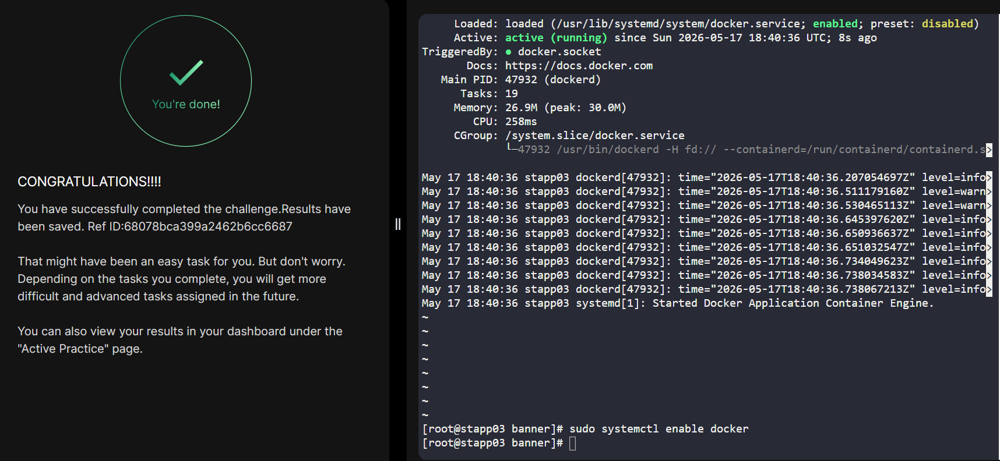

# Day 035 :shipit:

## Task
The Nautilus DevOps team aims to containerize various applications following a recent meeting with the application development team. They intend to conduct testing with the following steps:


Install docker-ce and docker compose packages on App Server 3.


Initiate the docker service.
## Commands Used

```
# Install required yum utilities
sudo yum install -y yum-utils

# Add Docker CE repository
sudo yum-config-manager --add-repo https://download.docker.com/linux/centos/docker-ce.repo

# Install docker-ce and docker compose plugin
sudo yum install -y docker-ce docker-ce-cli containerd.io docker-compose-plugin

# Start and enable Docker service
sudo systemctl enable docker
sudo systemctl start docker

# Verify service status
sudo systemctl status docker
```
## What I Learned

## Notes
