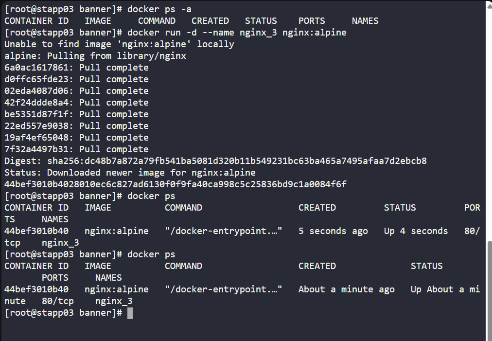
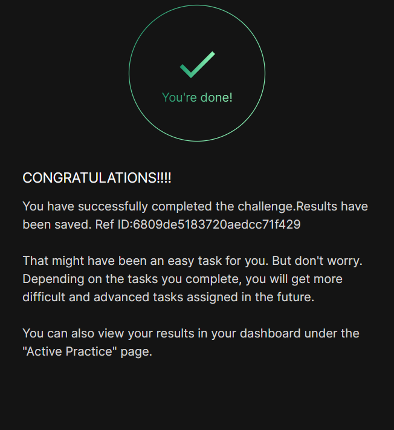

# Day 036 :shipit:

## Task
The Nautilus DevOps team is conducting application deployment tests on selected application servers. They require a nginx container deployment on Application Server 3. Complete the task with the following instructions:


On Application Server 3 create a container named nginx_3 using the nginx image with the alpine tag. Ensure container is in a running state.

## Commands Used


```
   12  docker ps -a
   13  docker run -d --name nginx_3 nginx:alpine
   14  docker ps
   15  docker ps
   16  history
```

## What I Learned

## Notes
