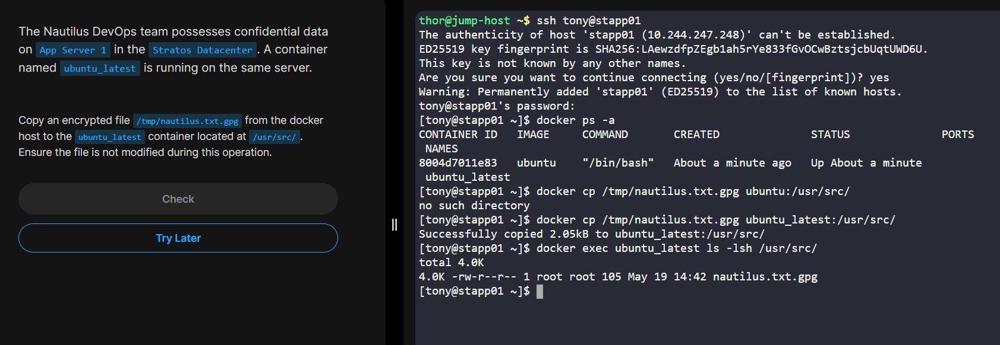
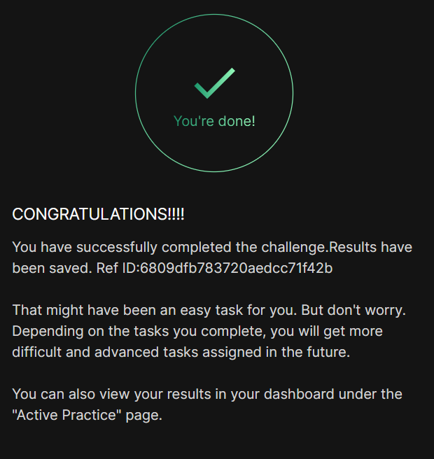

# Day 037 :shipit:

## Task

The Nautilus DevOps team possesses confidential data on App Server 1 in the Stratos Datacenter. A container named ubuntu_latest is running on the same server.


Copy an encrypted file /tmp/nautilus.txt.gpg from the docker host to the ubuntu_latest container located at /usr/src/. Ensure the file is not modified during this operation.

## Commands Used

```
 docker ps -a
    3  docker cp /tmp/nautilus.txt.gpg ubuntu_latest:/usr/src/
    4  docker exec ubuntu_latest ls -lsh /usr/src/
    5  history
```


## What I Learned


## Notes
