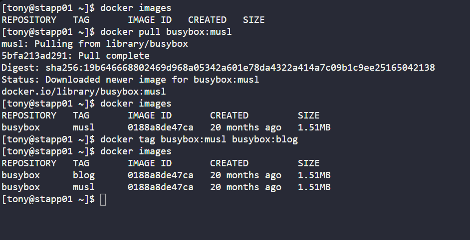
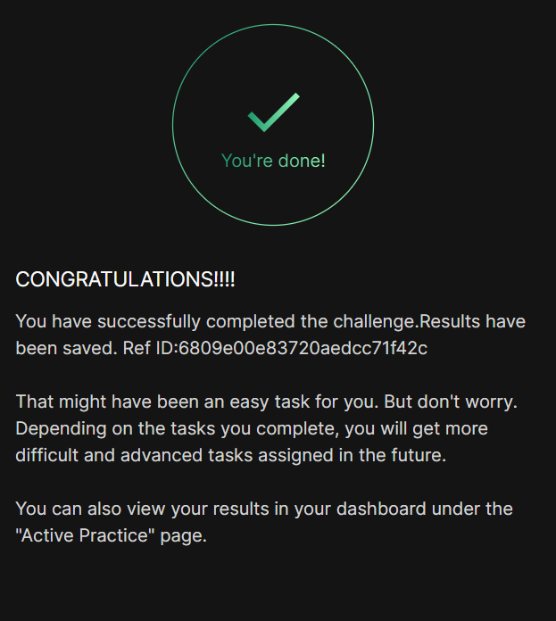

# Day 038 :shipit:

## Task

Nautilus project developers are planning to start testing on a new project. As per their meeting with the DevOps team, they want to test containerized environment application features. As per details shared with DevOps team, we need to accomplish the following task:


a. Pull busybox:musl image on App Server 1 in Stratos DC and re-tag (create new tag) this image as busybox:blog.
## Commands Used
```
  30  docker images
   31  docker pull busybox:musl
   32  docker images
   33  docker tag busybox:musl busybox:blog
   34  docker images
   35  history
```


## What I Learned

## Notes
