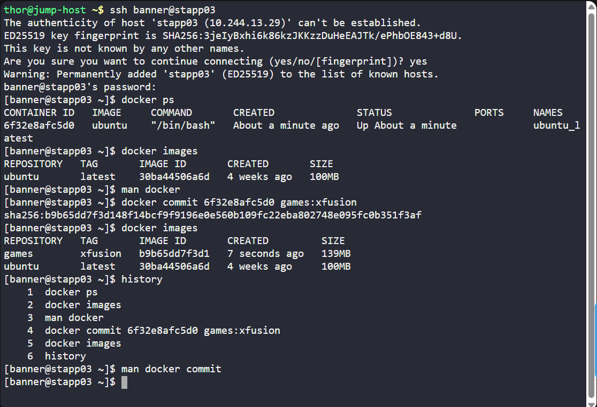
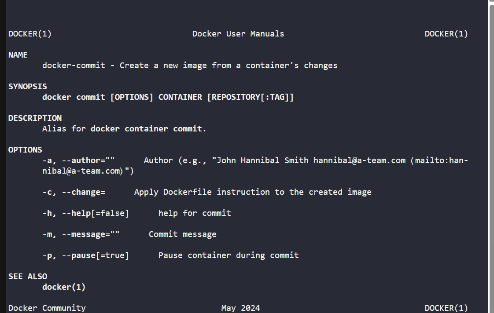
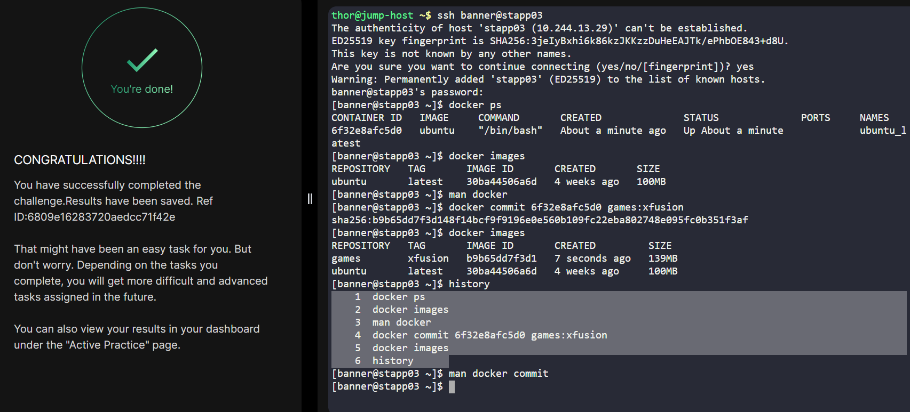

# Day 039 :shipit:

## Task

One of the Nautilus developer was working to test new changes on a container. He wants to keep a backup of his changes to the container. A new request has been raised for the DevOps team to create a new image from this container. Below are more details about it:

a. Create an image games:xfusion on Application Server 3 from a container ubuntu_latest that is running on same server.
## Commands Used

    1  docker ps
    2  docker images
    3  man docker
    4  docker commit 6f32e8afc5d0 games:xfusion
    5  docker images
    6  history

## What I Learned

## Notes

