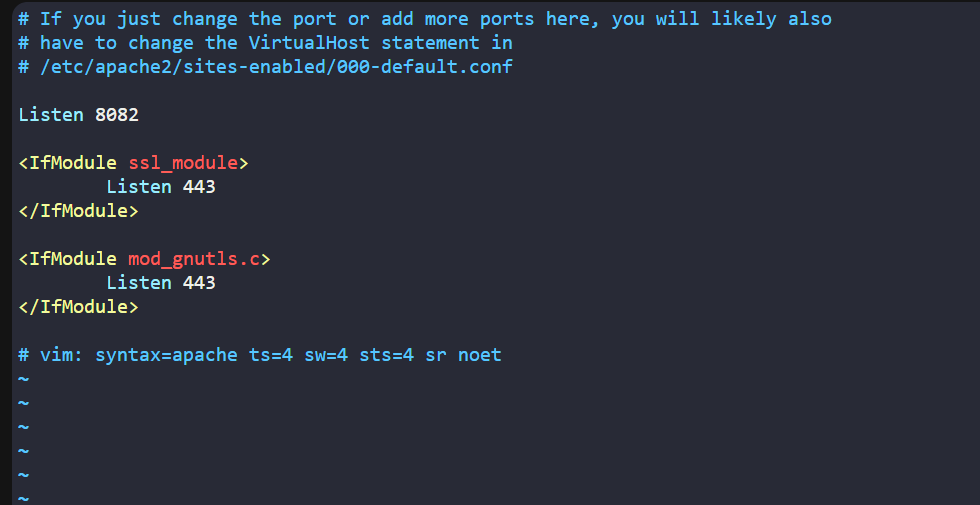
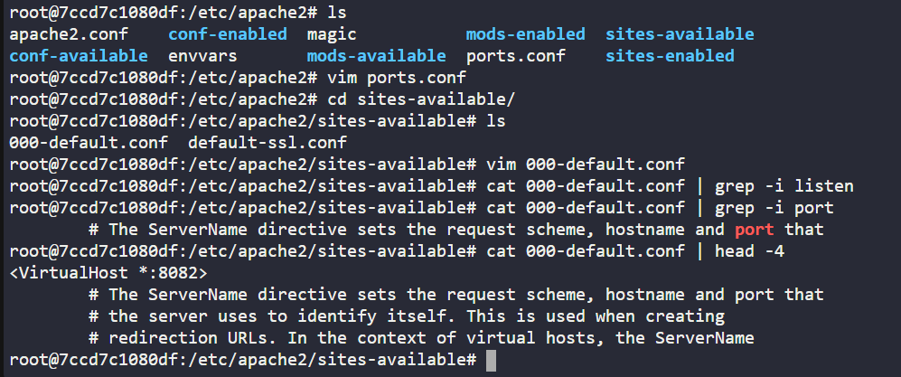
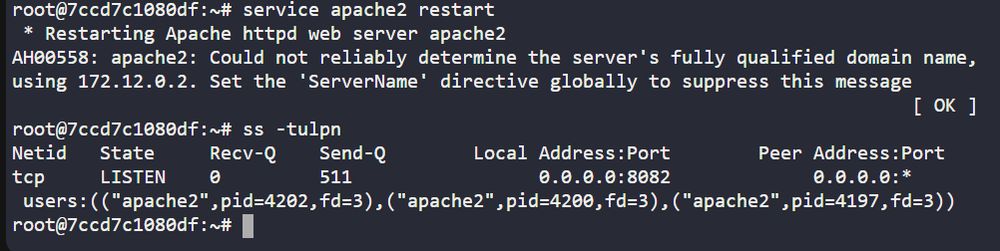
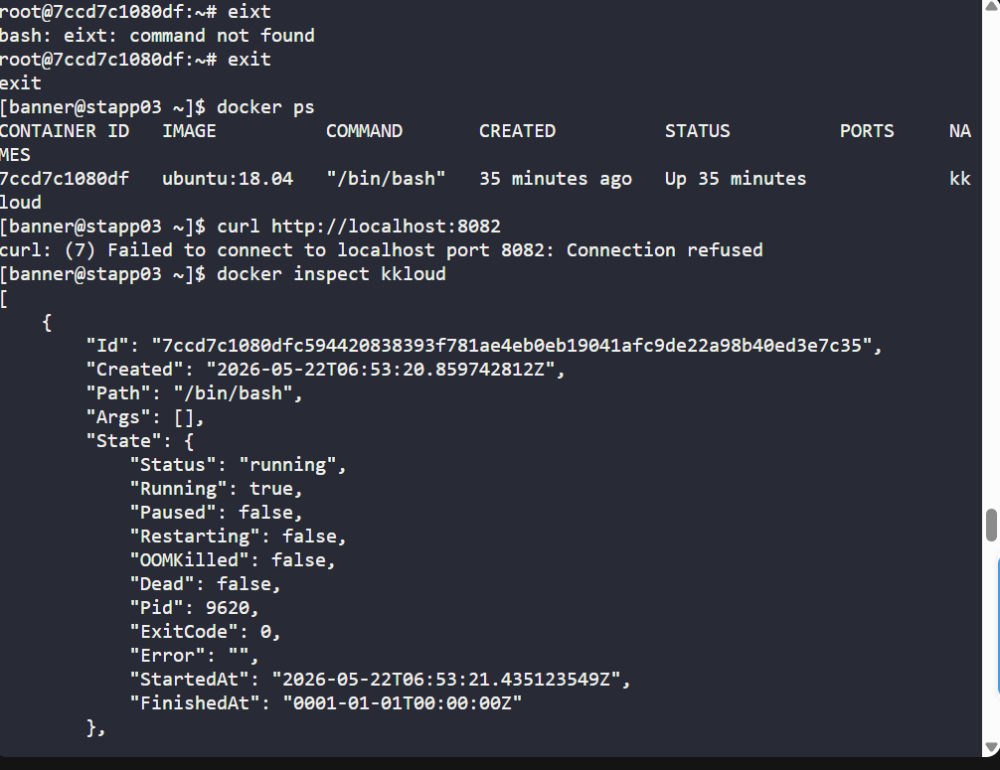
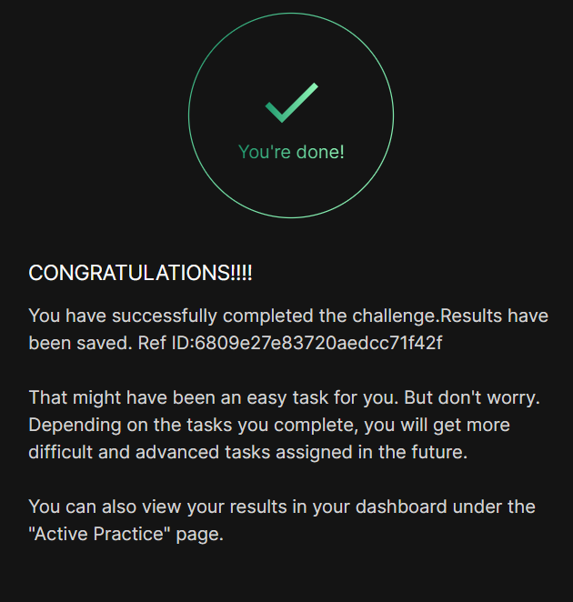

# Day 040 :shipit:

## Task
One of the Nautilus DevOps team members was working to configure services on a kkloud container that is running on App Server 3 in Stratos Datacenter. Due to some personal work he is on PTO for the rest of the week, but we need to finish his pending work ASAP. Please complete the remaining work as per details given below:


a. Install apache2 in kkloud container using apt that is running on App Server 3 in Stratos Datacenter.


b. Configure Apache to listen on port 8082 instead of default http port. Do not bind it to listen on specific IP or hostname only, i.e it should listen on localhost, 127.0.0.1, container ip, etc.


c. Make sure Apache service is up and running inside the container. Keep the container in running state at the end.

## Commands Used

```
# SSH into App Server 3
ssh banner@stapp03

# Check running containers
docker ps

# Access the kkloud container
docker exec -it kkloud bash

# Update packages
apt update

# Install apache2
apt install apache2 -y

# Change Apache listening port from 80 to 8082
sed -i 's/Listen 80/Listen 8082/' /etc/apache2/ports.conf

# Update default virtual host port
sed -i 's/*:80/*:8082/' /etc/apache2/sites-available/000-default.conf

# Start Apache service
service apache2 start

# Verify Apache is listening on port 8082
ss -tulpn | grep 8082

# Exit container
exit

# Verify container is still running
docker ps

```

port update









## What I Learned
```
systemctl = service inside the containers
# Change Apache listening port from 80 to 8082
sed -i 's/Listen 80/Listen 8082/' /etc/apache2/ports.conf

# Update default virtual host port
sed -i 's/*:80/*:8082/' /etc/apache2/sites-available/000-default.conf

# Start Apache service
service apache2 start
```

## Notes
