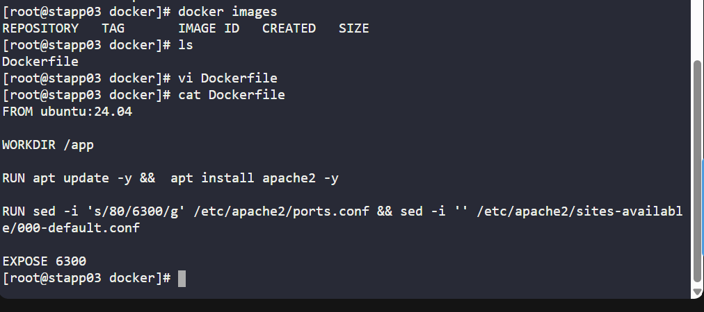
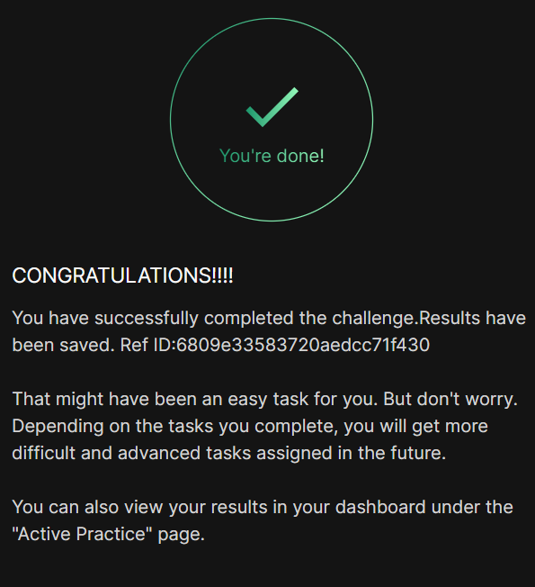

# Day 041 :shipit:

## Task
As per recent requirements shared by the Nautilus application development team, they need custom images created for one of their projects. Several of the initial testing requirements are already been shared with DevOps team. Therefore, create a docker file /opt/docker/Dockerfile (please keep D capital of Dockerfile) on App server 3 in Stratos DC and configure to build an image with the following requirements:


a. Use ubuntu:24.04 as the base image.


b. Install apache2 and configure it to work on 6300 port. (do not update any other Apache configuration settings like document root etc).

## Commands Used

```
FROM ubuntu:24.04

RUN apt-get update && \
    apt-get install -y apache2 && \
    apt-get clean

RUN sed -i 's/80/6300/g' /etc/apache2/ports.conf && \
    sed -i 's/:80/:6300/g' /etc/apache2/sites-available/000-default.conf

EXPOSE 6300

```


## What I Learned

## Notes
