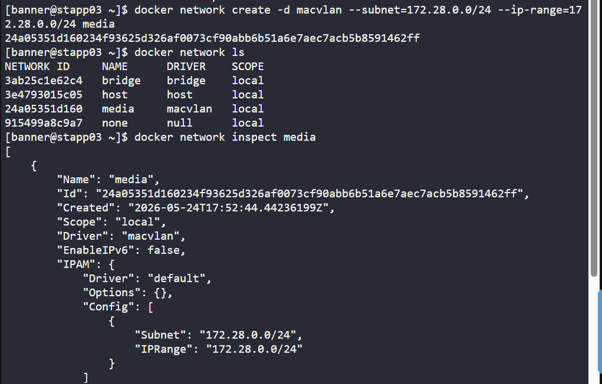
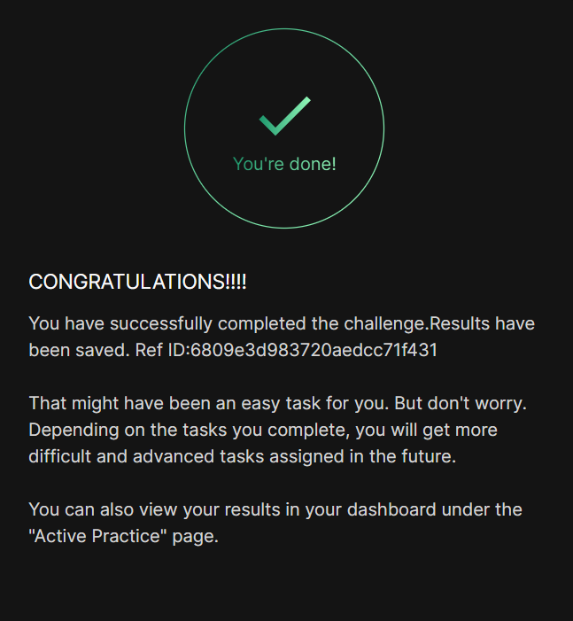

# Day 042 :shipit:

## Task

The Nautilus DevOps team needs to set up several docker environments for different applications. One of the team members has been assigned a ticket where he has been asked to create some docker networks to be used later. Complete the task based on the following ticket description:


a. Create a docker network named as media on App Server 3 in Stratos DC.


b. Configure it to use macvlan drivers.


c. Set it to use subnet 172.28.0.0/24 and iprange 172.28.0.0/24.

## Commands Used

```
docker network ls

docker network create -d drivername --subnet=192.0.0.0/24 --ip-range=12.0.0.0/24 jjarvisnetwork

docker network inspect jarvisnetwork
```


## What I Learned

## Notes


