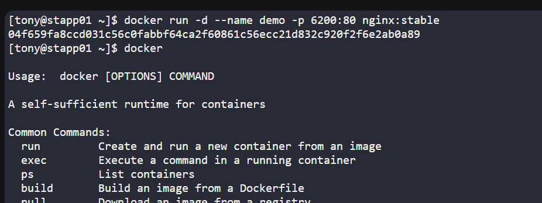
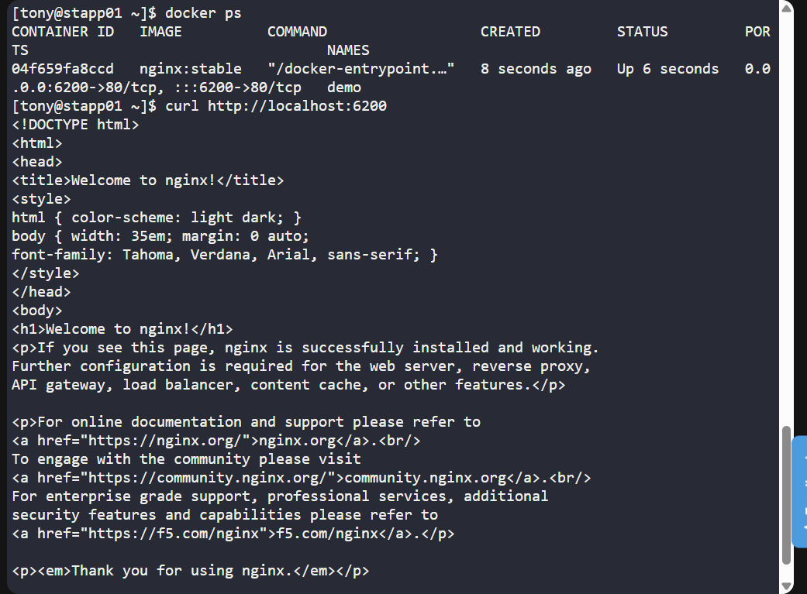
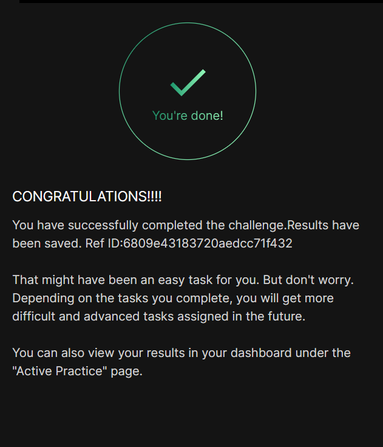

# Day 043 :shipit:

## Task
The Nautilus DevOps team is planning to host an application on a nginx-based container. There are number of tickets already been created for similar tasks. One of the tickets has been assigned to set up a nginx container on Application Server 1 in Stratos Datacenter. Please perform the task as per details mentioned below:


a. Pull nginx:stable docker image on Application Server 1.


b. Create a container named demo using the image you pulled.


c. Map host port 6200 to container port 80. Please keep the container in running state.
## Commands Used

```
docker pull image:tag

docker run -d --name jarvis -p 80:80 image:tag

docker ps -a

curl http://localhost:80




```
## What I Learned

## Notes

