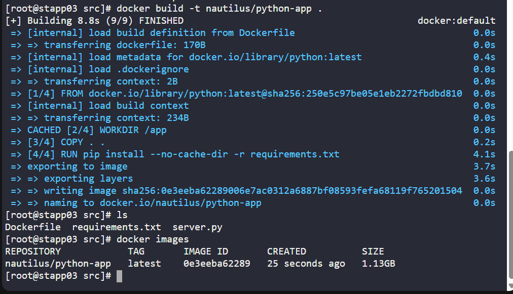
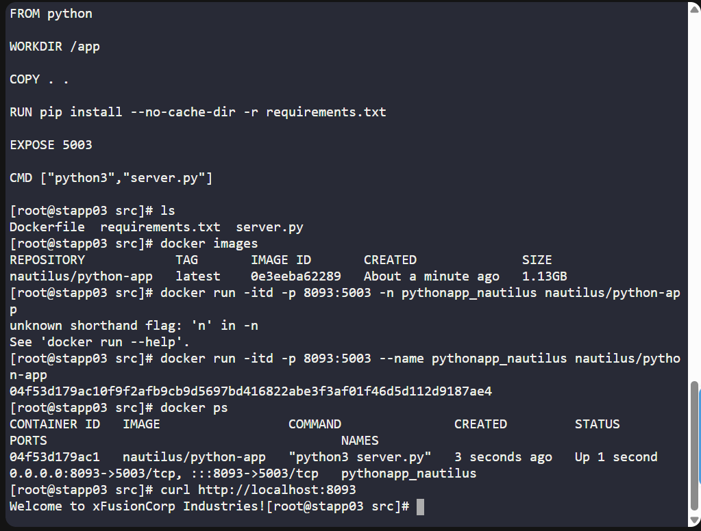
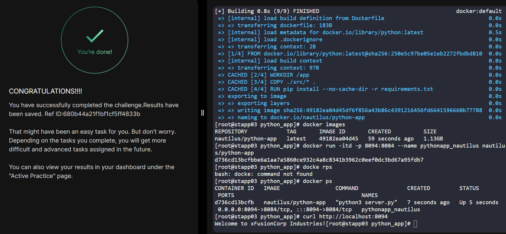

# Day 047 :shipit:

## Task

A python app needed to be Dockerized, and then it needs to be deployed on App Server 3. We have already copied a requirements.txt file (having the app dependencies) under /python_app/src/ directory on App Server 3. Further complete this task as per details mentioned below:


Create a Dockerfile under /python_app directory:

Use any python image as the base image.
Install the dependencies using requirements.txt file.
Expose the port 5003.
Run the server.py script using CMD.

Build an image named nautilus/python-app using this Dockerfile.


Once image is built, create a container named pythonapp_nautilus:

Map port 5003 of the container to the host port 8093.

Once deployed, you can test the app using curl command on App Server 3.


curl http://localhost:8093/

## Commands Used

```
FROM python

WORKDIR /app

COPY . .

RUN pip install --no-cache-dir -r requirements.txt

EXPOSE 5003

CMD ["python3","server.py"]

```


```
  21  vi Dockerfile 
   25  docker build -t nautilus/python-app .
   26  ls
   27  docker images
   32  docker run -itd -p 8093:5003 --name pythonapp_nautilus nautilus/python-app
   33  docker ps
   34  curl http://localhost:8093

   ```





## What I Learned

## Notes

