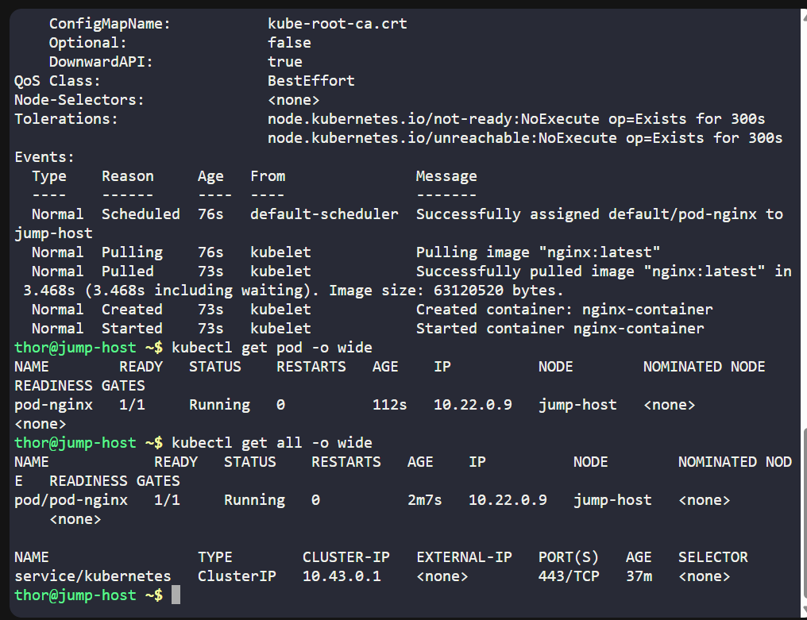
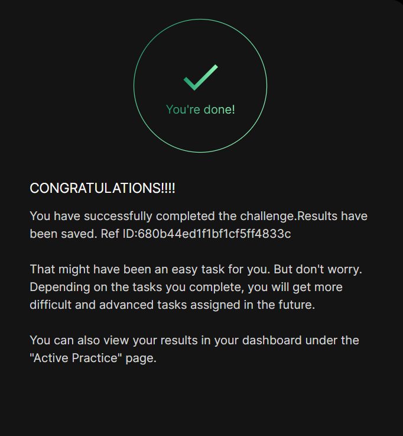

# Day 048 :shipit:

## Task

## Commands Used

```
kind: Pod
apiVersion: v1
metadata:
  name: pod-nginx
  labels:
    app: nginx_app

spec:
  containers:
    - name: nginx-container
      image: nginx:latest

```


## What I Learned

## Notes
