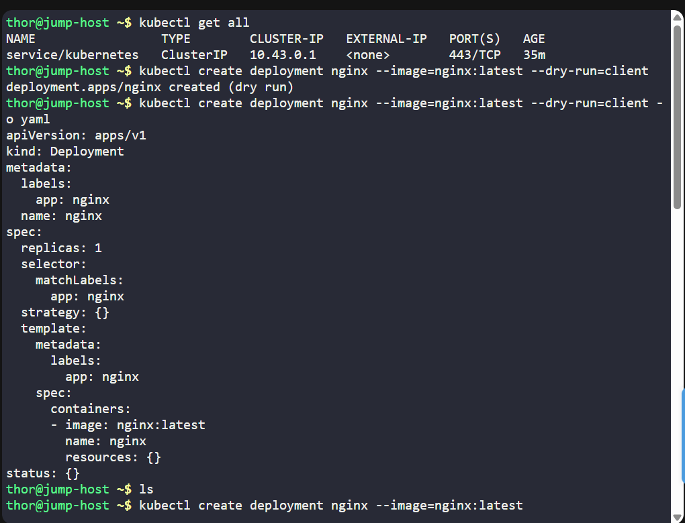
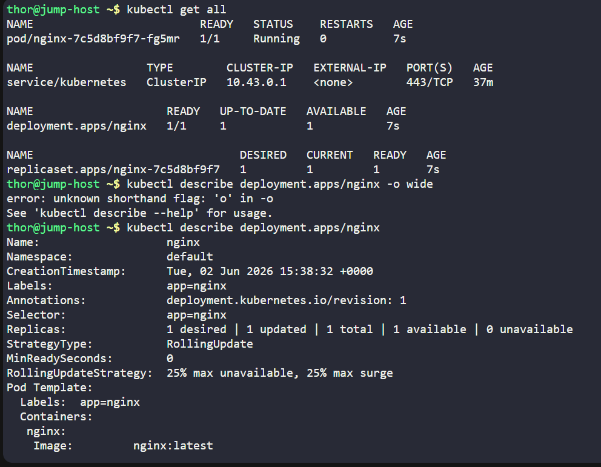

# Day 049 :shipit:

## Task

The Nautilus DevOps team is delving into Kubernetes for app management. One team member needs to create a deployment following these details:

Create a deployment named nginx to deploy the application nginx using the image nginx:latest (ensure to specify the tag)

Note: The kubectl utility on the jump-host has been configured to work with the Kubernetes cluster.

## Commands Used

## What I Learned

## Notes
