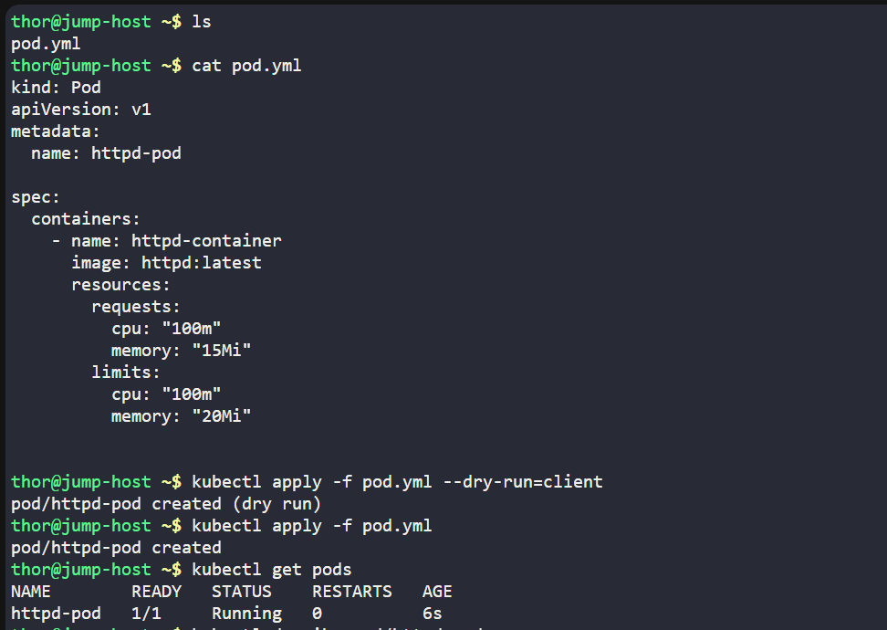
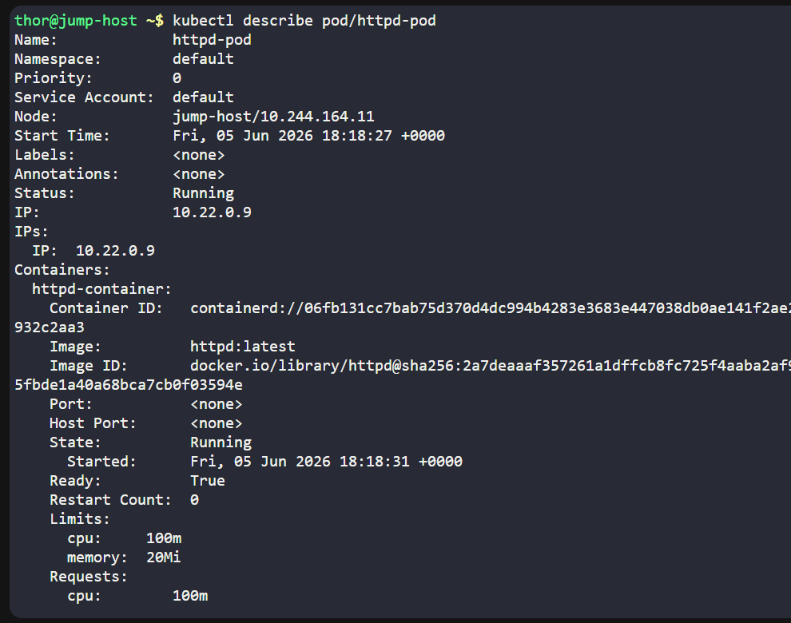
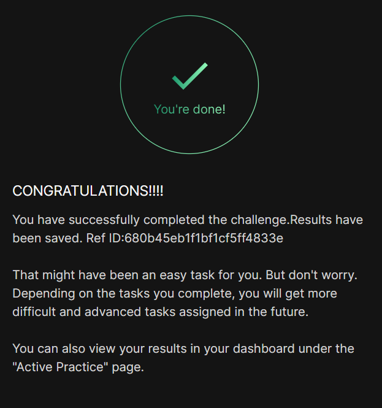

# Day 050 :shipit:

## Task

The Nautilus DevOps team has noticed performance issues in some Kubernetes-hosted applications due to resource constraints. To address this, they plan to set limits on resource utilization. Here are the details:


Create a pod named httpd-pod with a container named httpd-container. Use the httpd image with the latest tag (specify as httpd:latest). Configure the following container-level resource requests and limits for the container:

Requests: Memory: 15Mi, CPU: 100m

Limits: Memory: 20Mi, CPU: 100m

Note: The kubectl utility on the jump-host has been configured to work with the Kubernetes cluster.

## Commands Used
```
kubectl apply -f pod.yml --dry-run=client
kubectl apply -f pod.yml

kubectl get pods
kubectl describe pod/httpd-pod 
```




## What I Learned

## Notes

