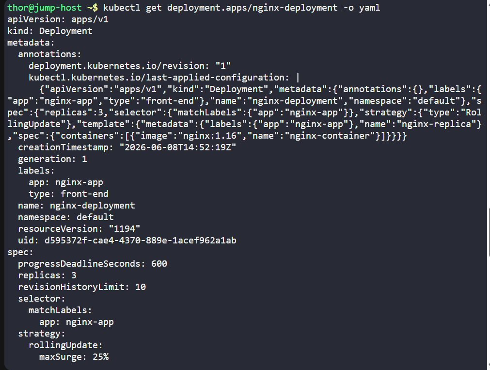
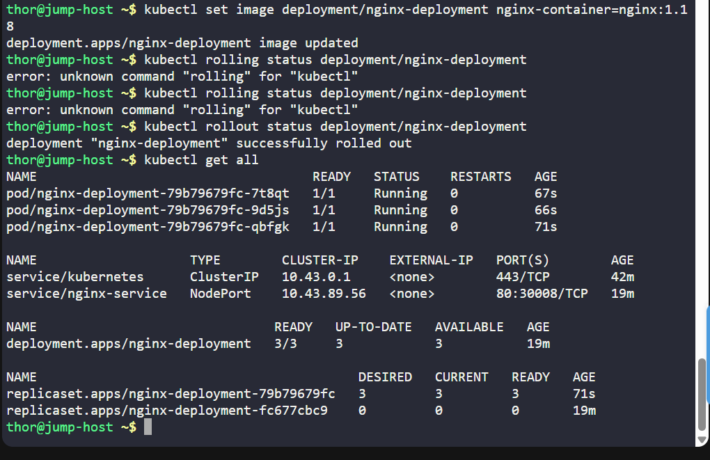
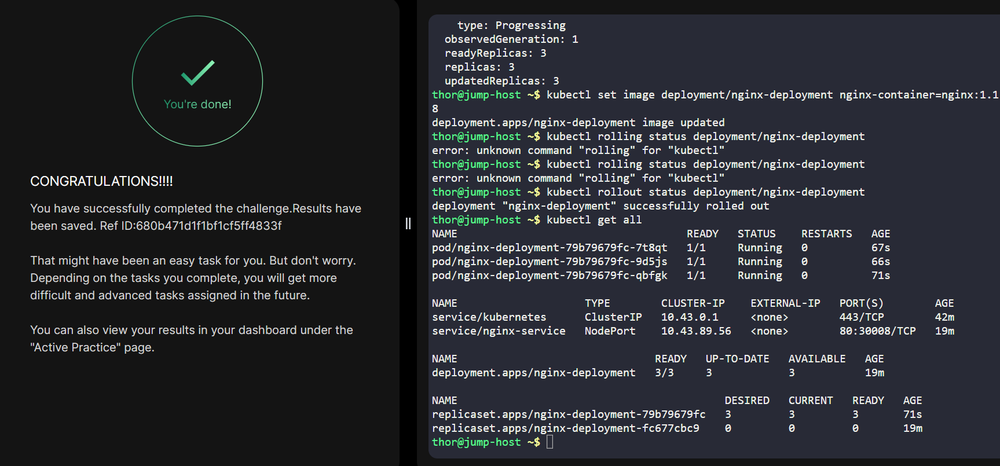

# Day 051 :shipit:

## Task

An application currently running on the Kubernetes cluster employs the nginx web server. The Nautilus application development team has introduced some recent changes that need deployment. They've crafted an image nginx:1.18 with the latest updates.


Execute a rolling update for this application, integrating the nginx:1.18 image. The deployment is named nginx-deployment.

Ensure all pods are operational post-update.

Note: The kubectl utility on the jump-host has been configured to work with the Kubernetes cluster.

## Commands Used

```
# Check existing resources
kubectl get all

# Check deployment details and identify container name
kubectl get deployment nginx-deployment -o yaml

# Perform rolling update to nginx:1.18
kubectl set image deployment/nginx-deployment nginx-container=nginx:1.18

# Verify rollout progress
kubectl rollout status deployment/nginx-deployment

# Verify deployment image
kubectl get deployment nginx-deployment -o=jsonpath='{.spec.template.spec.containers[0].image}'

# Verify all pods are running
kubectl get pods
```






## What I Learned

## Notes
