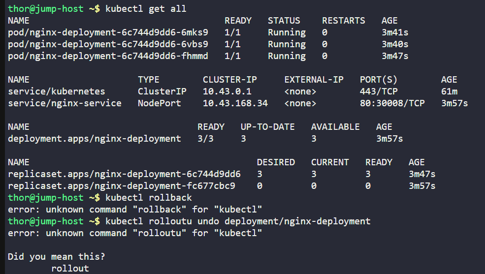
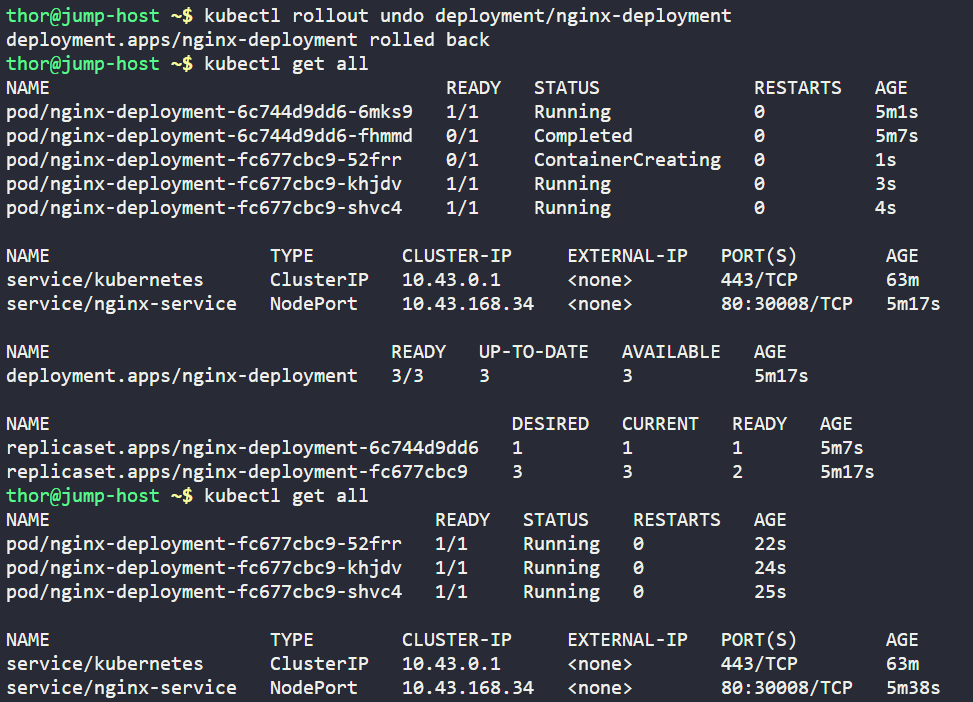
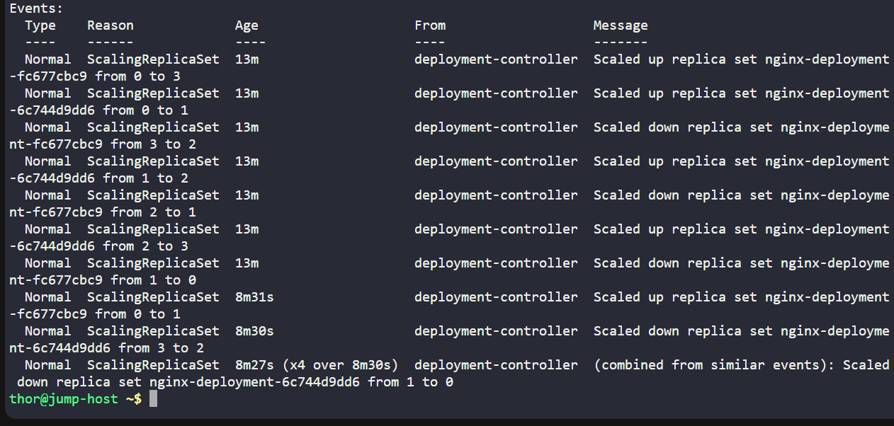
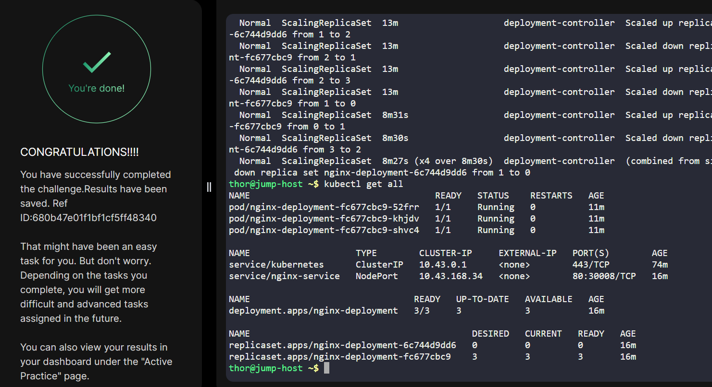

# Day 052 :shipit:


## Task

Earlier today, the Nautilus DevOps team deployed a new release for an application. However, a customer has reported a bug related to this recent release. Consequently, the team aims to revert to the previous version.


There exists a deployment named nginx-deployment; initiate a rollback to the previous revision.

Note: The kubectl utility on the jump-host has been configured to work with the Kubernetes cluster.

## Commands Used







```
kubectl get all

kubectl rollout undo deployment/nginx-deployment

kubectl get all 
kubectl logs deployment/nginx-deployment
kubectl describe deployment/nginx-deployment
```

## What I Learned

## Notes

