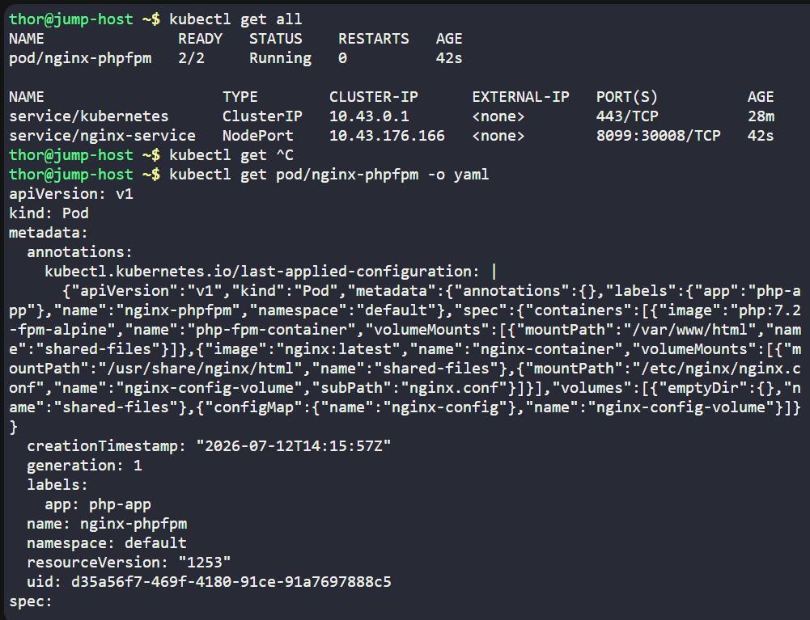
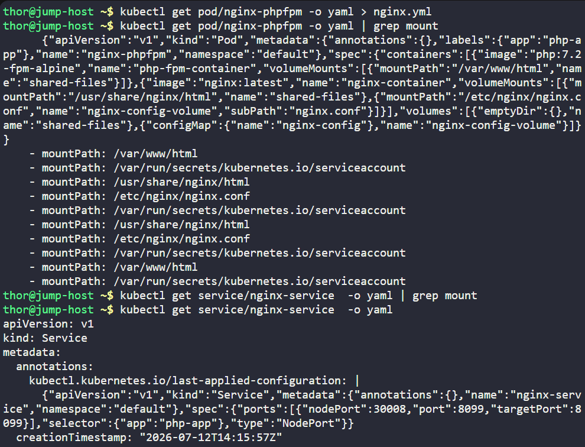
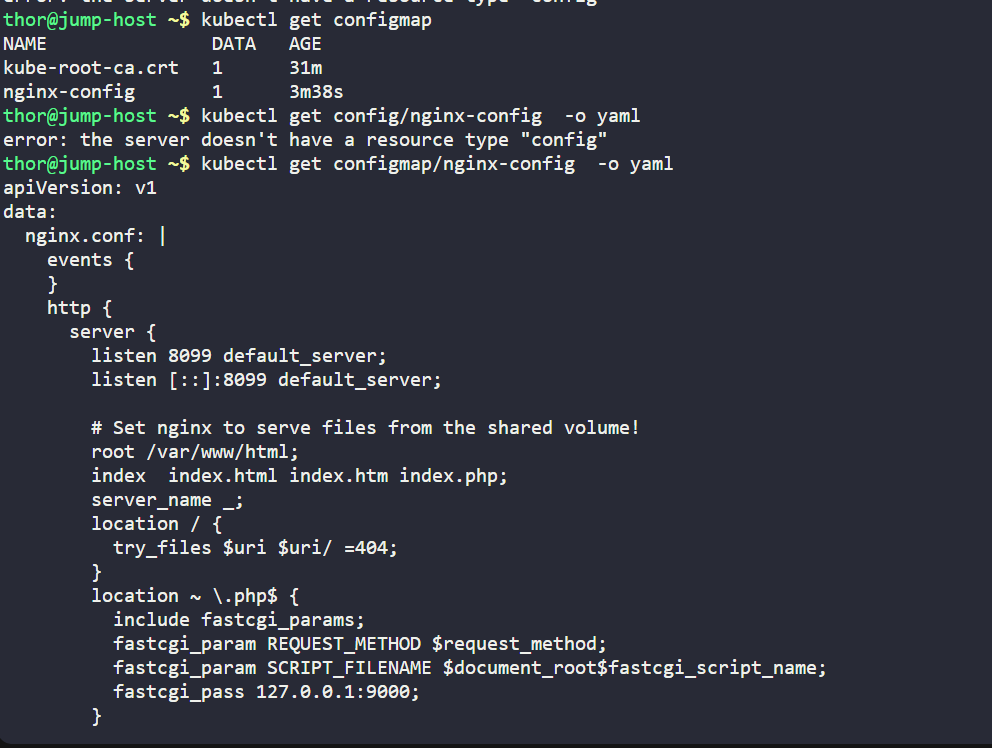
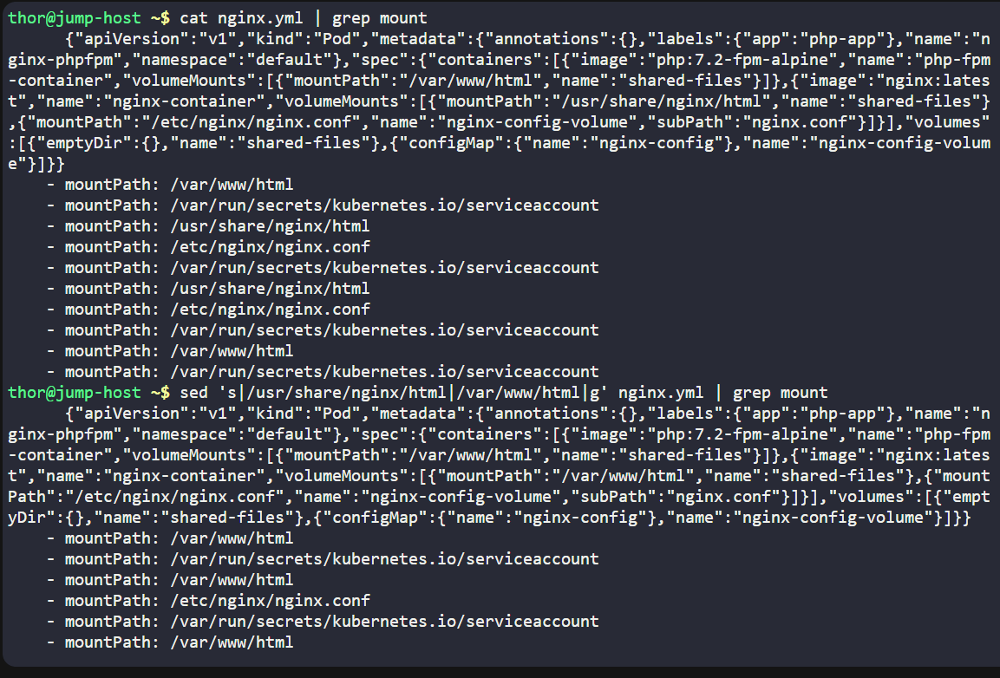
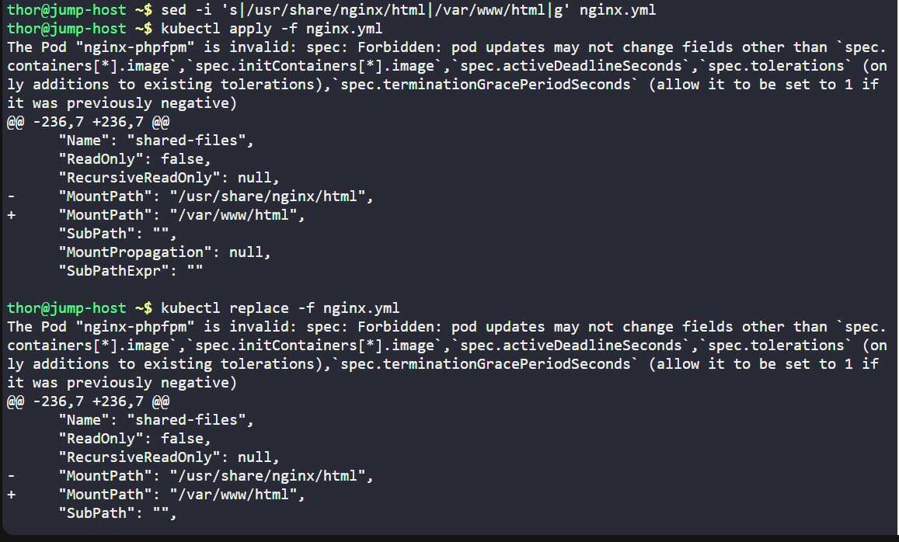
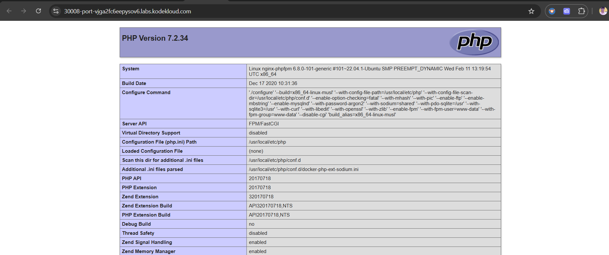
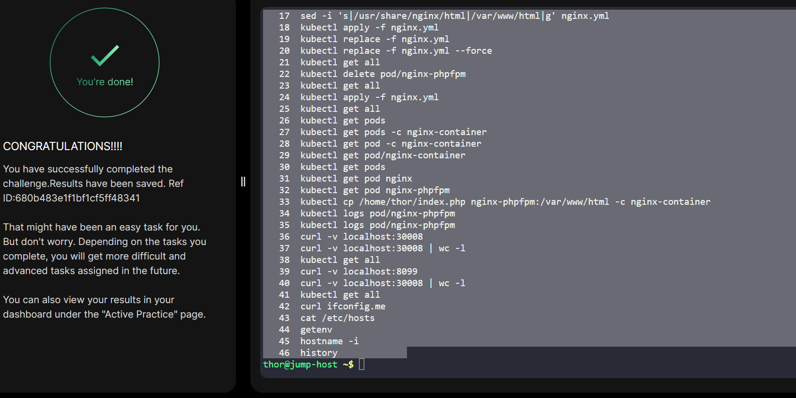

# Day 053 :shipit:

## Task
We encountered an issue with our Nginx and PHP-FPM setup on the Kubernetes cluster this morning, which halted its functionality. Investigate and rectify the issue:


The pod name is nginx-phpfpm and configmap name is nginx-config. Identify and fix the problem.


Once resolved, copy /home/thor/index.php file from the jump host to the nginx-container within the nginx document root. After this, you should be able to access the website using Website button on the top bar.


Note: The kubectl utility on the jump-host has been configured to work with the Kubernetes cluster.

## Commands Used

```
# Check Kubernetes resources
kubectl get all

# Export pod YAML
kubectl get pod/nginx-phpfpm -o yaml > nginx.yml

# Check volume mounts in the pod
kubectl get pod/nginx-phpfpm -o yaml | grep mount

# View Service YAML
kubectl get service/nginx-service -o yaml

# List ConfigMaps
kubectl get configmap

# View ConfigMap
kubectl get configmap/nginx-config -o yaml

# Search for paths in ConfigMap
kubectl get configmap/nginx-config -o yaml | grep /

# View current directory
ls

# Preview replacement (does not modify file)
sed 's|/usr/share/nginx/html|/var/www/html|g' nginx.yml

# View YAML
cat nginx.yml

# Check mount paths
cat nginx.yml | grep mount

# Preview updated mount paths
sed 's|/usr/share/nginx/html|/var/www/html|g' nginx.yml | grep mount

# Modify YAML in place
sed -i 's|/usr/share/nginx/html|/var/www/html|g' nginx.yml

# Recreate the Pod from YAML
kubectl replace --force -f nginx.yml

# Verify resources
kubectl get all

# List Pods
kubectl get pods

# Copy index.php into the nginx container
kubectl cp /home/thor/index.php nginx-phpfpm:/var/www/html -c nginx-container

# Check Pod logs
kubectl logs pod/nginx-phpfpm

# Test the application
curl -v localhost:30008

# Count output lines
curl -v localhost:30008 | wc -l

# Check resources again
kubectl get all

# Test another port
curl -v localhost:8099

# Check public IP
curl ifconfig.me

# View hosts file
cat /etc/hosts

# Display environment variables
printenv

# Show node IP
hostname -i
```















## What I Learned


verify the mount paths


## Notes
